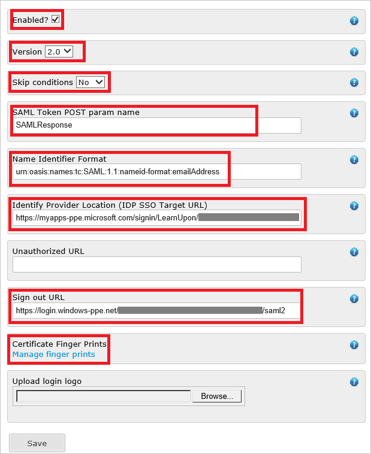
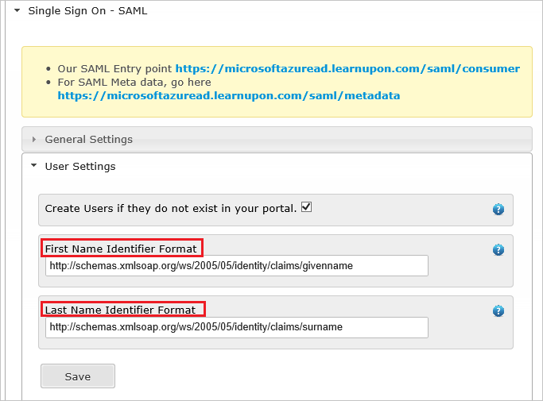
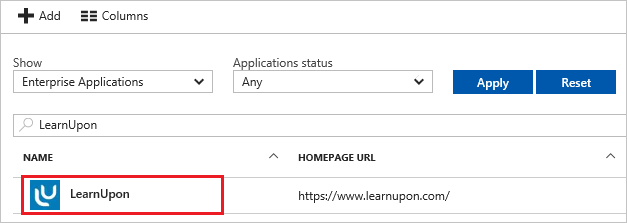

# Tutorial: Azure Active Directory integration with LearnUpon

In this tutorial, you learn how to integrate LearnUpon with Azure Active Directory (Azure AD).

Integrating LearnUpon with Azure AD provides you with the following benefits:

- You can control in Azure AD who has access to LearnUpon
- You can enable your users to automatically get signed-on to LearnUpon (Single Sign-On) with their Azure AD accounts
- You can manage your accounts in one central location - the Azure portal

If you want to know more details about SaaS app integration with Azure AD, see [what is application access and single sign-on with Azure Active Directory](active-directory-appssoaccess-whatis.md).

## Prerequisites

To configure Azure AD integration with LearnUpon, you need the following items:

- An Azure AD subscription
- A LearnUpon single sign-on enabled subscription

> [!NOTE]
> To test the steps in this tutorial, we do not recommend using a production environment.

To test the steps in this tutorial, you should follow these recommendations:

- Do not use your production environment, unless it is necessary.
- If you don't have an Azure AD trial environment, you can get a one-month trial [here](https://azure.microsoft.com/pricing/free-trial/).

## Scenario description
In this tutorial, you test Azure AD single sign-on in a test environment. 
The scenario outlined in this tutorial consists of two main building blocks:

1. Adding LearnUpon from the gallery
2. Configuring and testing Azure AD single sign-on

## Adding LearnUpon from the gallery
To configure the integration of LearnUpon into Azure AD, you need to add LearnUpon from the gallery to your list of managed SaaS apps.

**To add LearnUpon from the gallery, perform the following steps:**

1. In the **[Azure portal](https://portal.azure.com)**, on the left navigation panel, click **Azure Active Directory** icon. 

	![Active Directory][1]

2. Navigate to **Enterprise applications**. Then go to **All applications**.

	![Applications][2]
	
3. To add new application, click **New application** button on the top of dialog.

	![Applications][3]

4. In the search box, type **LearnUpon**.

	

5. In the results panel, select **LearnUpon**, and then click **Add** button to add the application.

	

##  Configuring and testing Azure AD single sign-on
In this section, you configure and test Azure AD single sign-on with LearnUpon based on a test user called "Britta Simon".

For single sign-on to work, Azure AD needs to know what the counterpart user in LearnUpon is to a user in Azure AD. In other words, a link relationship between an Azure AD user and the related user in LearnUpon needs to be established.

In LearnUpon, assign the value of the **user name** in Azure AD as the value of the **Username** to establish the link relationship.

To configure and test Azure AD single sign-on with LearnUpon, you need to complete the following building blocks:

1. **[Configuring Azure AD Single Sign-On](#configuring-azure-ad-single-sign-on)** - to enable your users to use this feature.
2. **[Creating an Azure AD test user](#creating-an-azure-ad-test-user)** - to test Azure AD single sign-on with Britta Simon.
3. **[Creating a LearnUpon test user](#creating-a-learnupon-test-user)** - to have a counterpart of Britta Simon in LearnUpon that is linked to the Azure AD representation of user.
4. **[Assigning the Azure AD test user](#assigning-the-azure-ad-test-user)** - to enable Britta Simon to use Azure AD single sign-on.
5. **[Testing Single Sign-On](#testing-single-sign-on)** - to verify whether the configuration works.

### Configuring Azure AD single sign-on

In this section, you enable Azure AD single sign-on in the Azure portal and configure single sign-on in your LearnUpon application.

**To configure Azure AD single sign-on with LearnUpon, perform the following steps:**

1. In the Azure portal, on the **LearnUpon** application integration page, click **Single sign-on**.

	![Configure Single Sign-On][4]

2. On the **Single sign-on** dialog, select **Mode** as	**SAML-based Sign-on** to enable single sign-on.
 
	

3. On the **LearnUpon Domain and URLs** section, perform the following steps:

	

	In the **Reply URL** textbox, type a URL using the following pattern: `https://<companyname>.learnupon.com/saml/consumer`

	> [!NOTE] 
	> Please note that this is not the real value. you have to update this value with the actual Reply URL. To get this value Contact [LearnUpon support team](https://www.learnupon.com/features/support/).

4. On the **SAML Signing Certificate** section, locate the **Thumbprint** - This will be added to your LearnUpon SAML Settings.

	 

5. Click **Save** button.

	

6. On the **LearnUpon Configuration** section, click **Configure LearnUpon** to open **Configure sign-on** window. Copy the **Sign-Out URL, SAML Entity ID, and SAML Single Sign-On Service URL** from the **Quick Reference section.**

	 

7. Open another browser instance and login into LearnUpon with an administrator account. 

8. Click the **settings** tab.
   
    

9. Click **Single Sign On - SAML**, and then click **General Settings** to configure SAML settings.
   
     

10. In the **General Settings** section, perform the following steps:
   
      
  
	a. Select **Enabled**.

	b. Select **Version** as **2.0**.

	c. Select **Skip conditions** as **No**.

	d. In the **SAML Token Post param name** textbox, type the name of request post parameter to the SAML consumer URL indicated above that contains the SAML Assertion to be verified and authenticated - for example **SAMLResponse**.

	e. In the **Name Identifier Format** textbox, type the value that indicates where in your SAML Assertion the users identifier (Email address) resides - for example **urn:oasis:names:tc:SAML:1.1:nameid-format:emailAddress**.
  
	f. In the **Identify Provider Location** textbox, type the value that indicates where the users are sent to if they click on your uploaded icon from your Azure portal login screen.
  
	g. In the **Sign out URL** textbox, paste the **Sign-Out URL** which you have copied from the Azure portal.
	
	h. Click **Manage finger prints**, and then upload the finger print of your downloaded certificate.

11. Click **User Settings**, and then perform the following steps:
   
       
 
	a. In the **First Name Identifier Format** textbox, type the value that tells us where in your SAML Assertion the users firstname resides - for example: **http://schemas.xmlsoap.org/ws/2005/05/identity/claims/givenname**.
  
	b. In the **Last Name Identifier Format** textbox, type the value that tells us where in your SAML Assertion the users lastname resides - for example: **http://schemas.xmlsoap.org/ws/2005/05/identity/claims/surname**.

> [!TIP]
> You can now read a concise version of these instructions inside the [Azure portal](https://portal.azure.com), while you are setting up the app!  After adding this app from the **Active Directory > Enterprise Applications** section, simply click the **Single Sign-On** tab and access the embedded documentation through the **Configuration** section at the bottom. You can read more about the embedded documentation feature here: [Azure AD embedded documentation]( https://go.microsoft.com/fwlink/?linkid=845985)
> 

### Creating an Azure AD test user
The objective of this section is to create a test user in the Azure portal called Britta Simon.

![Create Azure AD User][100]

**To create a test user in Azure AD, perform the following steps:**

1. In the **Azure portal**, on the left navigation pane, click **Azure Active Directory** icon.

	 

2. To display the list of users, go to **Users and groups** and click **All users**.
	
	 

3. To open the **User** dialog, click **Add** on the top of the dialog.
 
	 

4. On the **User** dialog page, perform the following steps:
 
	 

    a. In the **Name** textbox, type **BrittaSimon**.

    b. In the **User name** textbox, type the **email address** of BrittaSimon.

	c. Select **Show Password** and write down the value of the **Password**.

    d. Click **Create**.
 
### Creating a LearnUpon test user

The objective of this section is to create a user called Britta Simon in LearnUpon. LearnUpon supports just-in-time provisioning, which is by default enabled.

There is no action item for you in this section. A new user will be created during an attempt to access LearnUpon if it doesn't exist yet. [Configuring Azure AD Single Sign-On](#configuring-azure-ad-single-single-sign-on).

>[!NOTE]
>If you need to create an user manually, you need to contact [LearnUpon support team](https://www.learnupon.com/features/support/). 

### Assigning the Azure AD test user

In this section, you enable Britta Simon to use Azure single sign-on by granting access to LearnUpon.

![Assign User][200] 

**To assign Britta Simon to LearnUpon, perform the following steps:**

1. In the Azure portal, open the applications view, and then navigate to the directory view and go to **Enterprise applications** then click **All applications**.

	![Assign User][201] 

2. In the applications list, select **LearnUpon**.

	 

3. In the menu on the left, click **Users and groups**.

	![Assign User][202] 

4. Click **Add** button. Then select **Users and groups** on **Add Assignment** dialog.

	![Assign User][203]

5. On **Users and groups** dialog, select **Britta Simon** in the Users list.

6. Click **Select** button on **Users and groups** dialog.

7. Click **Assign** button on **Add Assignment** dialog.
	
### Testing single sign-on

In this section, you test your Azure AD single sign-on configuration using the Access Panel.

When you click the LearnUpon tile in the Access Panel, you should get automatically signed-on to your LearnUpon application.
For more information about the Access Panel, see [Introduction to the Access Panel](active-directory-saas-access-panel-introduction.md).

## Additional resources

* [List of Tutorials on How to Integrate SaaS Apps with Azure Active Directory](active-directory-saas-tutorial-list.md)
* [What is application access and single sign-on with Azure Active Directory?](active-directory-appssoaccess-whatis.md)

<!--Image references-->

[1]: ./media/active-directory-saas-learnupon-tutorial/tutorial_general_01.png
[2]: ./media/active-directory-saas-learnupon-tutorial/tutorial_general_02.png
[3]: ./media/active-directory-saas-learnupon-tutorial/tutorial_general_03.png
[4]: ./media/active-directory-saas-learnupon-tutorial/tutorial_general_04.png

[100]: ./media/active-directory-saas-learnupon-tutorial/tutorial_general_100.png

[200]: ./media/active-directory-saas-learnupon-tutorial/tutorial_general_200.png
[201]: ./media/active-directory-saas-learnupon-tutorial/tutorial_general_201.png
[202]: ./media/active-directory-saas-learnupon-tutorial/tutorial_general_202.png
[203]: ./media/active-directory-saas-learnupon-tutorial/tutorial_general_203.png

