# Tutorial: Azure Active Directory integration with SAML SSO for Jira by resolution GmbH

In this tutorial, you learn how to integrate SAML SSO for Jira by resolution GmbH with Azure Active Directory (Azure AD).

Integrating SAML SSO for Jira by resolution GmbH with Azure AD provides you with the following benefits:

- You can control in Azure AD who has access to SAML SSO for Jira by resolution GmbH
- You can enable your users to automatically get signed-on to SAML SSO for Jira by resolution GmbH (Single Sign-On) with their Azure AD accounts
- You can manage your accounts in one central location - the Azure portal

If you want to know more details about SaaS app integration with Azure AD, see [what is application access and single sign-on with Azure Active Directory](active-directory-appssoaccess-whatis.md).

## Prerequisites

To configure Azure AD integration with SAML SSO for Jira by resolution GmbH, you need the following items:

- An Azure AD subscription
- A SAML SSO for Jira by resolution GmbH single-sign on enabled subscription

> [!NOTE]
> To test the steps in this tutorial, we do not recommend using a production environment.

To test the steps in this tutorial, you should follow these recommendations:

- Do not use your production environment, unless it is necessary.
- If you don't have an Azure AD trial environment, you can get a one-month trial [here](https://azure.microsoft.com/pricing/free-trial/).

## Scenario description
In this tutorial, you test Azure AD single sign-on in a test environment. 
The scenario outlined in this tutorial consists of two main building blocks:

1. Adding SAML SSO for Jira by resolution GmbH from the gallery
2. Configuring and testing Azure AD single sign-on

## Adding SAML SSO for Jira by resolution GmbH from the gallery
To configure the integration of SAML SSO for Jira by resolution GmbH into Azure AD, you need to add SAML SSO for Jira by resolution GmbH from the gallery to your list of managed SaaS apps.

**To add SAML SSO for Jira by resolution GmbH from the gallery, perform the following steps:**

1. In the **[Azure portal](https://portal.azure.com)**, on the left navigation panel, click **Azure Active Directory** icon. 

	![Active Directory][1]

2. Navigate to **Enterprise applications**. Then go to **All applications**.

	![Applications][2]
	
3. To add new application, click **New application** button on the top of dialog.

	![Applications][3]

4. In the search box, type **SAML SSO for Jira by resolution GmbH**.

	

5. In the results panel, select **SAML SSO for Jira by resolution GmbH**, and then click **Add** button to add the application.

	

##  Configuring and testing Azure AD single sign-on
In this section, you configure and test Azure AD single sign-on with SAML SSO for Jira by resolution GmbH based on a test user called "Britta Simon."

For single sign-on to work, Azure AD needs to know what the counterpart user in SAML SSO for Jira by resolution GmbH is to a user in Azure AD. In other words, a link relationship between an Azure AD user and the related user in SAML SSO for Jira by resolution GmbH needs to be established.

In SAML SSO for Jira by resolution GmbH, assign the value of the **user name** in Azure AD as the value of the **Username** to establish the link relationship.

To configure and test Azure AD single sign-on with SAML SSO for Jira by resolution GmbH, you need to complete the following building blocks:

1. **[Configuring Azure AD Single Sign-On](#configuring-azure-ad-single-sign-on)** - to enable your users to use this feature.
2. **[Creating an Azure AD test user](#creating-an-azure-ad-test-user)** - to test Azure AD single sign-on with Britta Simon.
3. **[Creating a SAML SSO for Jira by resolution GmbH test user](#creating-a-saml-sso-for-jira-by-resolution-gmbh-test-user)** - to have a counterpart of Britta Simon in SAML SSO for Jira by resolution GmbH that is linked to the Azure AD representation of user.
4. **[Assigning the Azure AD test user](#assigning-the-azure-ad-test-user)** - to enable Britta Simon to use Azure AD single sign-on.
5. **[Testing Single Sign-On](#testing-single-sign-on)** - to verify whether the configuration works.

### Configuring Azure AD single sign-on

In this section, you enable Azure AD single sign-on in the Azure portal and configure single sign-on in your SAML SSO for Jira by resolution GmbH application.

**To configure Azure AD single sign-on with SAML SSO for Jira by resolution GmbH, perform the following steps:**

1. In the Azure portal, on the **SAML SSO for Jira by resolution GmbH** application integration page, click **Single sign-on**.

	![Configure Single Sign-On][4]

2. On the **Single sign-on** dialog, select **Mode** as	**SAML-based Sign-on** to enable single sign-on.
 
	

3. On the **SAML SSO for Jira by resolution GmbH Domain and URLs** section, If you wish to configure the application in **IDP** initiated mode:

	

    a. In the **Identifier** textbox, type a URL using the following pattern: `https://<server-base-url>/plugins/servlet/samlsso`

	b. In the **Reply URL** textbox, type a URL using the following pattern: `https://<server-base-url>/plugins/servlet/samlsso`

4. Check **Show advanced URL settings**. If you wish to configure the application in **SP** initiated mode:

	

    In the **Sign-on URL** textbox, type a URL using the following pattern: `https://<server-base-url>/plugins/servlet/samlsso`
	 
	> [!NOTE] 
	> These values are not real. Update these values with the actual Identifier, Reply URL, and Sign-On URL. Contact [SAML SSO for Jira by resolution GmbH Client support team](https://www.resolution.de/go/support) to get these values. 

5. On the **SAML Signing Certificate** section, click **Metadata XML** and then save the metadata file on your computer.

	 

6. Click **Save** button.

	
	
7. In a different web browser window, log in to your **SAML SSO for Jira by resolution GmbH admin portal** as an administrator.

8. Hover on cog and click the **Add-ons**.
    
	

9. You are redirected to Administrator Access page. Enter the **Password** and click **Confirm** button.

	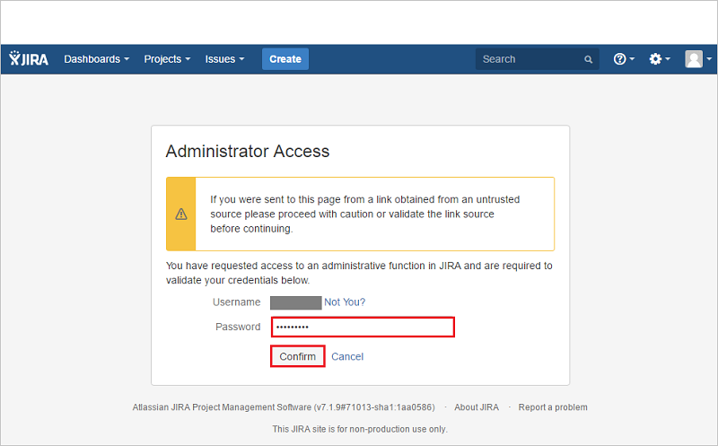

10. Under Add-ons tab section, click **Find new add-ons**. Search **SAML Single Sign On (SSO) for JIRA** and click **Install** button to install the new SAML plugin.

	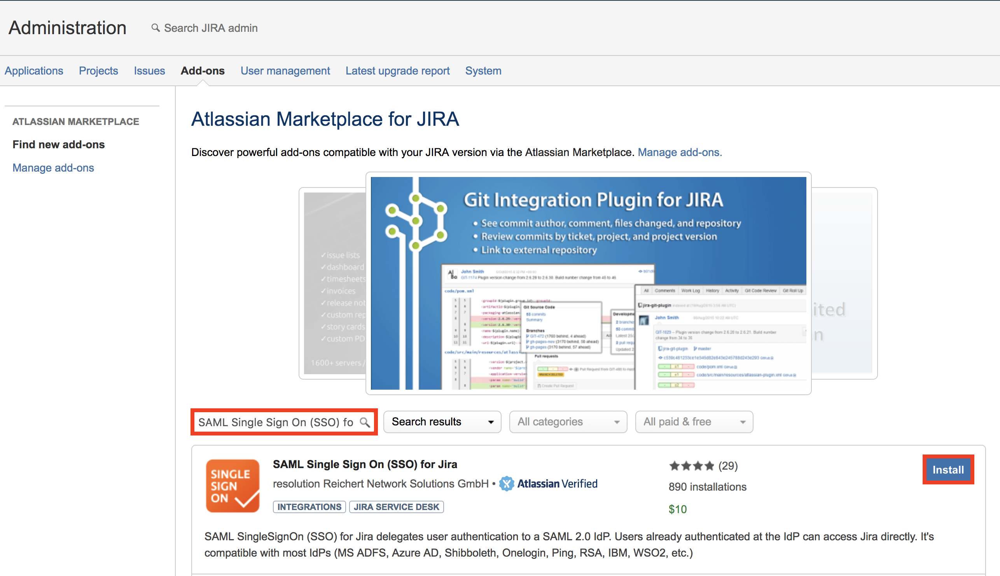

11. The plugin installation will start. Click **Close**.

	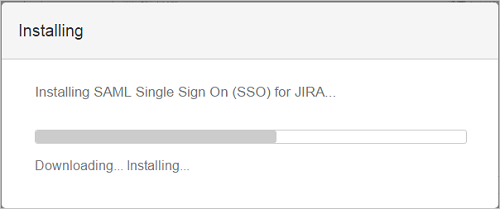

	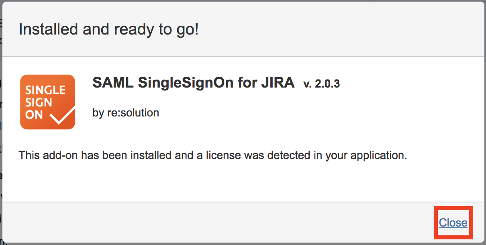

12.	Click **Manage**.

	
    
13. Click **Configure** to configure the new plugin.

	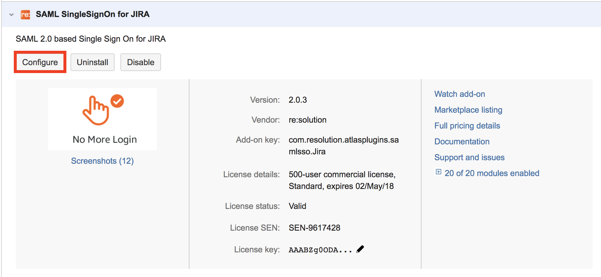

14. On **SAML SingleSignOn Plugin Configuration** page, click **Add new IdP** button to configure the settings of Identity Provider.

	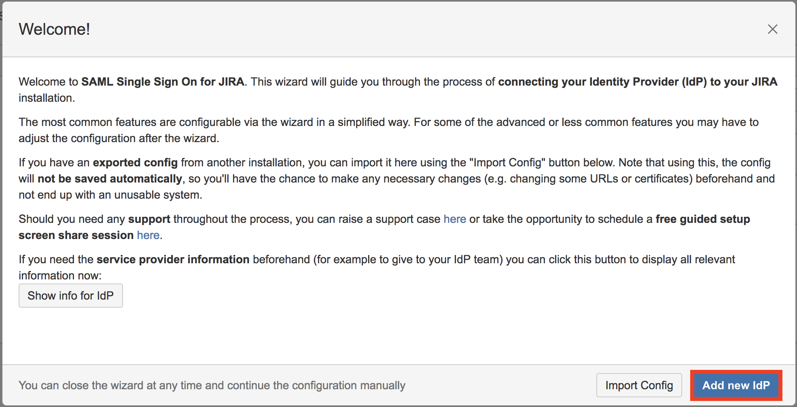

15. On **Choose your SAML Identity Provider** page, perform the following steps:

	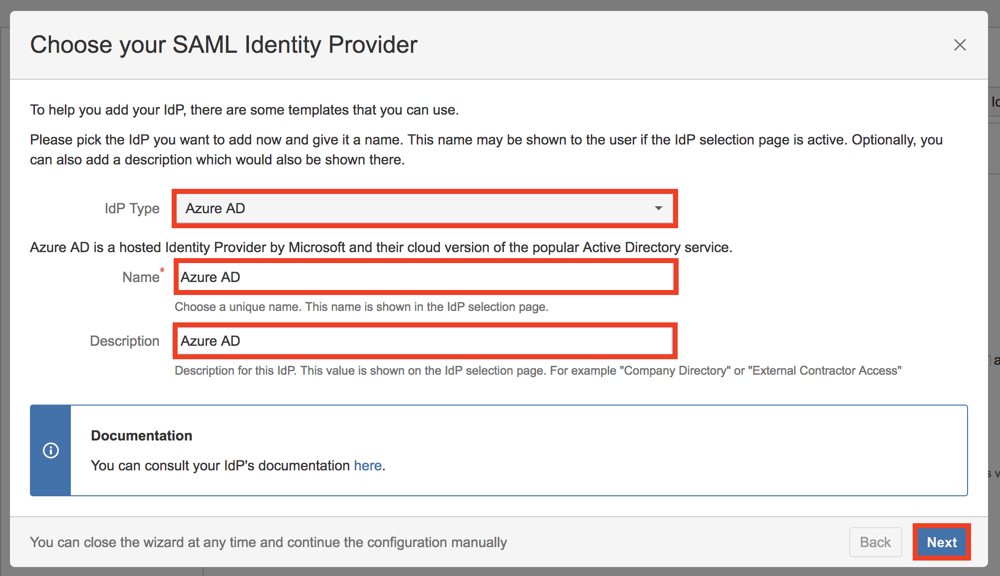
 
	a. Set **Azure AD** as the IdP type.
	
	b. Add **Name** of the Identity Provider (e.g Azure AD).
	
	c. Add **Description** of the Identity Provider (e.g Azure AD).
	
	d. Click **Next**.
	
16. On **Identity provider configuration** page, click **Next** button.

	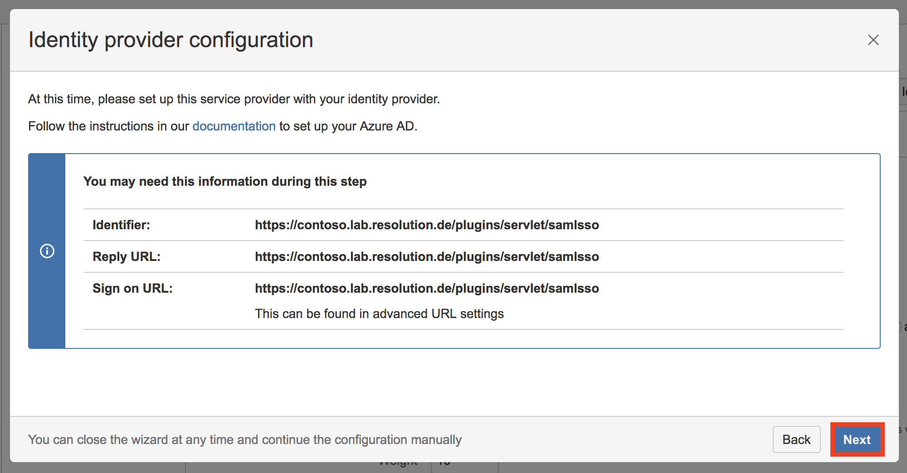

17. On **Import SAML IdP Metadata** page, perform the following steps:

	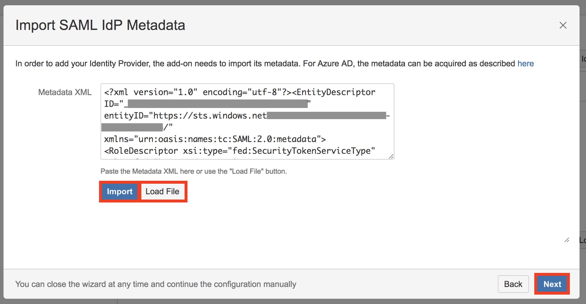

    a. Click **Load File** button and pick Metadata XML file you downloaded in Step 5.

    b. Click **Import** button.
    
    c. Wait briefly until import succeeds.
    
    d. Click **Next** button.
    
18. On **User ID attribute and transformation** page, click **Next** button.

	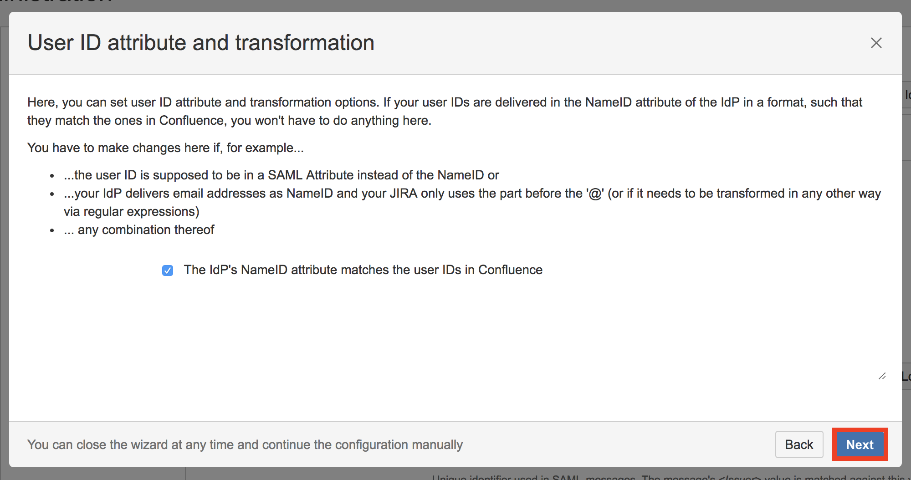
	
19. On **User creation and update** page, click **Save & Next** to save settings.	
	
	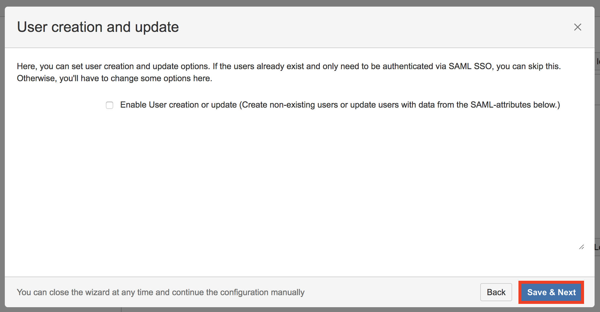
	
20. On **Test your settings** page, click **Skip test & configure manually** to skip the user test for now. This will be performed in the next section and requires some settings in Azure portal. 
	
	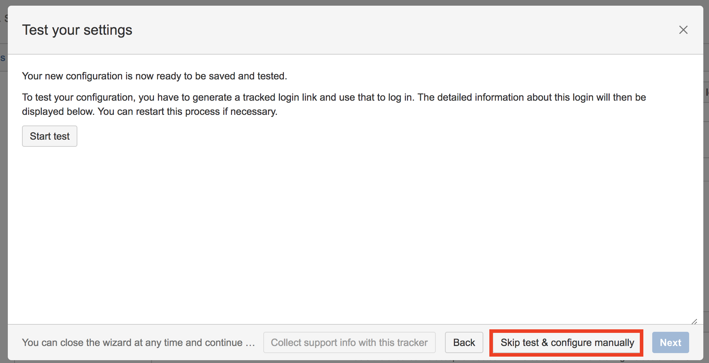
	
21. In the apprearing dialog reading **Skipping the test means...**, click **OK**.
	
	

> [!TIP]
> You can now read a concise version of these instructions inside the [Azure portal](https://portal.azure.com), while you are setting up the app!  After adding this app from the **Active Directory > Enterprise Applications** section, simply click the **Single Sign-On** tab and access the embedded documentation through the **Configuration** section at the bottom. You can read more about the embedded documentation feature here: [Azure AD embedded documentation]( https://go.microsoft.com/fwlink/?linkid=845985)
> 

### Creating an Azure AD test user
The objective of this section is to create a test user in the Azure portal called Britta Simon.

![Create Azure AD User][100]

**To create a test user in Azure AD, perform the following steps:**

1. In the **Azure portal**, on the left navigation pane, click **Azure Active Directory** icon.

	 

2. To display the list of users, go to **Users and groups** and click **All users**.
	
	 

3. To open the **User** dialog, click **Add** on the top of the dialog.
 
	 

4. On the **User** dialog page, perform the following steps:
 
	 

    a. In the **Name** textbox, type **BrittaSimon**.

    b. In the **User name** textbox, type the **email address** of BrittaSimon.

	c. Select **Show Password** and write down the value of the **Password**.

    d. Click **Create**.
 
### Creating a SAML SSO for Jira by resolution GmbH test user

To enable Azure AD users to log in to SAML SSO for Jira by resolution GmbH, they must be provisioned into SAML SSO for Jira by resolution GmbH.  
In SAML SSO for Jira by resolution GmbH, provisioning is a manual task.

**To provision a user account, perform the following steps:**

1. Log in to your SAML SSO for Jira by resolution GmbH company site as an administrator.

2. Hover on cog and click the **User management**.

     

3. You are redirected to Administrator Access page to enter **Password** and click **Confirm** button.

	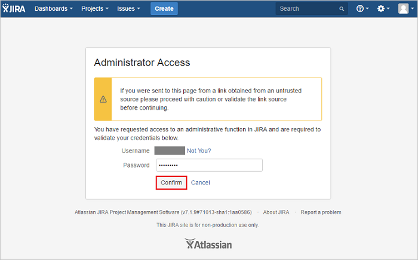 

4. Under **User management** tab section, click **create user**.

	 

5. On the **“Create new user”** dialog page, perform the following steps:

	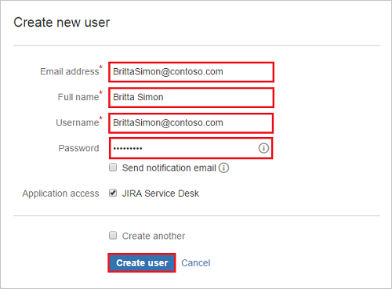 

	a. In the **Email address** textbox, type the email address of user like Brittasimon@contoso.com.

	b. In the **Full Name** textbox, type full name of the user like Britta Simon.

	c. In the **Username** textbox, type the email of user like Brittasimon@contoso.com.

	d. In the **Password** textbox, type the password of user.

	e. Click **Create user**.	

### Assigning the Azure AD test user

In this section, you enable Britta Simon to use Azure single sign-on by granting access to SAML SSO for Jira by resolution GmbH.

![Assign User][200] 

**To assign Britta Simon to SAML SSO for Jira by resolution GmbH, perform the following steps:**

1. In the Azure portal, open the applications view, and then navigate to the directory view and go to **Enterprise applications** then click **All applications**.

	![Assign User][201] 

2. In the applications list, select **SAML SSO for Jira by resolution GmbH**.

	 

3. In the menu on the left, click **Users and groups**.

	![Assign User][202] 

4. Click **Add** button. Then select **Users and groups** on **Add Assignment** dialog.

	![Assign User][203]

5. On **Users and groups** dialog, select **Britta Simon** in the Users list.

6. Click **Select** button on **Users and groups** dialog.

7. Click **Assign** button on **Add Assignment** dialog.
	
### Testing single sign-on

In this section, you test your Azure AD single sign-on configuration using the Access Panel.

When you click the SAML SSO for Jira by resolution GmbH tile in the Access Panel, you should get automatically signed-on to your SAML SSO for Jira by resolution GmbH application.
For more information about the Access Panel, see [introduction to the Access Panel](active-directory-saas-access-panel-introduction.md). 

## Additional resources

* [List of Tutorials on How to Integrate SaaS Apps with Azure Active Directory](active-directory-saas-tutorial-list.md)
* [What is application access and single sign-on with Azure Active Directory?](active-directory-appssoaccess-whatis.md)

<!--Image references-->

[1]: ./media/active-directory-saas-samlssojira-tutorial/tutorial_general_01.png
[2]: ./media/active-directory-saas-samlssojira-tutorial/tutorial_general_02.png
[3]: ./media/active-directory-saas-samlssojira-tutorial/tutorial_general_03.png
[4]: ./media/active-directory-saas-samlssojira-tutorial/tutorial_general_04.png

[100]: ./media/active-directory-saas-samlssojira-tutorial/tutorial_general_100.png

[200]: ./media/active-directory-saas-samlssojira-tutorial/tutorial_general_200.png
[201]: ./media/active-directory-saas-samlssojira-tutorial/tutorial_general_201.png
[202]: ./media/active-directory-saas-samlssojira-tutorial/tutorial_general_202.png
[203]: ./media/active-directory-saas-samlssojira-tutorial/tutorial_general_203.png

