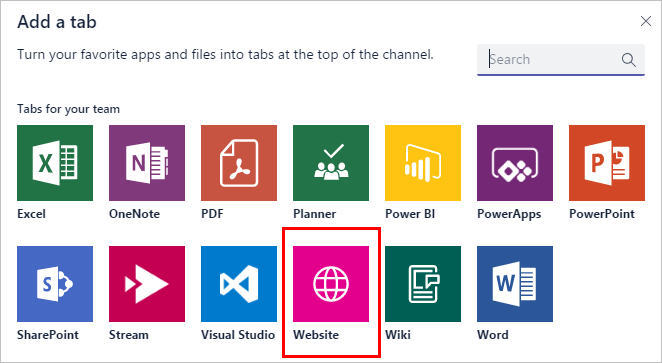
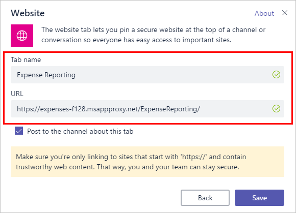

# Access your on-premises applications through Microsoft Teams

Azure Active Directory Application Proxy gives you single sign-on to on-premises applications no matter where you are. Microsoft Teams streamlines your collaborative efforts in one place. Integrating the two together means that your users can be productive with their teammates in any situation. 

Your users can add cloud apps to their Teams channels [using tabs](https://support.office.com/article/Video-Using-Tabs-7350a03e-017a-4a00-a6ae-1c9fe8c497b3?ui=en-US&rs=en-US&ad=US), but what about the SharePoint sites or planning tool that are hosted on-premises? Application Proxy is the solution. They can add apps published through Application Proxy to their channels using the same external URLs they always use to access their apps remotely. And because Application Proxy authenticates through Azure Active Directory, your users get a single sign-on experience.

## Install the Application Proxy connector and publish your app

If you haven't already, [configure Application Proxy for your tenant and install the connector](manage-apps/application-proxy-enable.md). Then, [publish your on-premises application](manage-apps/application-proxy-publish-azure-portal.md) for remote access. When you're publishing the app, make note of the external URL because it's used to add the app to Teams.

If you already have your apps published but don't remember their external URLs, look them up in the [Azure portal](https://portal.azure.com). Sign in, then navigate to **Azure Active Directory** > **Enterprise applications** > **All applications** > select your app > **Application proxy**.

## Add your app to Teams

Once you publish the app through Application Proxy, let your users know that they can add it as a tab directly in their Teams channels, and then the app is available for everyone in the team to use. Have them follow these three steps:

1. Navigate to the Teams channel where you want to add this app and select **+** to add a tab.

   

2. Select **Website** from the tab options.

   

3. Give the tab a name and set the URL to the Application Proxy external URL. 

   

Once one member of a team adds the tab, it shows up for everyone in the channel. Any users who have access to the app get single sign-on access with the credentials they use for Microsoft Teams. Any users who don't have access to the app can see the tab in Teams, but are blocked until you give them permissions to the on-premises app and the Azure portal published version of the app. 

## Next steps

- Learn how to [publish on-premises SharePoint sites](manage-apps/application-proxy-integrate-with-sharepoint-server.md) with Application Proxy.
- Configure your apps to use [custom domains](manage-apps/application-proxy-configure-custom-domain.md) for their external URL. 
