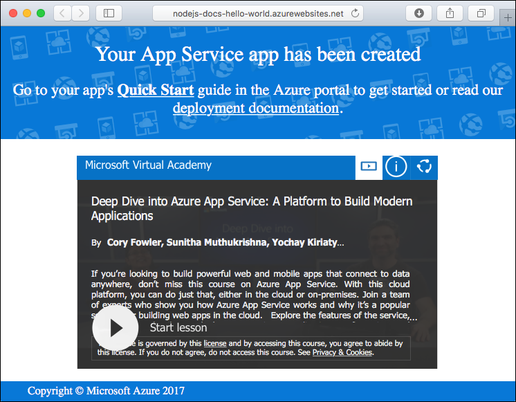

# Create a Node.js web app in Azure App Service on Linux

> [!NOTE]
> This article deploys an app to App Service on Linux. To deploy to App Service on _Windows_, see [Create a Node.js web app in Azure](../app-service-web-get-started-nodejs.md).
>

[App Service on Linux](app-service-linux-intro.md) provides a highly scalable, self-patching web hosting service using the Linux operating system. This quickstart shows how to deploy a Node.js app to App Service on Linux using a built-in image. You create the web app with built-in image using the [Azure CLI](https://docs.microsoft.com/cli/azure/get-started-with-azure-cli), and you use Git to deploy the Node.js code to the web app.


You can follow the steps in this tutorial using a Mac, Windows, or Linux machine. You can also follow along with [the video](#video) that covers this article.

[!INCLUDE [quickstarts-free-trial-note](../../../includes/quickstarts-free-trial-note.md)]

## Prerequisites

To complete this quickstart:

* <a href="https://git-scm.com/" target="_blank">Install Git</a>
* <a href="https://nodejs.org/" target="_blank">Install Node.js and NPM</a>

## Download the sample

In a terminal window on your machine, run the following command to clone the sample app repository to your local machine.

```bash
git clone https://github.com/Azure-Samples/nodejs-docs-hello-world
```

You use this terminal window to run all the commands in this quickstart.

Change to the directory that contains the sample code.

```bash
cd nodejs-docs-hello-world
```

## Run the app locally

Run the application locally by opening a terminal window and using the `npm start` script to launch the built in Node.js HTTP server.

```bash
npm start
```

Open a web browser, and navigate to the sample app at `http://localhost:1337`.

You see the **Hello World** message from the sample app displayed in the page.


In your terminal window, press **Ctrl+C** to exit the web server.

[!INCLUDE [cloud-shell-try-it.md](../../../includes/cloud-shell-try-it.md)]

[!INCLUDE [Configure deployment user](../../../includes/configure-deployment-user.md)]

[!INCLUDE [Create resource group](../../../includes/app-service-web-create-resource-group-linux.md)]

[!INCLUDE [Create app service plan](../../../includes/app-service-web-create-app-service-plan-linux.md)]

## Create a web app

[!INCLUDE [Create web app](../../../includes/app-service-web-create-web-app-nodejs-linux-no-h.md)]

Browse to your newly created web app. Replace _&lt;app name>_ with your web app name.

```bash
http://<app name>.azurewebsites.net
```

Here is what your new web app should look like:



[!INCLUDE [Push to Azure](../../../includes/app-service-web-git-push-to-azure.md)]

```bash
Counting objects: 23, done.
Delta compression using up to 4 threads.
Compressing objects: 100% (21/21), done.
Writing objects: 100% (23/23), 3.71 KiB | 0 bytes/s, done.
Total 23 (delta 8), reused 7 (delta 1)
remote: Updating branch 'master'.
remote: Updating submodules.
remote: Preparing deployment for commit id 'bf114df591'.
remote: Generating deployment script.
remote: Generating deployment script for node.js Web Site
remote: Generated deployment script files
remote: Running deployment command...
remote: Handling node.js deployment.
remote: Kudu sync from: '/home/site/repository' to: '/home/site/wwwroot'
remote: Copying file: '.gitignore'
remote: Copying file: 'LICENSE'
remote: Copying file: 'README.md'
remote: Copying file: 'index.js'
remote: Copying file: 'package.json'
remote: Copying file: 'process.json'
remote: Deleting file: 'hostingstart.html'
remote: Ignoring: .git
remote: Using start-up script index.js from package.json.
remote: Node.js versions available on the platform are: 4.4.7, 4.5.0, 6.2.2, 6.6.0, 6.9.1.
remote: Selected node.js version 6.9.1. Use package.json file to choose a different version.
remote: Selected npm version 3.10.8
remote: Finished successfully.
remote: Running post deployment command(s)...
remote: Deployment successful.
To https://<app_name>.scm.azurewebsites.net:443/<app_name>.git
 * [new branch]      master -> master
```

## Browse to the app

Browse to the deployed application using your web browser.

```bash
http://<app_name>.azurewebsites.net
```

The Node.js sample code is running in a web app with built-in image.


**Congratulations!** You've deployed your first Node.js app to App Service on Linux.

## Update and redeploy the code

In the local directory, open the `index.js` file in the Node.js app, and make a small change to the text in the call to `response.end`:

```nodejs
response.end("Hello Azure!");
```

Commit your changes in Git, and then push the code changes to Azure.

```bash
git commit -am "updated output"
git push azure master
```

Once deployment has completed, switch back to the browser window that opened in the **Browse to the app** step, and hit refresh.


## Manage your new Azure web app

Go to the <a href="https://portal.azure.com" target="_blank">Azure portal</a> to manage the web app you created.

From the left menu, click **App Services**, and then click the name of your Azure web app.


You see your web app's Overview page. Here, you can perform basic management tasks like browse, stop, start, restart, and delete. 


The left menu provides different pages for configuring your app. 

[!INCLUDE [cli-samples-clean-up](../../../includes/cli-samples-clean-up.md)]

## Video

>[!VIDEO https://www.youtube.com/embed/S9eqK7xPKqU]

## Next steps

> [!div class="nextstepaction"]
> [Node.js with MongoDB](tutorial-nodejs-mongodb-app.md)
