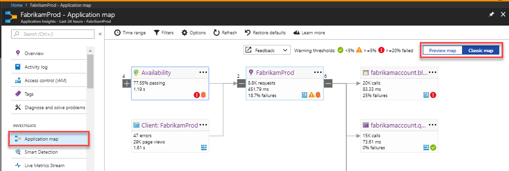
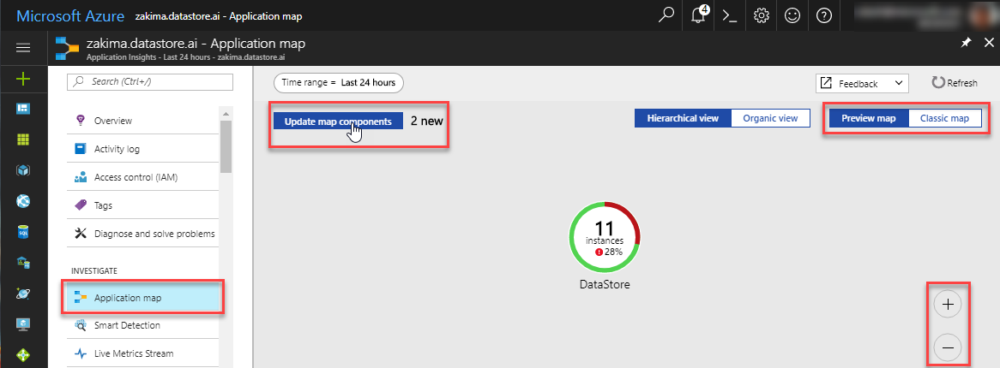
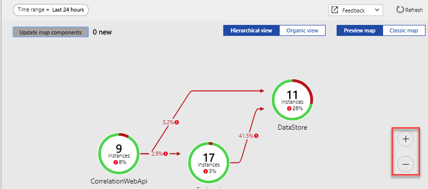
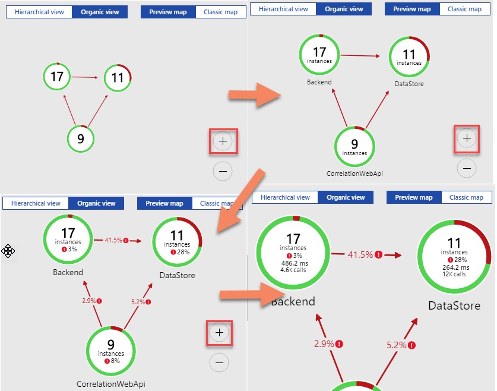
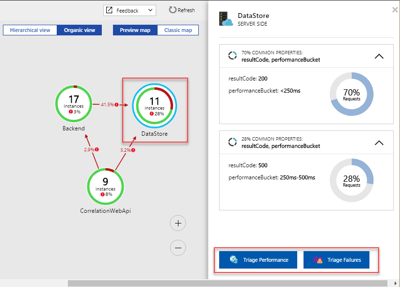
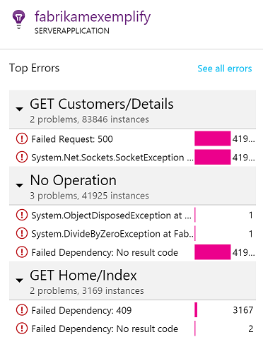

---
title: Application Map in Azure Application Insights | Microsoft Docs
description: Monitor complex application topologies with the application map
services: application-insights
documentationcenter: ''
author: mrbullwinkle
manager: carmonm

ms.assetid: 3bf37fe9-70d7-4229-98d6-4f624d256c36
ms.service: application-insights
ms.workload: tbd
ms.tgt_pltfrm: ibiza
ms.devlang: na
ms.topic: article
ms.date: 03/14/2017
ms.author: mbullwin; Soubhagya.Dash

---
# Application Map: Triage Distributed Applications
Application Map helps you spot performance bottlenecks or failure hotspots across all components of your distributed application. Each node on the map represents an application component or its dependencies; and has health KPI and alerts status. You can click through from any component to more detailed diagnostics, such as Application Insights events. If your app uses Azure services, you can also click through to Azure diagnostics, such as SQL Database Advisor recommendations.

## What is a Component?

Components are independently deployable parts of your distributed/microservices application. Developers and operations teams have code-level visibility or access to telemetry generated by these application components. 

* Components are different from "observed" external dependencies such as SQL, EventHub etc. which your team/organization may not have access to (code or telemetry).
* Components run on any number of server/role/container instances.
* Components can be separate Application Insights instrumentation keys (even if subscriptions are different) or different roles reporting to a single Application Insights instrumentation key. The preview map experience shows the components regardless of how they are set up.

## Composite Application Map (Preview)
*This is an early preview, and we will be adding more features to this map. We would love to get your feedback on the new experience. You can switch between the preview and classic experiences easily.*

Enable "Composite Application Map" from the [previews list](app-insights-previews.md), or click on "Preview map" in the toggle at the top-right corner. You can use this toggle to switch back to the classic experience.

>[!Note]
This preview replaces the prior "Multi-role Application Map" preview. At this time, use this to view the entire topology across multiple levels of application component dependencies. Give us your feedback, we will be adding more capabilities similar to what the classic map supports.

You can see the full application topology across multiple levels of related application components. Components could be different Application Insights resources, or different roles in a single resource. The app map finds components by following HTTP dependency calls made between servers with the Application Insights SDK installed. 

This experience starts with progressive discovery of the components. When you first load the preview, a set of queries are triggered to discover the components related to this component. A button at the top-left corner will update with the number of components in your application as they are discovered. 

On clicking "Update map components", the map is refreshed with all components discovered until that point.

If all of the components are roles within a single Application Insights resource, then this discovery step is not required. The initial load for such an application will have all its components.

One of the key objectives with the new experience is to be able to visualize complex topologies with hundreds of components. The new experience supports zooming, and adds detail as you zoom-in. You can zoom-out to view more components at a glance, and still spot components with higher failure rates. 

Click on any component to see related insights and go to the performance and failure triage experience for that component.

## Classic Application Map

The map shows:

* Availability tests
* Client-side component (monitored with the JavaScript SDK)
* Server-side component
* Dependencies of the client and server components

You can expand and collapse dependency link groups:

If you have many dependencies of one type (SQL, HTTP etc.), they may appear grouped. 

## Spot problems
Each node has relevant performance indicators, such as the load, performance, and failure rates for that component. 

Warning icons highlight possible problems. An orange warning means there are failures in requests, page views or dependency calls. Red means a failure rate above 5%. If you want to adjust these thresholds, open Options.

Active alerts also show up: 

If you use SQL Azure, there's an icon that shows when there are recommendations on how you can improve performance. 

Click any icon to get more details:

## Diagnostic click through
Each of the nodes on the map offers targeted click through for diagnostics. The options vary depending on the type of the node.

For components that are hosted in Azure, the options include direct links to them.

## Filters and time range
By default, the map summarizes all the data available for the chosen time range. But you can filter it to include only specific operation names or dependencies.

* Operation name: This includes both page views and server-side request types. With this option, the map shows the KPI on the server/client-side node for the selected operations only. It shows the dependencies called in the context of those specific operations.
* Dependency base name: This includes the AJAX browser dependencies and server-side dependencies. If you report custom dependency telemetry with the TrackDependency API, they also appear here. You can select the dependencies to show on the map. Currently this selection does not filter the server-side requests, or the client-side page views.

## Save filters
To save the filters you have applied, pin the filtered view onto a [dashboard](app-insights-dashboards.md).

## Error pane
When you click a node in the map, an error pane is displayed on the right-hand side summarizing failures for that node. Failures are grouped first by operation ID and then grouped by problem ID.

Clicking on a failure takes you to the most recent instance of that failure.

## Resource health
For some resource types, resource health is displayed at the top of the error pane. For example, clicking a SQL node will show the database health and any alerts that have fired.

You can click the resource name to view standard overview metrics for that resource.

## Video

> [!VIDEO https://channel9.msdn.com/events/Connect/2016/112/player] 

## Feedback
Please provide feedback through the portal feedback option.

## Next steps

* [Azure portal](https://portal.azure.com)
