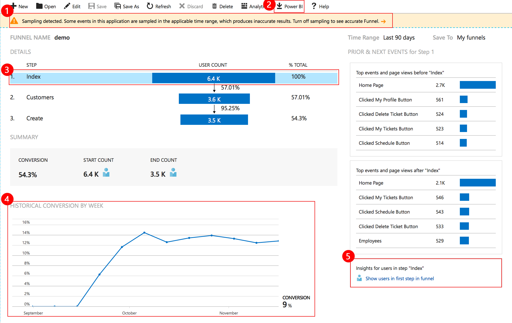

---
title: Azure Application Insights Funnels
description: Learn how you can use Funnels to discover how customers are interacting with your application.
services: application-insights
documentationcenter: ''
author: mrbullwinkle
manager: carmonm
ms.service: application-insights
ms.workload: tbd
ms.tgt_pltfrm: ibiza
ms.devlang: na
ms.topic: article
ms.date: 07/17/2017
ms.author: mbullwin
---

# Discover how customers are using your application with Application Insights Funnels

Understanding the customer experience is of the utmost importance to your business. If your application involves multiple stages, you need to know if most customers are progressing through the entire process, or if they are ending the process at some point. The progression through a series of steps in a web application is known as a *funnel*. You can use Azure Application Insights Funnels to gain insights into your users, and monitor step-by-step conversion rates. 

## Create your funnel
Before you create your funnel, decide on the question you want to answer. For example, you might want to know how many users are viewing the home page, viewing a customer profile, and creating a ticket. In this example, the owners of the Fabrikam Fiber company want to know the percentage of customers who successfully create a customer ticket.

Here are the steps they take to create their funnel.

1. In the Application Insights Funnels tool, select **New**.
1. From the **Time Range** drop-down menu, select **Last 90 days**. Select either **My funnels** or **Shared funnels**.
1. From the **Step 1** drop-down list, select **Index**. 
1. From the **Step 2** list, select **Customer**.
1. From the **Step 3** list, select **Create**.
1. Add a name to the funnel, and select **Save**.

The following screenshot shows an example of the kind of data the Funnels tool generates. The Fabrikam owners can see that during the last 90 days, 54.3 percent of their customers who visited the home page created a customer ticket. They can also see that 2,700 of their customers came to the index from the home page. This might indicate a refresh issue.

### Funnels features
The preceding screenshot includes five highlighted areas. These are features of Funnels. The following list explains more about each corresponding area in the screenshot:
1. If your app is sampled, you will see a sampling banner. Selecting the banner opens a context pane, explaining how to turn sampling off. 
2. You can export your funnel to [Power BI](app-insights-export-power-bi.md).
3. Select a step to see more details on the right. 
4. The historical conversion graph shows the conversion rates over the last 90 days. 
5. Understand your users better by accessing the users tool. You can use filters in each step. 

## Next steps
  * [Usage overview](app-insights-usage-overview.md)
  * [Users, Sessions, and Events](app-insights-usage-segmentation.md)
  * [Retention](app-insights-usage-retention.md)
  * [Workbooks](app-insights-usage-workbooks.md)
  * [Add user context](app-insights-usage-send-user-context.md)
  * [Export to Power BI](app-insights-export-power-bi.md)

