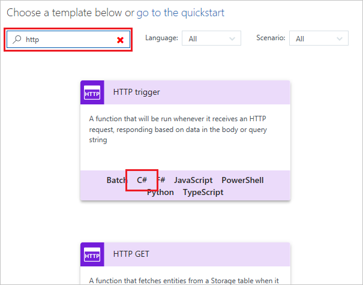
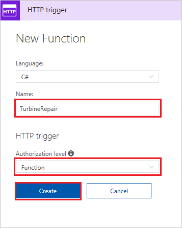
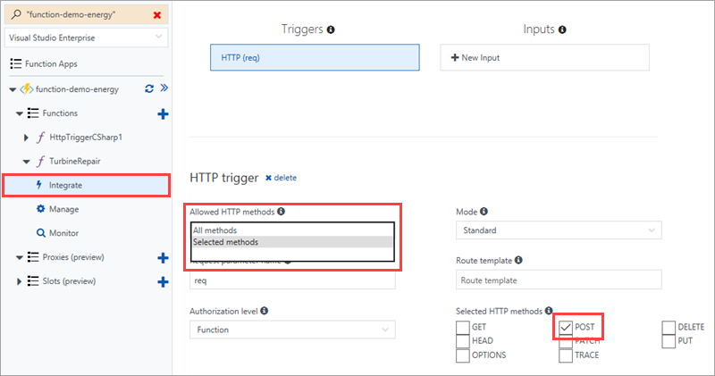
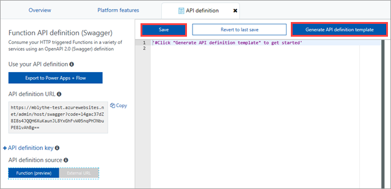
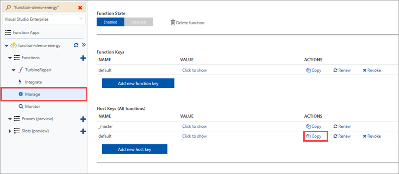
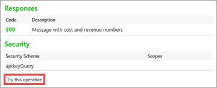
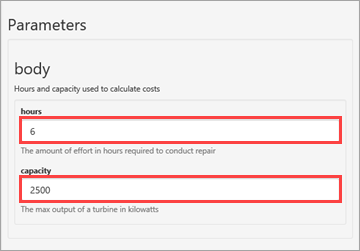

# Create an OpenAPI definition for a function
REST APIs are often described using an OpenAPI definition (formerly known as a [Swagger](http://swagger.io/) file). This definition contains information about what operations are available in an API and how the request and response data for the API should be structured.

In this tutorial, you create a function that determines whether an emergency repair on a wind turbine is cost-effective. You then create an OpenAPI definition for the function app so that the function can be called from other apps and services.

In this tutorial, you learn how to:

> [!div class="checklist"]
> * Create a function in Azure
> * Generate an OpenAPI definition using OpenAPI tools
> * Modify the definition to provide additional metadata
> * Test the definition by calling the function

## Create a function app

You must have a function app to host the execution of your functions. A function app lets you group functions as a logic unit for easier management, deployment, scaling, and sharing of resources. 

[!INCLUDE [Create function app Azure portal](../../includes/functions-create-function-app-portal.md)]


## Create the function

This tutorial uses an HTTP triggered function that takes two parameters: the estimated time to make a turbine repair (in hours); and the capacity of the turbine (in kilowatts). The function then calculates how much a repair will cost, and how much revenue the turbine could make in a 24 hour period.

1. Expand your function app and select the **+** button next to **Functions**. If this is the first function in your function app, select **Custom function**. This displays the complete set of function templates. 

    

2. In the search field, type `http` and then choose **C#** for the HTTP trigger template. 
 
    

3. Type `TurbineRepair` for the function **Name**, choose `Function` for **[Authentication level](functions-bindings-http-webhook.md#http-auth)**, and then select **Create**.  

    

1. Replace the contents of the run.csx file with the following code, then click **Save**:

    ```csharp
    using System.Net;

    const double revenuePerkW = 0.12; 
    const double technicianCost = 250; 
    const double turbineCost = 100;

    public static async Task<HttpResponseMessage> Run(HttpRequestMessage req, TraceWriter log)
    {   

        //Get request body
        dynamic data = await req.Content.ReadAsAsync<object>();
        int hours = data.hours;
        int capacity = data.capacity;

        //Formulas to calculate revenue and cost
        double revenueOpportunity = capacity * revenuePerkW * 24;  
        double costToFix = (hours * technicianCost) +  turbineCost;
        string repairTurbine;

        if (revenueOpportunity > costToFix){
            repairTurbine = "Yes";
        }
        else {
            repairTurbine = "No";
        }

        return req.CreateResponse(HttpStatusCode.OK, new{
            message = repairTurbine,
            revenueOpportunity = "$"+ revenueOpportunity,
            costToFix = "$"+ costToFix         
        }); 
    }
    ```
    This function code returns a message of `Yes` or `No` to indicate whether an emergency repair is cost-effective, as well as the revenue opportunity that the turbine represents, and the cost to fix the turbine. 

1. To test the function, click **Test** at the far right to expand the test tab. Enter the following value for the **Request body**, and then click **Run**.

    ```json
    {
    "hours": "6",
    "capacity": "2500"
    }
    ```

    

    The following value is returned in the body of the response.

    ```json
    {"message":"Yes","revenueOpportunity":"$7200","costToFix":"$1600"}
    ```

Now you have a function that determines the cost-effectiveness of emergency repairs. Next, you generate and modify an OpenAPI definition for the function app.

## Generate the OpenAPI definition

Now you're ready to generate the OpenAPI definition. This definition can be used by other Microsoft technologies, like API Apps, [PowerApps](functions-powerapps-scenario.md) and [Microsoft Flow](../azure-functions/app-service-export-api-to-powerapps-and-flow.md), as well as third party developer tools like [Postman](https://www.getpostman.com/docs/importing_swagger) and [many more packages](http://swagger.io/tools/).

1. Select only the *verbs* that your API supports (in this case POST). This makes the generated API definition cleaner.

    1. On the **Integrate** tab of your new HTTP Trigger function, change **Allowed HTTP methods** to **Selected methods**

    1. In **Selected HTTP methods**, clear every option except **POST**, then click **Save**.

        
        
1. Click your function app name (like **function-demo-energy**) > **Platform features** > **API definition**.

    

1. On the **API definition** tab, click **Function**.

    

    This step enables a suite of OpenAPI options for your function app, including an endpoint to host an OpenAPI file from your function app's domain, an inline copy of the [OpenAPI Editor](http://editor.swagger.io), and an API definition template generator.

1. Click **Generate API definition template** > **Save**.

    

    Azure scans your function app for HTTP Trigger functions and uses the info in functions.json to generate an OpenAPI definition. Here's the definition that is generated:

    ```yaml
    swagger: '2.0'
    info:
    title: function-demo-energy.azurewebsites.net
    version: 1.0.0
    host: function-demo-energy.azurewebsites.net
    basePath: /
    schemes:
    - https
    - http
    paths:
    /api/TurbineRepair:
        post:
        operationId: /api/TurbineRepair/post
        produces: []
        consumes: []
        parameters: []
        description: >-
            Replace with Operation Object
            #http://swagger.io/specification/#operationObject
        responses:
            '200':
            description: Success operation
        security:
            - apikeyQuery: []
    definitions: {}
    securityDefinitions:
    apikeyQuery:
        type: apiKey
        name: code
        in: query
    ```

    This definition is described as a _template_ because it requires more metadata to be a full OpenAPI definition. You'll modify the definition in the next step.

## Modify the OpenAPI definition
Now that you have a template definition, you modify it to provide additional metadata about the API's operations and data structures. In **API definition**, delete the generated definition from `post` to the bottom of the definition, paste in the content below, and click **Save**.

```yaml
    post:
      operationId: CalculateCosts
      description: Determines if a technician should be sent for repair
      summary: Calculates costs
      x-ms-summary: Calculates costs
      x-ms-visibility: important
      produces:
        - application/json
      consumes:
        - application/json
      parameters:
        - name: body
          in: body
          description: Hours and capacity used to calculate costs
          x-ms-summary: Hours and capacity
          x-ms-visibility: important
          required: true
          schema:
            type: object
            properties:
              hours:
                description: The amount of effort in hours required to conduct repair
                type: number
                x-ms-summary: Hours
                x-ms-visibility: important
              capacity:
                description: The max output of a turbine in kilowatts
                type: number
                x-ms-summary: Capacity
                x-ms-visibility: important
      responses:
        200:
          description: Message with cost and revenue numbers
          x-ms-summary: Message
          schema:
           type: object
           properties:
            message:
              type: string
              description: Returns Yes or No depending on calculations
              x-ms-summary: Message 
            revenueOpportunity:
              type: string
              description: The revenue opportunity cost
              x-ms-summary: RevenueOpportunity 
            costToFix:
              type: string
              description: The cost in $ to fix the turbine
              x-ms-summary: CostToFix
      security:
        - apikeyQuery: []
definitions: {}
securityDefinitions:
  apikeyQuery:
    type: apiKey
    name: code
    in: query
```

In this case you could just paste in updated metadata, but it's important to understand the types of modifications we made to the default template:

+ Specified that the API produces and consumes data in a JSON format.

+ Specified the required parameters, with their names and data types.

+ Specified the return values for a successful response, with their names and data types.

+ Provided friendly summaries and descriptions for the API, and its operations and parameters. This is important for people who will use this function.

+ Added x-ms-summary and x-ms-visibility, which are used in the UI for Microsoft Flow and Logic Apps. For more information, see [OpenAPI extensions for custom APIs in Microsoft Flow](https://preview.flow.microsoft.com/documentation/customapi-how-to-swagger/).

> [!NOTE]
> We left the security definition with the default authentication method of API key. You would change this section of the definition if you used a different type of authentication.

For more information about defining API operations, see the [Open API specification](https://swagger.io/specification/#operationObject).

## Test the OpenAPI definition
Before you use the API definition, it's a good idea to test it in the Azure Functions UI.

1. On the **Manage** tab of your function, under **Host Keys**, copy the **default** key.

    

    > [!NOTE]
    >You use this key for testing, and you also use it when you call the API from an app or service.

1. Go back to the API definition: **function-demo-energy** > **Platform features** > **API definition**.

1. In the right pane, click **Authenticate**, enter the API key that you copied, and click **Authenticate**.

    

1. Scroll down and click **Try this operation**.

    

1. Enter values for **hours** and **capacity**.

    

    Notice how the UI uses the descriptions from the API definition.

1. Click **Send Request**, then click the **Pretty** tab to see the output.

    

## Next steps

In this tutorial, you learned how to:

> [!div class="checklist"]
> * Create a function in Azure
> * Generate an OpenAPI definition using OpenAPI tools
> * Modify the definition to provide additional metadata
> * Test the definition by calling the function

Advance to the next topic to learn how to create a PowerApps app that uses the OpenAPI definition you created.
> [!div class="nextstepaction"]
> [Call a function from PowerApps](functions-powerapps-scenario.md)
