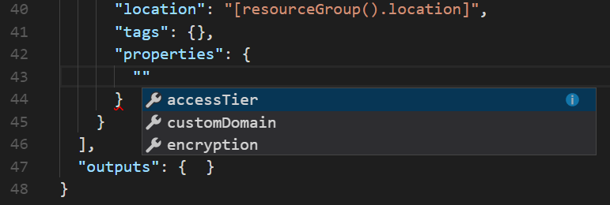
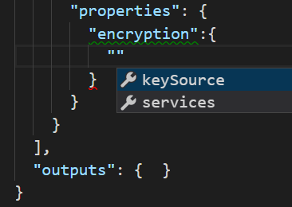
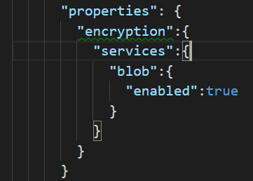
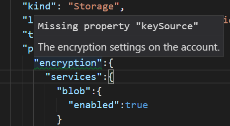

---
title: Create first Azure Resource Manager template | Microsoft Docs
description: A step-by-step guide to creating your first Azure Resource Manager template. It shows you how to use the template reference for a storage account to create the template.
services: azure-resource-manager
documentationcenter: ''
author: tfitzmac
manager: timlt
editor: tysonn

ms.service: azure-resource-manager
ms.workload: multiple
ms.tgt_pltfrm: na
ms.devlang: na
ms.date: 03/30/2018
ms.topic: get-started-article
ms.author: tomfitz
---

# Create and deploy your first Azure Resource Manager template
This topic walks you through the steps of creating your first Azure Resource Manager template. Resource Manager templates are JSON files that define the resources you need to deploy for your solution. To understand the concepts associated with deploying and managing your Azure solutions, see [Azure Resource Manager overview](resource-group-overview.md). If you have existing resources and want to get a template for those resources, see [Export an Azure Resource Manager template from existing resources](resource-manager-export-template.md).

To create and revise templates, you need a JSON editor. [Visual Studio Code](https://code.visualstudio.com/) is a lightweight, open-source, cross-platform code editor. We strongly recommend using Visual Studio Code for creating Resource Manager templates. This article assumes you are using VS Code. If you have another JSON editor (like Visual Studio), you can use that editor.

## Prerequisites

* Visual Studio Code. If needed, install it from [https://code.visualstudio.com/](https://code.visualstudio.com/).
* An Azure subscription. If you don't have an Azure subscription, create a [free account](https://azure.microsoft.com/free/?WT.mc_id=A261C142F) before you begin.
* [Azure PowerShell](/powershell/azure/install-azurerm-ps) or [Azure CLI](/cli/azure/install-azure-cli) installed locally. You need a local installation for this tutorial because your template is saved as a local file. To use Cloud Shell, you must [load your template to a storage account](resource-group-template-deploy-cli.md#deploy-template-from-cloud-shell).

## Create template

Let's start with a simple template that deploys a storage account to your subscription.

1. Select **File** > **New File**. 

   

2. Copy and paste the following JSON syntax into your file:

   ```json
   {
     "$schema": "http://schema.management.azure.com/schemas/2015-01-01/deploymentTemplate.json#",
     "contentVersion": "1.0.0.0",
     "parameters": {
     },
     "variables": {
     },
     "resources": [
       {
         "name": "[concat('storage', uniqueString(resourceGroup().id))]",
         "type": "Microsoft.Storage/storageAccounts",
         "apiVersion": "2016-01-01",
         "sku": {
           "name": "Standard_LRS"
         },
         "kind": "Storage",
         "location": "South Central US",
         "tags": {},
         "properties": {}
       }
     ],
     "outputs": {  }
   }
   ```

   Storage account names have several restrictions that make them difficult to set. The name must be between 3 and 24 characters in length, use only numbers and lower-case letters, and be unique. The preceding template uses the [uniqueString](resource-group-template-functions-string.md#uniquestring) function to generate a hash value. To give this hash value more meaning, it adds the prefix *storage*. 

3. Save this file as **azuredeploy.json** to a local folder.

   

## Deploy template

You are ready to deploy this template. You use either PowerShell or Azure CLI to create a resource group. Then, you deploy a storage account to that resource group.

* For PowerShell, use the following commands from the folder containing the template:

   ```powershell
   Connect-AzureRmAccount
   
   New-AzureRmResourceGroup -Name examplegroup -Location "South Central US"
   New-AzureRmResourceGroupDeployment -ResourceGroupName examplegroup -TemplateFile azuredeploy.json
   ```

* For a local installation of Azure CLI, use the following commands from the folder containing the template:

   ```azurecli
   az login

   az group create --name examplegroup --location "South Central US"
   az group deployment create --resource-group examplegroup --template-file azuredeploy.json
   ```

When deployment finishes, your storage account exists in the resource group.

## Customize the template

The template works fine, but it is not flexible. It always deploys a locally redundant storage to South Central US. The name is always *storage* followed by a hash value. To enable using the template for different scenarios, add parameters to the template.

The following example shows the parameters section with two parameters. The first parameter `storageSKU` enables you to specify the type of redundancy. It limits the values you can pass in to values that are valid for a storage account. It also specifies a default value. The second parameter `storageNamePrefix` is set to allow a maximum of 11 characters. It specifies a default value.

```json
"parameters": {
  "storageSKU": {
    "type": "string",
    "allowedValues": [
      "Standard_LRS",
      "Standard_ZRS",
      "Standard_GRS",
      "Standard_RAGRS",
      "Premium_LRS"
    ],
    "defaultValue": "Standard_LRS",
    "metadata": {
      "description": "The type of replication to use for the storage account."
    }
  },
  "storageNamePrefix": {
    "type": "string",
    "maxLength": 11,
    "defaultValue": "storage",
    "metadata": {
      "description": "The value to use for starting the storage account name. Use only lowercase letters and numbers."
    }
  }
},
```

In the variables section, add a variable named `storageName`. It combines the prefix value from the parameters and a hash value from the [uniqueString](resource-group-template-functions-string.md#uniquestring) function. It uses the [toLower](resource-group-template-functions-string.md#tolower) function to convert all characters to lowercase.

```json
"variables": {
  "storageName": "[concat(toLower(parameters('storageNamePrefix')), uniqueString(resourceGroup().id))]"
},
```

To use these new values for your storage account, change the resource definition:

```json
"resources": [
  {
    "name": "[variables('storageName')]",
    "type": "Microsoft.Storage/storageAccounts",
    "apiVersion": "2016-01-01",
    "sku": {
      "name": "[parameters('storageSKU')]"
    },
    "kind": "Storage",
    "location": "[resourceGroup().location]",
    "tags": {},
    "properties": {}
  }
],
```

Notice that the name of the storage account is now set to the variable that you added. The SKU name is set to the value of the parameter. The location is set the same location as the resource group.

Save your file. 

Your template now looks like:

```json
{
  "$schema": "http://schema.management.azure.com/schemas/2015-01-01/deploymentTemplate.json#",
  "contentVersion": "1.0.0.0",
  "parameters": {
    "storageSKU": {
      "type": "string",
      "allowedValues": [
        "Standard_LRS",
        "Standard_ZRS",
        "Standard_GRS",
        "Standard_RAGRS",
        "Premium_LRS"
      ],
      "defaultValue": "Standard_LRS",
      "metadata": {
        "description": "The type of replication to use for the storage account."
      }
    },   
    "storageNamePrefix": {
      "type": "string",
      "maxLength": 11,
      "defaultValue": "storage",
      "metadata": {
        "description": "The value to use for starting the storage account name. Use only lowercase letters and numbers."
      }
    }
  },
  "variables": {
    "storageName": "[concat(toLower(parameters('storageNamePrefix')), uniqueString(resourceGroup().id))]"
  },
  "resources": [
    {
      "name": "[variables('storageName')]",
      "type": "Microsoft.Storage/storageAccounts",
      "apiVersion": "2016-01-01",
      "sku": {
        "name": "[parameters('storageSKU')]"
      },
      "kind": "Storage",
      "location": "[resourceGroup().location]",
      "tags": {},
      "properties": {}
    }
  ],
  "outputs": {  }
}
```

## Redeploy template

Redeploy the template with different values.

For PowerShell, use:

```powershell
New-AzureRmResourceGroupDeployment -ResourceGroupName examplegroup -TemplateFile azuredeploy.json -storageNamePrefix newstore -storageSKU Standard_RAGRS
```

For Azure CLI, use:

```azurecli
az group deployment create --resource-group examplegroup --template-file azuredeploy.json --parameters storageSKU=Standard_RAGRS storageNamePrefix=newstore
```

## Use autocomplete

So far, your work on the template has consisted of only copying and pasting JSON from this article. However, when developing your own templates, you want to find and specify properties and values that are available for the resource type. VS Code reads the schema for the resource type, and suggests properties and values. To see the autocomplete feature, go the properties element of your template and add a new line. Type a quotation mark, and notice that VS Code immediately suggests names that available within the properties element.



Select **encryption**. Type a colon (:), and VS Code suggests adding a new object.


Press tab or enter to add the object.

Again, type a quotation mark, and see that VS Code now suggests properties that are available for encryption.



Select **services** and continue adding values based on VS Code extensions until you have:

```json
"properties": {
    "encryption":{
        "services":{
            "blob":{
              "enabled":true
            }
        }
    }
}
```

You have enabled blob encryption for the storage account. However, VS Code has identified a problem. Notice that encryption has a warning.



To see the warning, hover over the green line.



You see that the encryption element requires a keySource property. Add a comma after the services object, and add the keySource property. VS Code suggests **"Microsoft.Storage"** as a valid value. When finished, the properties element is:

```json
"properties": {
    "encryption":{
        "services":{
            "blob":{
              "enabled":true
            }
        },
        "keySource":"Microsoft.Storage"
    }
}
```

The final template is:

```json
{
  "$schema": "http://schema.management.azure.com/schemas/2015-01-01/deploymentTemplate.json#",
  "contentVersion": "1.0.0.0",
  "parameters": {
    "storageSKU": {
      "type": "string",
      "allowedValues": [
        "Standard_LRS",
        "Standard_ZRS",
        "Standard_GRS",
        "Standard_RAGRS",
        "Premium_LRS"
      ],
      "defaultValue": "Standard_LRS",
      "metadata": {
        "description": "The type of replication to use for the storage account."
      }
    },   
    "storageNamePrefix": {
      "type": "string",
      "maxLength": 11,
      "defaultValue": "storage",
      "metadata": {
        "description": "The value to use for starting the storage account name. Use only lowercase letters and numbers."
      }
    }
  },
  "variables": {
    "storageName": "[concat(toLower(parameters('storageNamePrefix')), uniqueString(resourceGroup().id))]"
  },
  "resources": [
    {
      "name": "[variables('storageName')]",
      "type": "Microsoft.Storage/storageAccounts",
      "apiVersion": "2016-01-01",
      "sku": {
        "name": "[parameters('storageSKU')]"
      },
      "kind": "Storage",
      "location": "[resourceGroup().location]",
      "tags": {},
      "properties": {
        "encryption":{
          "services":{
            "blob":{
              "enabled":true
            }
          },
          "keySource":"Microsoft.Storage"
        }
      }
    }
  ],
  "outputs": {}
}
```

## Deploy encrypted storage

Again, deploy the template and provide a new storage account name.

For PowerShell, use:

```powershell
New-AzureRmResourceGroupDeployment -ResourceGroupName examplegroup -TemplateFile azuredeploy.json -storageNamePrefix storesecure
```

For Azure CLI, use:

```azurecli
az group deployment create --resource-group examplegroup --template-file azuredeploy.json --parameters storageNamePrefix=storesecure
```

## Clean up resources

When no longer needed, clean up the resources you deployed by deleting the resource group.

For PowerShell, use:

```powershell
Remove-AzureRmResourceGroup -Name examplegroup
```

For Azure CLI, use:

```azurecli
az group delete --name examplegroup
```

## Next steps
* To gain greater assistance with developing templates, you can install a VS Code extension. For more information, see [Use Visual Studio Code extension to create Azure Resource Manager template](resource-manager-vscode-extension.md)
* To learn more about the structure of a template, see [Authoring Azure Resource Manager templates](resource-group-authoring-templates.md).
* To learn about the properties for a storage account, see [storage accounts template reference](/azure/templates/microsoft.storage/storageaccounts).
* To view complete templates for many different types of solutions, see the [Azure Quickstart Templates](https://azure.microsoft.com/documentation/templates/).
