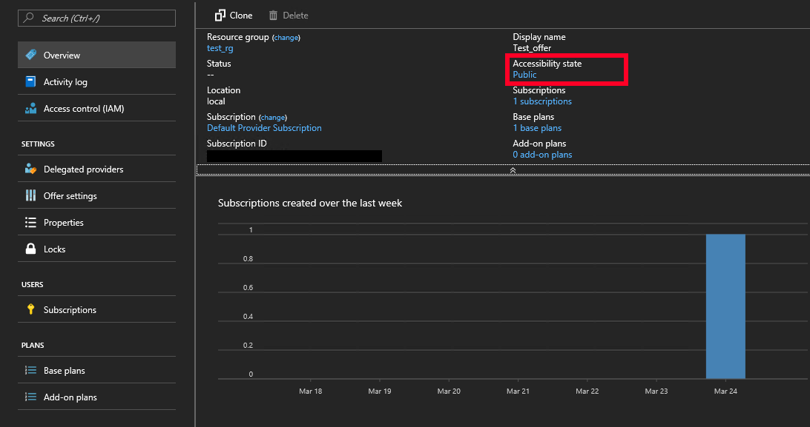

# Create an offer in Azure Stack

[Offers](azure-stack-key-features.md) are groups of one or more plans that providers present to users to purchase or subscribe to. This document shows you how to create an offer that includes the [plan that you created](azure-stack-create-plan.md) in the last step. This offer gives subscribers the ability to provision virtual machines.

1. Sign in to the Azure Stack administrator portal (https://adminportal.local.azurestack.external) > click **New** > **Tenant Offers + Plans** > **Offer**.

   
2. In the **New Offer** pane, fill in **Display Name** and **Resource Name**, and then select a new or existing **Resource Group**. The Display Name is the friendly name for the offer. This friendly name is the only information about the offer that the users see when subscribing. Therefore, be sure to use an intuitive name that helps the user understand what comes with the offer. Only the admin can see the Resource Name. It's the name that admins use to work with the offer as an Azure Resource Manager resource.

   
3. Click **Base plans** to open the **Plan** pane, select the plans you want to include in the offer, and then click **Select**. Click **Create** to create the offer.

   
4. After creating the offer, you can change its state. Offers must be made *public* for users to get the full view when they subscribe. Offers can be:
   - **Public**: Visible to users.
   - **Private**: Only visible to cloud administrators. Useful while drafting the plan or offer, or if the cloud administrator wants to [create each subscription for users](azure-stack-subscribe-plan-provision-vm.md#create-a-subscription-as-a-cloud-operator).
   - **Decommissioned**: Closed to new subscribers. The cloud administrator can use decommissioned to prevent future subscriptions, but leave current subscribers untouched.

   > [!TIP]  
   > Changes to the offer are not immediately visible to the user. To see the changes, users might have to logout and login again to the user portal to see the new offer. 

   To change the state of the offer: 

   - **Version 1803 and later**:  
     On the Overview blade for the offer, click **Accessibility state**, select the state you want to use, like *Public*, and then click **save**. 
 
      

     Alternately, after you access an offer you can goto **Offer settings**, and then select **Accessibility state** to change the state. 

   - **Prior to version 1803**:  
     Click **All Resources**, search for your new offer, click on the new offer, click **Change State**, and then click **Public**.

  
   > [!NOTE] 
   > You can also use PowerShell to create default offers, plans, and quotas. For more information, see [Azure Stack Service Administrator readme](https://github.com/Azure/AzureStack-Tools/tree/master/ServiceAdmin).
   >

### Next steps
[Create subscriptions](azure-stack-subscribe-plan-provision-vm.md)      
[Provision a virtual machine](azure-stack-provision-vm.md)
