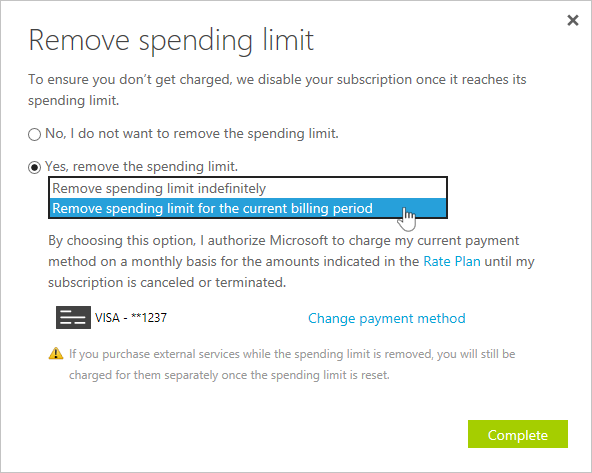

# Understand Azure spending limit and how to remove it

Spending limit in Azure exists to prevent spending over your credit amount. All new customers who sign up for the trial or offers that includes credits over multiple months have the spending limit turned on by default. The spending limit is $0. It can’t be changed. The spending limit isn’t available for subscription types such as Pay-As-You-Go subscriptions and commitment plans. See the [full list of Azure offers and the availability of the spending limit](https://azure.microsoft.com/support/legal/offer-details/).

**Looking for billing alerts?** See [Set up billing or credit alerts for Azure subscriptions](billing-set-up-alerts.md).

## What happens when I reach the spending limit?

When your usage results in charges that exhaust the monthly amounts included with your subscription, the services that you deployed are disabled for the rest of that billing period. 

For example, when you spend all the credit included with your subscription, Cloud Services that you deployed are removed from production and your Azure virtual machines are stopped and de-allocated. The data in your storage accounts and databases are available in a read-only manner.

At the beginning of the next billing period, if your subscription offer includes credits over multiple months, your subscription would be re-enabled automatically. Then you can redeploy your Cloud Services and have full access to your storage accounts and databases.

We send email notifications when you hit the spending limit for your subscription. Sign in to the [Account Center](https://account.windowsazure.com/Subscriptions), and you see notifications about subscriptions that have reached the spending limit.

If you have a Free Trial and reach the spending limit, you can [upgrade to Pay-As-You-Go](billing-upgrade-azure-subscription.md) to remove the spending limit and have the subscription automatically re-enabled.

## Remove the spending limit in Account Center

You can remove the spending limit at any time as long as there's a valid payment method associated with your subscription. For offers that have credit over multiple months, you can also re-enable the spending limit at the beginning of your next billing period.

To remove your spending limit, follow these steps:

1. Sign in to the [Account Center](https://account.windowsazure.com/Subscriptions).
1. Select a subscription.
. If the subscription is disabled due to the spending limit being reached, click this notification: "Subscription reached the Spending Limit and has been disabled to prevent charges." Otherwise, click **Remove spending limit** in the **SUBSCRIPTION STATUS** area.
1. Select an option that is appropriate for you.

|Option|Effect|
|-------|-----|
|Remove spending limit indefinitely|Removes the spending limit without turning it on automatically at the start of the next billing period.|
|Remove spending limit for the current billing period|Removes the spending limit so that it turns back on automatically at the start of the next billing period.|

## Frequently asked questions

### Why would I want to remove the spending limit?

The spending limit could prevent you from deploying or using certain third-party and Microsoft services. Here are the scenarios where you should remove the spending limit on your subscription.

* You plan to deploy first party images like Oracle and services such as Visual Studio Team Services. This scenario causes you to exceed your spending limit almost immediately and causes your subscription to be disabled.
* You have services that cannot be disrupted.
* You have services and resources with settings like virtual IP addresses that you don't want to lose. These settings are lost when the services and resources are de-allocated.

### How do I turn on the spending limit after removing it?

This feature is available only when the spending limit has been removed indefinitely. Change it to turn on automatically at the start of the next billing period.

1. Sign in to the [Account Center](https://account.windowsazure.com/Subscriptions).
1. Click the yellow banner to change the spending limit option.
1. Choose **Turn on spending limit in the next billing period \<start date of billing period\>**

### How do I set a custom spending limit?

We don't have custom spend limits today. However, you can opt in to [use billing alerts to control your spend](billing-set-up-alerts.md).

### Does the spending limit prevent all charges from Azure?

[Some external services published in the Azure Marketplace](billing-understand-your-azure-marketplace-charges.md) cannot be used with your subscription credits, and can incur separate charges even when your spending limit is set. Examples include Visual Studio licenses, Azure Active Directory premium, support plans, and most third-party branded services. When you provision a new external service, a warning is shown to let you know the services are billed separately:

## Need help? Contact support

If you still need help, [contact support](https://portal.azure.com/?#blade/Microsoft_Azure_Support/HelpAndSupportBlade) to get your issue resolved quickly.
