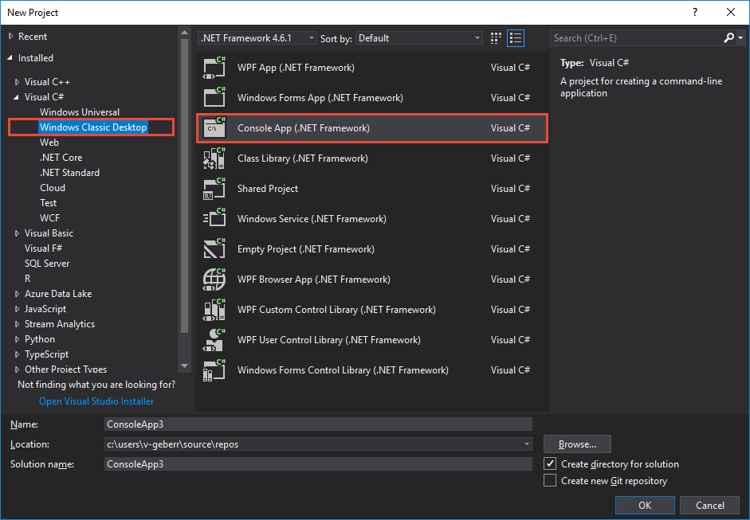
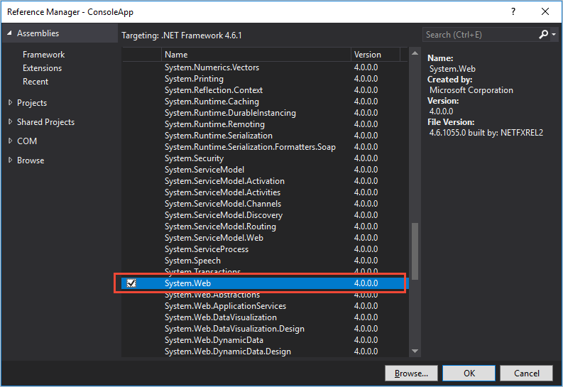
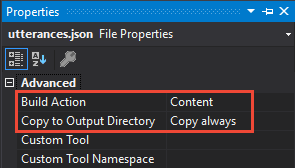

# Quickstart: Add utterances to a LUIS app using C# 
In this quickstart, write a program to add an utterance to an intent using the Authoring APIs in C#.

For more information, see the technical documentation for the [add utterance](https://westus.dev.cognitive.microsoft.com/docs/services/5890b47c39e2bb17b84a55ff/operations/5890b47c39e2bb052c5b9c08), [train](https://westus.dev.cognitive.microsoft.com/docs/services/5890b47c39e2bb17b84a55ff/operations/5890b47c39e2bb052c5b9c45), and [training status](https://westus.dev.cognitive.microsoft.com/docs/services/5890b47c39e2bb17b84a55ff/operations/5890b47c39e2bb052c5b9c46) APIs.

For this article, you need a free [LUIS][LUIS] account in order to author your LUIS application.

## Prerequisites

* Latest [**Visual Studio Community edition**](https://www.visualstudio.com/downloads/). 
* Your LUIS **[authoring key](luis-concept-keys.md#authoring-key)**. You can find this key under Account Settings in the [LUIS](luis-reference-regions.md) website.
* Your existing LUIS [**application ID**](./luis-get-started-create-app.md). The application ID is shown in the application dashboard. The LUIS application with the intents and entities used in the `utterances.json` file must exist prior to running this code. The code in this article does not create the intents and entities. It adds the utterances for existing intents and entities. 
* The **version ID** within the application that receives the utterances. The default ID is "0.1"
* Create a new file named `add-utterances.cs` project in VSCode.

> [!NOTE] 
> The complete C# solution including an example `utterances.json` file are available from the [**LUIS-Samples** Github repository](https://github.com/Microsoft/LUIS-Samples/blob/master/documentation-samples/authoring-api-samples/csharp/).


## Create the project in Visual Studio

In Visual Studio, create a new **Windows Classic Desktop Console** app using the .Net Framework. 



## Add the System.Web dependency

In the Visual Studio project, the project needs **System.Web**. In the Solution Explorer, right-click on **References** and select **Add Reference**.



## Write the C# code
The **Program.cs** file should be:

```CSharp
using System;
using System.Collections.Generic;
using System.Linq;
using System.Text;
using System.Threading.Tasks;

namespace ConsoleApp3
{
    class Program
    {
        static void Main(string[] args)
        {
        }
    }
}

```

Add the System.IO and System.Net.Http dependencies.

   [!code-csharp[Add the dependencies](~/samples-luis/documentation-samples/authoring-api-samples/csharp/ConsoleApp1/Program.cs?range=1-6 "Add the dependencies")]


Add the LUIS IDs and strings to the **Program** class.

   [!code-csharp[Add the LUIS IDs and strings](~/samples-luis/documentation-samples/authoring-api-samples/csharp/ConsoleApp1/Program.cs?range=12-30&dedent=8 "Add the LUIS IDs and strings")]

Add the JsonPrettyPrint method.

   [!code-csharp[Add the JsonPrettyPrint method](~/samples-luis/documentation-samples/authoring-api-samples/csharp/ConsoleApp1/Program.cs?range=32-92 "Add the JsonPrettyPrint method")]

Add the GET request used to create utterances or start training. 

   [!code-csharp[SendGet](~/samples-luis/documentation-samples/authoring-api-samples/csharp/ConsoleApp1/Program.cs?range=93-103 "SendGet")]


Add the POST request used to create utterances or start training. 

   [!code-csharp[SendPost](~/samples-luis/documentation-samples/authoring-api-samples/csharp/ConsoleApp1/Program.cs?range=104-115 "SendPost")]

Add the `AddUtterances` function.

   [!code-csharp[AddUtterances method](~/samples-luis/documentation-samples/authoring-api-samples/csharp/ConsoleApp1/Program.cs?range=116-125 "AddUtterances method")]


Add the `Train` function. 

   [!code-csharp[Train](~/samples-luis/documentation-samples/authoring-api-samples/csharp/ConsoleApp1/Program.cs?range=126-136 "Train")]

Add the `Status` function.

   [!code-csharp[Status](~/samples-luis/documentation-samples/authoring-api-samples/csharp/ConsoleApp1/Program.cs?range=137-143 "Status")]

To manage arguments, add the main code.

   [!code-csharp[Main code](~/samples-luis/documentation-samples/authoring-api-samples/csharp/ConsoleApp1/Program.cs?range=144-172 "Main code")]

## Specify utterances to add
Create and edit the file `utterances.json` to specify the **array of utterances** you want to add to the LUIS app. The intent and entities **must** already be in the LUIS app.

> [!NOTE]
> The LUIS application with the intents and entities used in the `utterances.json` file must exist prior to running the code in `add-utterances.cs`. The code in this article does not create the intents and entities. It only adds the utterances for existing intents and entities.

The `text` field contains the text of the utterance. The `intentName` field must correspond to the name of an intent in the LUIS app. The `entityLabels` field is required. If you don't want to label any entities, provide an empty list as shown in the following example:

If the entityLabels list is not empty, the `startCharIndex` and `endCharIndex` need to mark the entity referred to in the `entityName` field. Both indexes are zero-based counts meaning 6 in the top example refers to the "S" of Seattle and not the space before the capital S.

```json
[
    {
        "text": "go to Seattle",
        "intentName": "BookFlight",
        "entityLabels": [
            {
                "entityName": "Location::LocationTo",
                "startCharIndex": 6,
                "endCharIndex": 12
            }
        ]
    },
    {
        "text": "book a flight",
        "intentName": "BookFlight",
        "entityLabels": []
    }
]
```

## Mark the JSON file as content
In the Solution Explorer, right-click the `utterances.json` and select **Properties**. In the properties windows, mark the **Build Action** of `Content`, and the **Copy to Output Directory** of `Copy Always`.  



## Add an utterance from the command line

Build and run the application from a command line with C# from the /bin/Debug directory. Make sure the utterances.json file is also in this directory.

Calling add-utterances.cs with only the utterance.json as an argument adds but does not train LUIS on the new utterances.
````
ConsoleApp\bin\Debug> ConsoleApp1.exe utterances.json
````

This command-line displays the results of calling the add utterances API. The `response` field is in this format for utterances that was added. The `hasError` is false, indicating the utterance was added.  

```json
    "response": [
        {
            "value": {
                "UtteranceText": "go to seattle",
                "ExampleId": -5123383
            },
            "hasError": false
        },
        {
            "value": {
                "UtteranceText": "book a flight",
                "ExampleId": -169157
            },
            "hasError": false
        }
    ]
```

## Add an utterance and train from the command line
Call add-utterance with the `-train` argument to send a request to train. 

````
ConsoleApp\bin\Debug> ConsoleApp1.exe -train utterances.json
````

> [!NOTE]
> Duplicate utterances aren't added again, but don't cause an error. The `response` contains the ID of the original utterance.

The following JSON shows the result of a successful request to train:

```json
{
    "request": null,
    "response": {
        "statusId": 9,
        "status": "Queued"
    }
}
```

After the request to train is queued, it can take a moment to complete training.

## Get training status from the command line
Call the app with the `-status` argument to check the training status and display status details.

````
ConsoleApp\bin\Debug> ConsoleApp1.exe -status
````

```
Requested training status.
[
   {
      "modelId": "eb2f117c-e10a-463e-90ea-1a0176660acc",
      "details": {
         "statusId": 0,
         "status": "Success",
         "exampleCount": 33,
         "trainingDateTime": "2017-11-20T18:09:11Z"
      }
   },
   {
      "modelId": "c1bdfbfc-e110-402e-b0cc-2af4112289fb",
      "details": {
         "statusId": 0,
         "status": "Success",
         "exampleCount": 33,
         "trainingDateTime": "2017-11-20T18:09:11Z"
      }
   },
   {
      "modelId": "863023ec-2c96-4d68-9c44-34c1cbde8bc9",
      "details": {
         "statusId": 0,
         "status": "Success",
         "exampleCount": 33,
         "trainingDateTime": "2017-11-20T18:09:11Z"
      }
   },
   {
      "modelId": "82702162-73ba-4ae9-a6f6-517b5244c555",
      "details": {
         "statusId": 0,
         "status": "Success",
         "exampleCount": 33,
         "trainingDateTime": "2017-11-20T18:09:11Z"
      }
   },
   {
      "modelId": "37121f4c-4853-467f-a9f3-6dfc8cad2763",
      "details": {
         "statusId": 0,
         "status": "Success",
         "exampleCount": 33,
         "trainingDateTime": "2017-11-20T18:09:11Z"
      }
   },
   {
      "modelId": "de421482-753e-42f5-a765-ad0a60f50d69",
      "details": {
         "statusId": 0,
         "status": "Success",
         "exampleCount": 33,
         "trainingDateTime": "2017-11-20T18:09:11Z"
      }
   },
   {
      "modelId": "80f58a45-86f2-4e18-be3d-b60a2c88312e",
      "details": {
         "statusId": 0,
         "status": "Success",
         "exampleCount": 33,
         "trainingDateTime": "2017-11-20T18:09:11Z"
      }
   },
   {
      "modelId": "c9eb9772-3b18-4d5f-a1e6-e0c31f91b390",
      "details": {
         "statusId": 0,
         "status": "Success",
         "exampleCount": 33,
         "trainingDateTime": "2017-11-20T18:09:11Z"
      }
   },
   {
      "modelId": "2afec2ff-7c01-4423-bb0e-e5f6935afae8",
      "details": {
         "statusId": 0,
         "status": "Success",
         "exampleCount": 33,
         "trainingDateTime": "2017-11-20T18:09:11Z"
      }
   },
   {
      "modelId": "95a81c87-0d7b-4251-8e07-f28d180886a1",
      "details": {
         "statusId": 0,
         "status": "Success",
         "exampleCount": 33,
         "trainingDateTime": "2017-11-20T18:09:11Z"
      }
   }
]
```

## Next steps

 
> [!div class="nextstepaction"] 
> [Build a LUIS app programmatically](luis-tutorial-node-import-utterances-csv.md) 

> [Authoring APIs](https://aka.ms/luis-authoring-api)

[LUIS]: luis-reference-regions.md#luis-website
