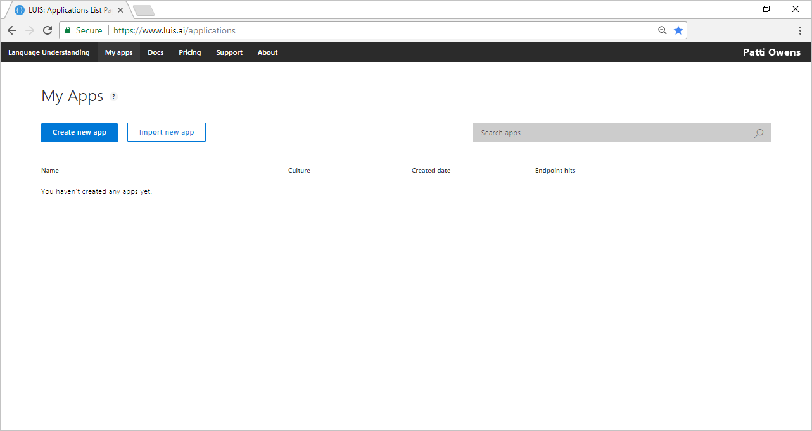
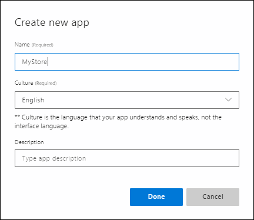
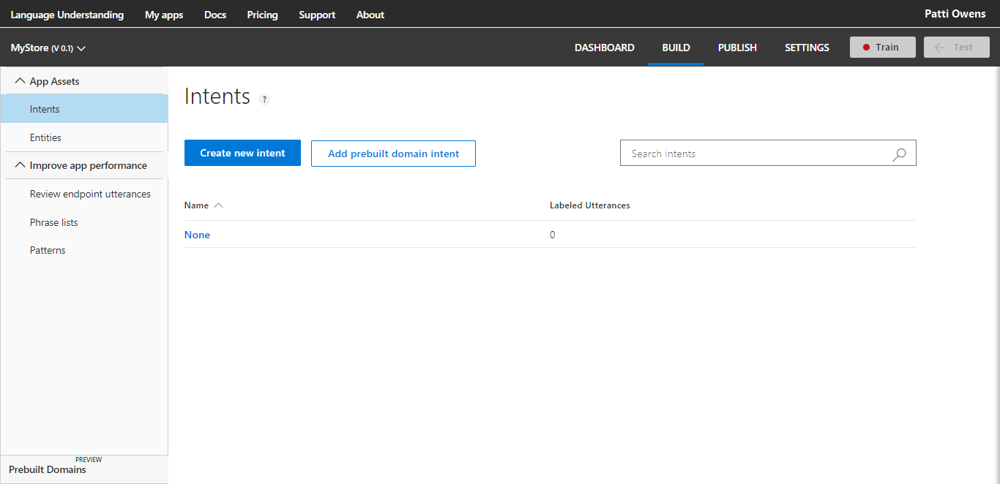
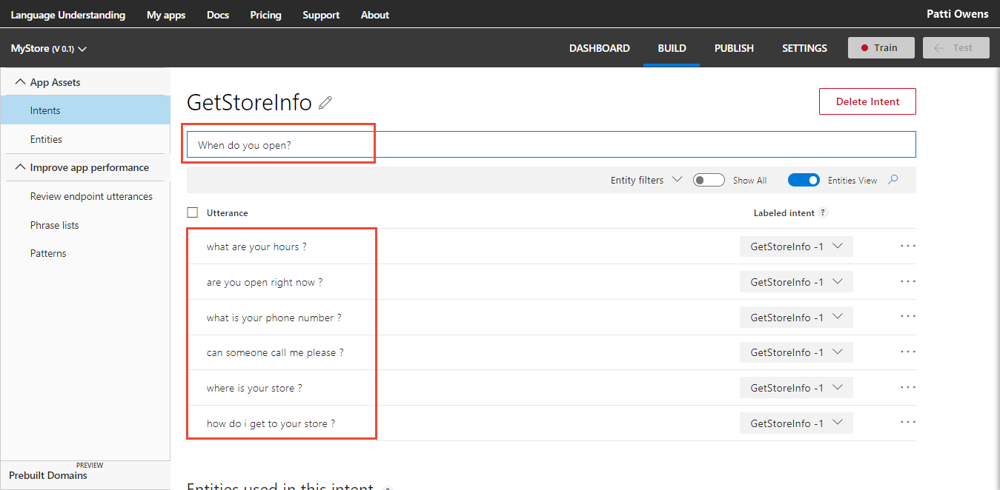

# Quickstart: Create app with intents
In this quickstart, you create an app that demonstrates how to use intents to determine the user's intention based on the utterance they submit to the app.

This simple app has two intentions. The first intent's purpose is to identify when a user wants store information such as hours, and location. The second intent's purpose is to identify every other type of utterance. 

Once the type of utterance is identified, LUIS is done. The calling application or chat bot then takes that identification and fulfills the request -- in whatever way the app or chat bot is designed to do. 

For this article, you need a free [LUIS][LUIS] account in order to author your LUIS application.

## Create a new app
1. Log in to the [LUIS][LUIS] website. Make sure to log in to the region where you need the LUIS endpoints published.

2. On the [LUIS][LUIS] website, select **Create new app**.  

    [](media/luis-quickstart-intents-only/app-list.png#lightbox)

3. In the pop-up dialog, enter the name `MyStore`. 

    

4. When that process finishes, the app shows the **Intents** page with the **None** Intent. 

    [](media/luis-quickstart-intents-only/intents-list.png#lightbox)

5. Select **Create new intent**. Enter the new intent name `GetStoreInfo`. This intent should be selected any time a user wants information about your store such as what you sell, what hours you are open, and how to contact you.

    By creating an intent, you are creating a category of information that you want to identify. Giving the category a name allows any other application that uses the LUIS query results to use that category name to find an appropriate answer. LUIS won't answer these questions, only identify what type of information is being asked for in natural language. 

6. Add seven utterances to the `GetStoreInfo` intent that you expect a user to ask for, such as:

    | Example utterances|
    |--|
    |When do you open?|
    |What are your hours?|
    |Are you open right now?|
    |What is your phone number?|
    |Can someone call me please?|
    |Where is your store?|
    |How do I get to your store?|

    [](media/luis-quickstart-intents-only/utterance-getstoreinfo.png#lightbox)

7. The LUIS app currently has no utterances for the **None** intent. It needs utterances that you don't want the app to answer, so it has to have utterances in the **None** intent. Do not leave it empty. 
    
    Select **Intents** from the left panel. Select the **None** intent. Add three utterances that your user might enter but are not relevant to your app. If the app is about your store, some good **None** utterances are:

    | Example utterances|
    |--|
    |Cancel!|
    |Good bye|
    |What is going on?|

    In your LUIS-calling application, such as a chat bot, if LUIS returns the **None** intent for an utterance, your bot can ask if the user wants to end the conversation. The bot can also give more directions for continuing the conversation if the user doesn't want to end it. 

8. In the top right side of the LUIS website, select the **Train** button. 

    

    Training is complete when you see the green status bar at the top of the website confirming success.

    

9. In the top right side of the LUIS website, select the **Publish** button. Select the Production slot and the **Publish** button. Publishing is complete when you see the green status bar at the top of the website confirming success.

10. On the **Publish** page, select the **endpoint** link at the bottom of the page. This action opens another browser window with the endpoint URL in the address bar. Go to the end of the URL in the address and enter `When do you open next?`. The last querystring parameter is `q`, the utterance **q**uery. This utterance is not the same as any of the example utterances in step 4 so it is a good test and should return the `GetStoreInfo` utterances. 

    ```
    {
      "query": "When do you open next?",
      "topScoringIntent": {
        "intent": "MyStore",
        "score": 0.984749258
      },
      "intents": [
        {
          "intent": "MyStore",
          "score": 0.984749258
        },
        {
          "intent": "None",
          "score": 0.2040639
        }
      ],
      "entities": []
    }
    ```

## What has this LUIS app accomplished?
This app, with just two intents, identified a natural language query that is of the same intention but worded differently. 

The JSON result identifies the top scoring intent `GetStoreInfo` with a score of 0.984749258. All scores are between 1 and 0, with the better score being close to 1. The `None` intent's score is 0.2040639, much closer to zero. 

## Where is this LUIS data used? 
LUIS is done with this request. The calling application, such as a chat bot, can take the topScoringIntent result and either find information (not stored in LUIS) to answer the question or can send the user to the store's website page containing the information. There are other programmatic options for the bot or calling application. LUIS doesn't do that work. LUIS only determines what the user's intention is. 

## What about entities? 
This LUIS app is so simple that it doesn't need entities yet. 

## Clean up resources
When no longer needed, delete the LUIS app. To do so, select the three dot menu (...) to the right of the app name in the app list, select **Delete**. On the pop-up dialog **Delete app?**, select **Ok**.

## Next steps

> [!div class="nextstepaction"]
> [Learn how to add a simple entity to your app](luis-quickstart-primary-and-secondary-data.md)

Add the **number** [prebuilt entity](add-entities.md#add-prebuilt-entity) to extract the number for each drink type. 

Add the **datetimeV2** [prebuilt entity](add-entities.md#add-prebuilt-entity) to extract dates, times, and datetime ranges.


<!--References-->
[LUIS]: luis-reference-regions.md#luis-website
