# Use patterns to improve predictions

This tutorial demonstrates how to use patterns to increase intent and entity prediction.  

In this tutorial, you learn:

> [!div class="checklist"]
* How to identify that a pattern would help your app
* How to create a pattern 
* How to use prebuilt and custom entities in a pattern 
* How to verify pattern prediction improvements
* How to add a role to an entity to find contextually-based entities
* How to add a Pattern.any to find free-form entities

## Prerequisites

> [!div class="checklist"]
> * For this article, you also need a [LUIS][LUIS] account in order to author your LUIS application.

> [!Tip]
> If you do not already have a subscription, you can register for a [free account](https://azure.microsoft.com/free/).

## Import HumanResources app
This tutorial imports a HumanResources app. The app has three intents: None, GetEmployeeOrgChart, GetEmployeeBenefits. The app has two entities: Prebuilt number and Employee. The Employee entity is a simple entity to extract an employee's name. 

1. Create a new LUIS app file and name it `HumanResources.json`. 

2. Copy the following app definition into the file:
<!-- TBD: Post build release -- move to samples and link from there -->
    ```JSON
    {
      "luis_schema_version": "2.3.0",
      "versionId": "0.1",
      "name": "HumanResources",
      "desc": "",
      "culture": "en-us",
      "intents": [
        {
          "name": "GetEmployeeBenefits"
        },
        {
          "name": "GetEmployeeOrgChart"
        },
        {
          "name": "None"
        }
      ],
      "entities": [
        {
          "name": "Employee",
          "roles": []
        }
      ],
      "composites": [],
      "closedLists": [],
      "patternAnyEntities": [],
      "regex_entities": [],
      "prebuiltEntities": [
        {
          "name": "number",
          "roles": []
        }
      ],
      "model_features": [],
      "regex_features": [],
      "patterns": [],
      "utterances": [
        {
          "text": "did you watch the show last night?",
          "intent": "None",
          "entities": []
        },
        {
          "text": "does ilene chavez have any sl?",
          "intent": "GetEmployeeBenefits",
          "entities": [
            {
              "entity": "Employee",
              "startPos": 5,
              "endPos": 16
            }
          ]
        },
        {
          "text": "does lottie change have 40 hours of pto?",
          "intent": "GetEmployeeBenefits",
          "entities": [
            {
              "entity": "Employee",
              "startPos": 5,
              "endPos": 17
            }
          ]
        },
        {
          "text": "how many days of sick leave does santos mahaffey have?",
          "intent": "GetEmployeeBenefits",
          "entities": [
            {
              "entity": "Employee",
              "startPos": 33,
              "endPos": 47
            }
          ]
        },
        {
          "text": "how many hours of paid time off does jody pardo have?",
          "intent": "GetEmployeeBenefits",
          "entities": [
            {
              "entity": "Employee",
              "startPos": 37,
              "endPos": 46
            }
          ]
        },
        {
          "text": "is helen walton on maternity leave?",
          "intent": "GetEmployeeBenefits",
          "entities": [
            {
              "entity": "Employee",
              "startPos": 3,
              "endPos": 14
            }
          ]
        },
        {
          "text": "is there blue in the color green?",
          "intent": "None",
          "entities": []
        },
        {
          "text": "that is too hot!",
          "intent": "None",
          "entities": []
        },
        {
          "text": "who are virgie benjamin's subordinates?",
          "intent": "GetEmployeeOrgChart",
          "entities": [
            {
              "entity": "Employee",
              "startPos": 8,
              "endPos": 22
            }
          ]
        },
        {
          "text": "who does adrian garcia report to?",
          "intent": "GetEmployeeOrgChart",
          "entities": [
            {
              "entity": "Employee",
              "startPos": 9,
              "endPos": 21
            }
          ]
        },
        {
          "text": "who is dina's manager?",
          "intent": "GetEmployeeOrgChart",
          "entities": [
            {
              "entity": "Employee",
              "startPos": 7,
              "endPos": 10
            }
          ]
        },
        {
          "text": "who is mattie rivas manager?",
          "intent": "GetEmployeeOrgChart",
          "entities": [
            {
              "entity": "Employee",
              "startPos": 7,
              "endPos": 18
            }
          ]
        },
        {
          "text": "who reports to magdalena joseph",
          "intent": "GetEmployeeOrgChart",
          "entities": [
            {
              "entity": "Employee",
              "startPos": 15,
              "endPos": 30
            }
          ]
        }
      ]
    }
    ```

3. On the LUIS **Apps** page, select **Import new app**. 

4. In the **Import new app** dialog, select the `HumanResources.json` file you created in step 1.

5. Select the **GetEmployeeOrgChart** intent, then change from **Entities view** to **Tokens view**. Several example utterances are listed. Each utterance contains a name, which is an Employee entity. Notice that each name is different and that the arrangement of the wording is different for each utterance. This diversity helps LUIS learn a wide range of utterances.

    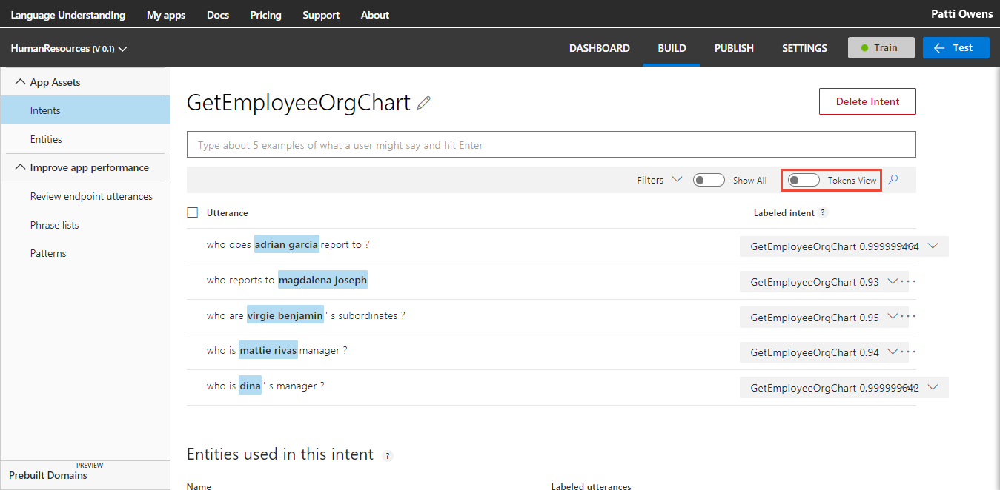

6. Select **Train** in the top navigation bar to train the app. Wait for the green success bar.

7. Select **Test** in the top panel. Enter `Who does Patti Owens report to?` then select enter. Select **Inspect** under the utterance to see more information about the test.
    
    The employee name, Patti Owens, has not been used in an example utterance yet. This is a test to see how well LUIS learned this utterance is for the `GetEmployeeOrgChart` intent and the Employee entity should be `Patti Owens`. The result should be below 50% (.50) for the `GetEmployeeOrgChart` intent. While the intent is correct, the score is low. The Employee entity is also correctly identified as `Patti Owens`. Patterns increase this initial prediction score. 

    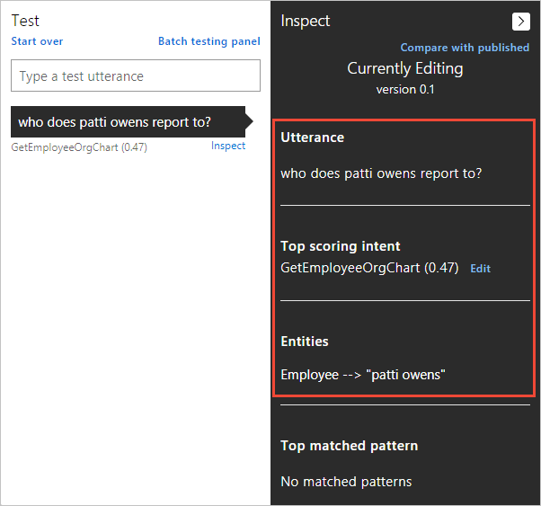

8. Close the test panel by selecting the **Test** button in the top navigation. 

## Patterns teach LUIS common utterances with fewer examples
Because of the nature of the human resource domain, there are a few common ways of asking about employee relationships in organizations. For example:

```
Who does Mike Jones report to?
Who reports to Mike Jones? 
```

These utterances are too close to determine the contextual uniqueness of each without providing many utterance examples. By adding a pattern for an intent, LUIS learns common utterance patterns for an intent without supplying many utterance examples. 

Example template utterances for this intent include:

```
Who does {Employee} report to?
Who reports to {Employee}? 
```

The pattern is a combination of regular expression matching and machine learning. Next, provide some template utterance examples for LUIS to learn the pattern. These examples, along with the intent utterances, give LUIS a better understanding of what utterances fit the intent and where, within the utterance, the entity exists. <!--A pattern is specific to an intent. You can't duplicate the same pattern on another intent. That would confuse LUIS, which lowers the prediction score. -->

## Add the template utterances

1. In the left navigation, under **Improve app performance**, select **Patterns** from the left navigation.

2. Select the **GetEmployeeOrgChart** intent, then enter the following template utterances, one at a time, selecting enter after each template utterance:

    ```
    Does {Employee} have {number} subordinates?
    Does {Employee} have {number} direct reports?
    Who does {Employee} report to?
    Who reports to {Employee}?
    Who is {Employee}'s manager?
    Who are {Employee}'s subordinates?
    ```

    The `{Employee}` syntax marks the entity location within the template utterance as well as which entity it is. 

    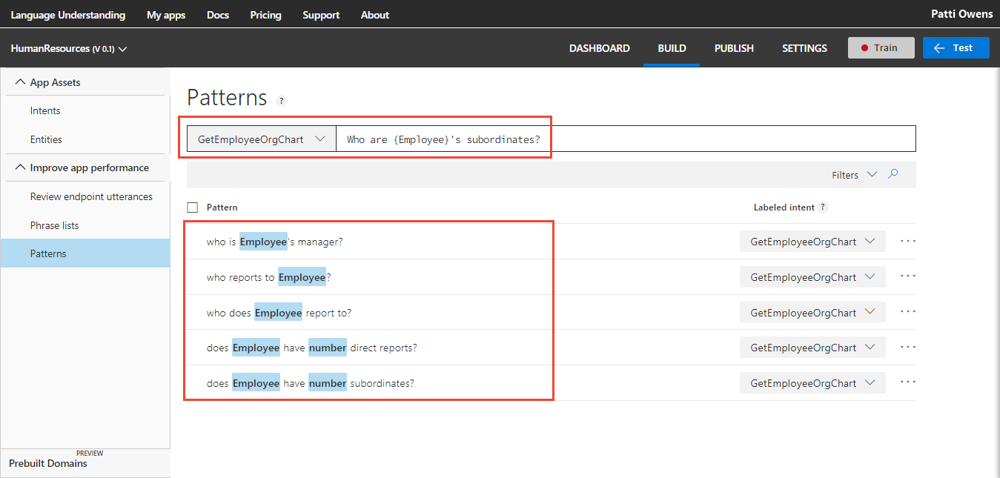

3. Select **Train** in the top navigation bar. Wait for the green success bar.

4. Select **Test** in the top panel. Enter `Who does Patti Owens report to?` in the text box. Select Enter. This is the same utterance tested in the previous section. The result should be higher for the `GetEmployeeOrgChart` intent. 

    The score is now much better. LUIS learned the pattern relevant to the intent without providing many examples.

    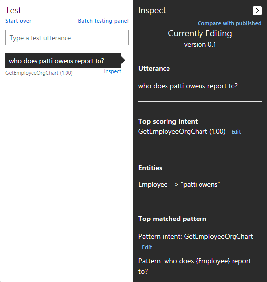

    The entity is found first, then the pattern is found, indicating the intent. If you have a test result where the entity is not detected, and therefore the pattern is not found, you need to add more example utterances on the intent (not the pattern). 

5. Close the test panel by selecting the **Test** button in the top navigation.

## Use an entity with a role in a pattern
The LUIS app is used to help move employees from one location to another. An example utterance is `Move Bob Jones from Seattle to Los Colinas`. Each location in the utterance has a different meaning. Seattle is the originating location and Los Colinas is the destination location for the move. In order to differentiate those locations in the pattern, in the following sections you create a simple entity for location with two roles: origin and destination. 

### Create a new intent for moving people and assets
Create a new intent for any utterances that are about moving people or assets.

1. Select **Intents** from left navigation
2. Select **Create new intent**
3. Name the new intent `MoveAssetsOrPeople`
4. Add example utterances:

    ```
    Move Bob Jones from Seattle to Los Colinas
    Move Dave Cooper from Redmond to Seattle
    Move Jim Smith from Toronto to Vancouver
    Move Jill Benson from Boston to London
    Move Travis Hinton from Portland to Orlando
    ```
    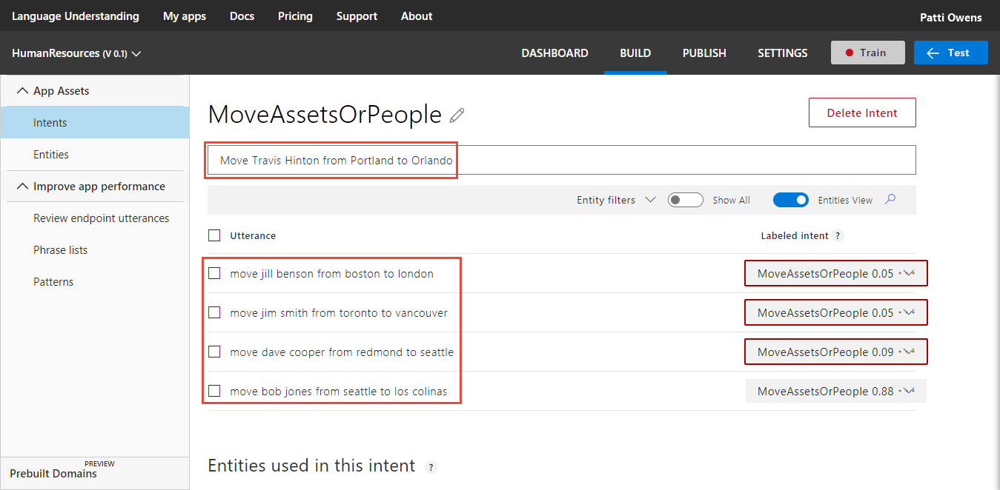

    The purpose of the example utterances is to give enough examples. If, later in the test, the location entity isn't detected, and consequently the pattern isn't detected, come back to this step and add more examples. Then train and test again. 

5. Mark the entities in the example utterances with the Employee entity by selecting the first name then the last name in an utterance, then selecting the Employee entity in the list.

    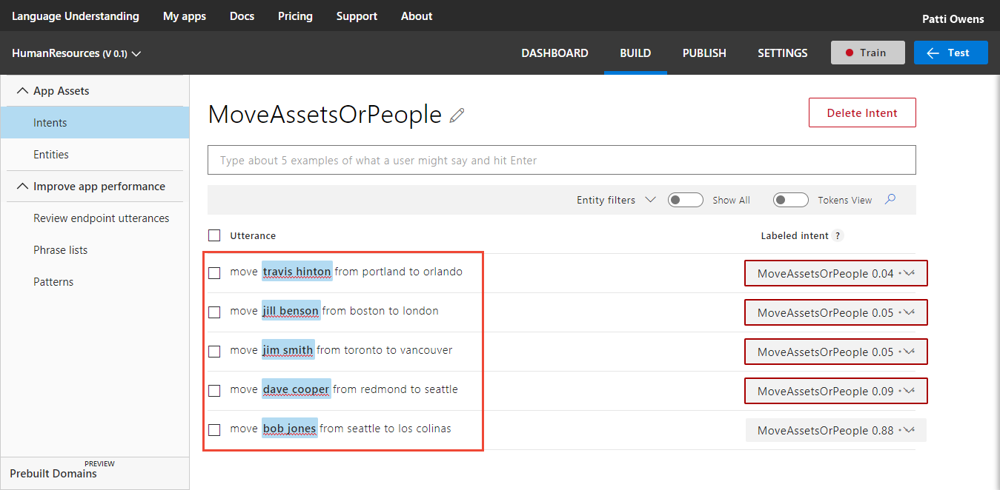

6. Select the text `portland` in the utterance `move travis hinton from portland to orlando`. In the pop-up dialog, enter the new entity name `Location`, and select **Create new entity**. Choose the **Simple** entity type and select **Done**.

    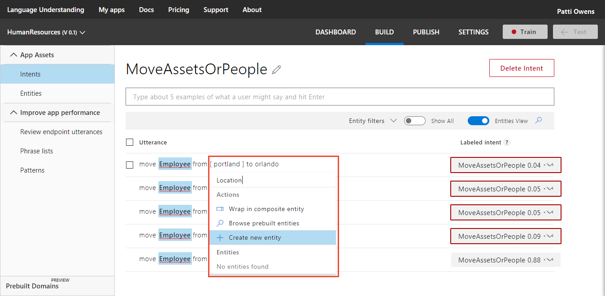

    Mark the rest of the location names in the utterances. 

    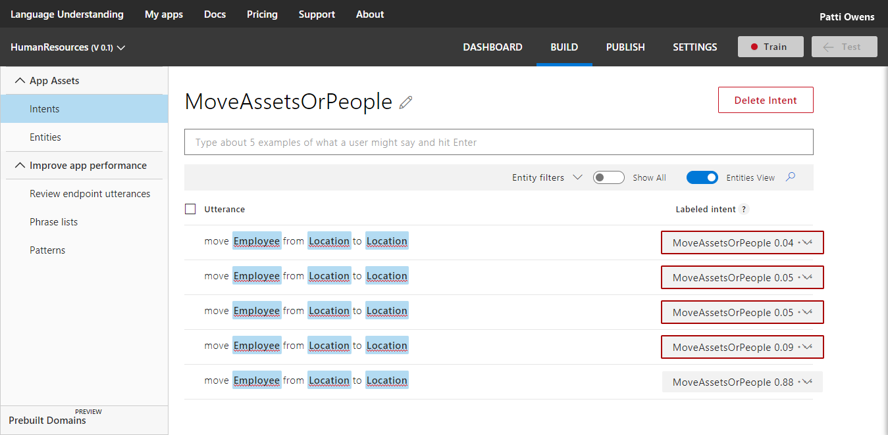

    The pattern of word choice and order is obvious in the previous image. If you were **not** using patterns, and the utterances on the intent have an obvious pattern, that is a good indication you should be using patterns. 

    If you expect a wide variety of utterances, instead of a pattern, these would be the wrong example utterances. In that case, you would want widely varying utterances in term or word choice, utterance length, and entity placement. 

<!--TBD: what guidance to move from hier entities to patterns with roles -->
<!--    The [Hierarchical entity quickstart](luis-quickstart-intent-and-hier-entity.md) uses the  same idea of location but uses child entities to find origin and destination locations. 
-->
### Add role to location entity 
Roles can only be used for patterns. Add the roles of Origin and Destination to the Location entity. 

1. Select **Entities** in the left navigation, then **Location** from the list of entities.

2. Add `Origin` and `Destination` roles to the entity.

    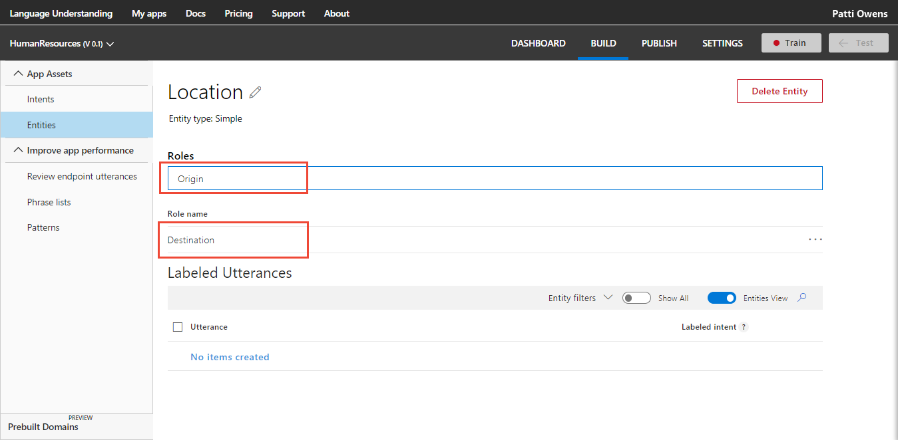

    The roles are not marked on the MoveAssetsOrPeople intent page because roles don't exist on intent utterances. They only exist on pattern template utterances. 

### Add template utterances that uses location and destination roles
Add template utterances that use the new entity.

1. Select **Patterns** from the left navigation.

2. Select the **MoveAssetsOrPeople** intent.

3. Enter a new template utterance using the new entity `Move {Employee} from {Location:Origin} to {Location:Destination}`. The syntax for an entity and role inside a template utterance is `{entity:role}`.

    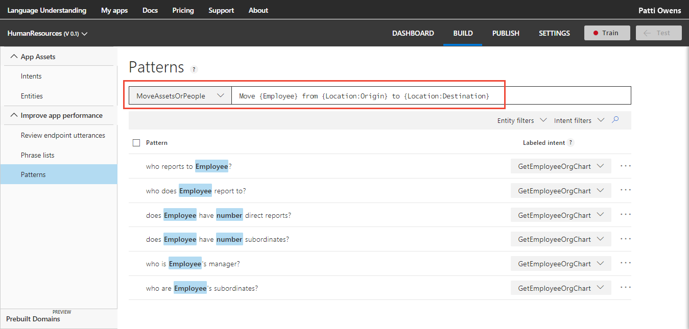

4. Train the app for the new intent, entity, and pattern.

### Test the new pattern for role data extraction
Validate the new pattern with a test.

1. Select **Test** in the top panel. 
2. Enter the utterance `Move Tammi Carlson from Bellingham to Winthrop`.
3. Select **Inspect** under the result to see the test results for entity and intent.

    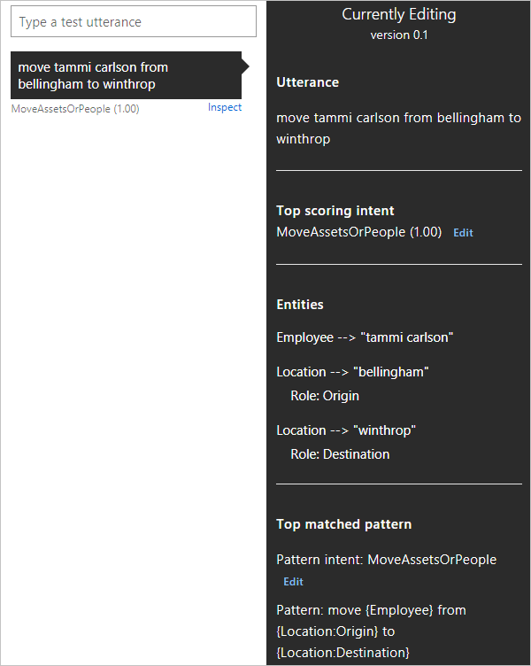

    The entities are found first, then the pattern is found, indicating the intent. If you have a test result where the entities are not detected, and therefore the pattern is not found, you need to add more example utterances on the intent (not the pattern). 

4. Close the test panel by selecting the **Test** button in the top navigation.

## Use a Pattern.any entity to find free-form entities in a pattern
This HumanResources app also helps employees find company forms. Many of the forms have titles that are varying in length. The varying length includes phrases that may confuse LUIS about where the form name ends. Using a **Pattern.any** entity in a pattern allows you to specify the beginning and end of the form name so LUIS correctly extracts the form name. 

### Create a new intent for the form
Create a new intent for utterances that are looking for forms.

1. Select **Intents** from left navigation.

2. Select **Create new intent**.

3. Name the new intent `FindForm`.

4. Add an example utterance.

    ```
    `Where is the form What to do when a fire breaks out in the Lab and who needs to sign it after I read it?`
    ```

    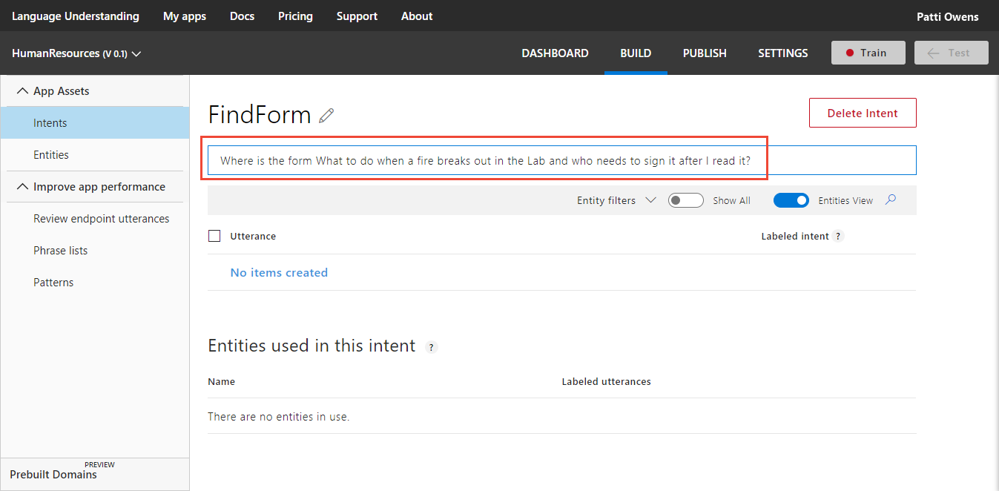

    The form title is `What to do when a fire breaks out in the Lab`. The utterance is asking for the location of the form and is also asking who needs to sign it validating the employee read it. Without a Pattern.any entity, it would be difficult to understand where the form title ends and extract the form title as an entity of the utterance.

### Create a Pattern.any entity for the form title
The Pattern.any entity allows for entities of varying length. It only works in a pattern because the pattern marks the beginning and end of the entity. If you find that your pattern, when it includes a Pattern.any, extracts entities incorrectly, use an [explicit list](luis-concept-patterns.md#explicit-lists) to correct this problem. 

1. Select **Entities** in the left navigation.

2. Select **Create new entity**. 

3. Name the entity `FormName` with type **Pattern.any**. For this specific tutorial, you do not need to add any roles to the entity.

    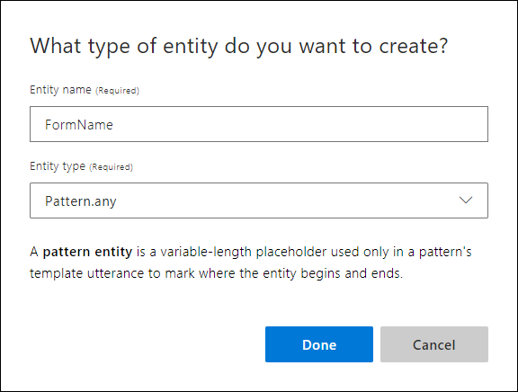

### Add a pattern that uses the Pattern.any

1. Select **Patterns** from the left navigation.

2. Select the **FindForm** intent.

3. Enter a template utterance using the new entity `Where is the form {FormName} and who needs to sign it after I read it?`

    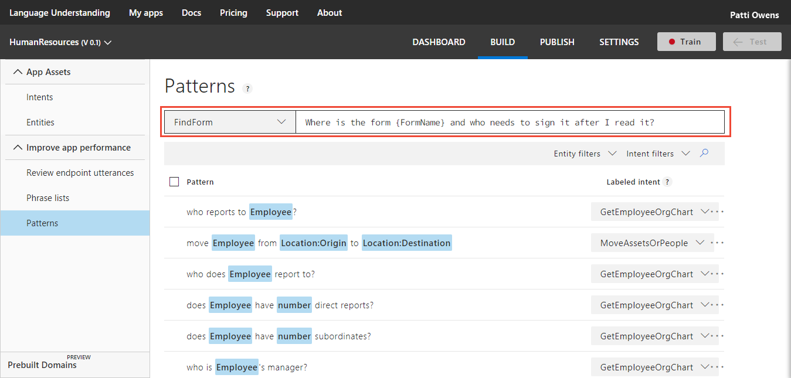

4. Train the app for the new intent, entity, and pattern.

### Test the new pattern for free-form data extraction
1. Select **Test** from the top bar to open the test panel. 

2. Enter the utterance `Where is the form Understand your responsibilities as a member of the community and who needs to sign it after I read it?`.

3. Select **Inspect** under the result to see the test results for entity and intent.

    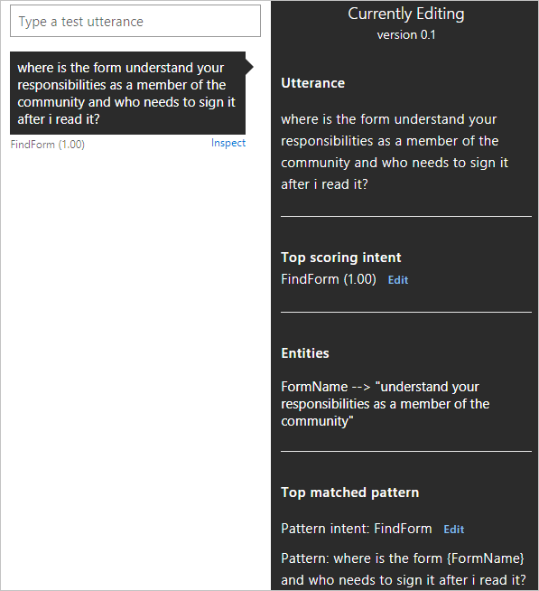

    The entity is found first, then the pattern is found, indicating the intent. If you have a test result where the entities are not detected, and therefore the pattern is not found, you need to add more example utterances on the intent (not the pattern).

4. Close the test panel by selecting the **Test** button in the top navigation.

## Next steps

> [!div class="nextstepaction"]
> [Learn how to improve accuracy with batch testing](luis-tutorial-batch-testing.md)

[LUIS]: luis-reference-regions.md