# Load data into Azure Data Lake Store by using Azure Data Factory

[Azure Data Lake Store](../data-lake-store/data-lake-store-overview.md) is an enterprise-wide hyper-scale repository for big data analytic workloads. Azure Data Lake lets you capture data of any size, type, and ingestion speed. The data is captured in a single place for operational and exploratory analytics.

Azure Data Factory is a fully managed cloud-based data integration service. You can use the service to populate the lake with data from your existing system and save time when building your analytics solutions.

Azure Data Factory offers the following benefits for loading data into Azure Data Lake Store:

* **Easy to set up**: An intuitive 5-step wizard with no scripting required.
* **Rich data store support**: Built-in support for a rich set of on-premises and cloud-based data stores. For a detailed list, see the table of [Supported data stores](copy-activity-overview.md#supported-data-stores-and-formats).
* **Secure and compliant**: Data is transferred over HTTPS or ExpressRoute. The global service presence ensures that your data never leaves the geographical boundary.
* **High performance**: Up to 1-GB/s data loading speed into Azure Data Lake Store. For details, see [Copy activity performance](copy-activity-performance.md).

This article shows you how to use the Data Factory Copy Data tool to _load data from Amazon S3 into Azure Data Lake Store_. You can follow similar steps to copy data from other types of data stores.

> [!NOTE]
> For more information, see [Copy data to or from Azure Data Lake Store by using Azure Data Factory](connector-azure-data-lake-store.md).
>
> This article applies to version 2 of Azure Data Factory, which is currently in preview. If you're using version 1 of the Data Factory service, which is generally available (GA), see [Copy Activity in Azure Data Factory version 1](v1/data-factory-data-movement-activities.md).

## Prerequisites

* Azure subscription: If you don't have an Azure subscription, create a [free account](https://azure.microsoft.com/free/) before you begin.
* Azure Data Lake Store: If you don't have a Data Lake Store account, see the instructions in [Create a Data Lake Store account](../data-lake-store/data-lake-store-get-started-portal.md#create-an-azure-data-lake-store-account).
* Amazon S3: This article shows how to copy data from Amazon S3. You can use other data stores by following similar steps.

## Create a data factory

1. On the left menu, select **New** > **Data + Analytics** > **Data Factory**:
   
   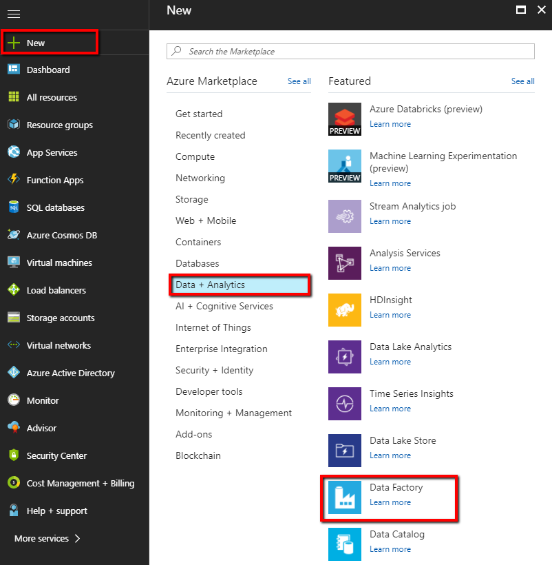
2. In the **New data factory** page, provide values for the fields that are shown in the following image: 
      
   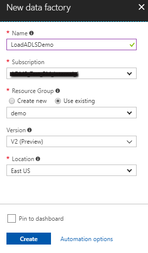
 
    * **Name**: Enter a globally unique name for your Azure data factory. If you receive the error "Data factory name \"LoadADLSDemo\" is not available," enter a different name for the data factory. For example, you could use the name _**yourname**_**ADFTutorialDataFactory**. Try creating the data factory again. For the naming rules for Data Factory artifacts, see [Data Factory naming rules](naming-rules.md).
    * **Subscription**: Select your Azure subscription in which to create the data factory. 
    * **Resource Group**: Select an existing resource group from the drop-down list, or select the **Create new** option and enter the name of a resource group. To learn about resource groups, see [Using resource groups to manage your Azure resources](../azure-resource-manager/resource-group-overview.md).  
    * **Version**: Select **V2 (Preview)**.
    * **Location**: Select the location for the data factory. Only supported locations are displayed in the drop-down list. The data stores that are used by data factory can be in other locations and regions. These data stores include Azure Data Lake Store, Azure Storage, Azure SQL Database, and so on.

3. Select **Create**.
4. After creation is complete, go to your data factory. You see the **Data Factory** home page as shown in the following image: 
   
   

   Select the **Author & Monitor** tile to launch the Data Integration Application in a separate tab.

## Load data into Azure Data Lake Store

1. In the **Get started** page, select the **Copy Data** tile to launch the Copy Data tool: 

   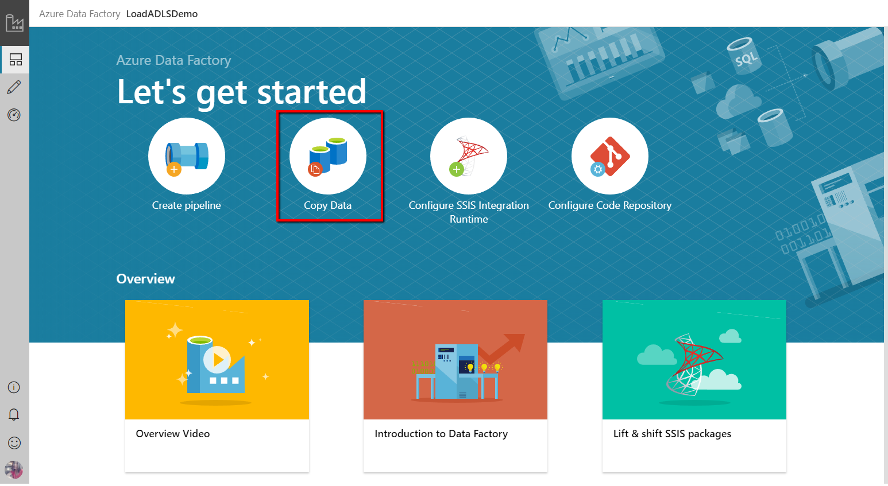
2. In the **Properties** page, specify **CopyFromAmazonS3ToADLS** for the **Task name** field, and select **Next**:

    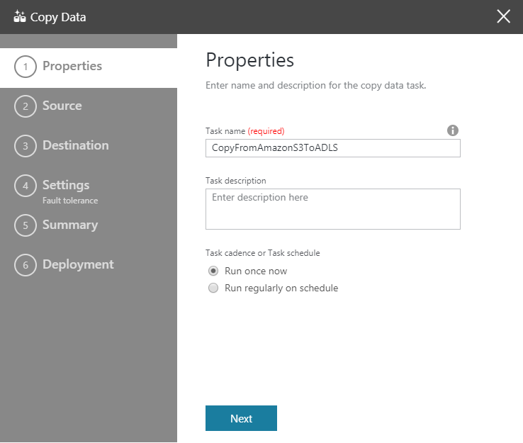
3. In the **Source data store** page, select **Amazon S3**, and select **Next**:

    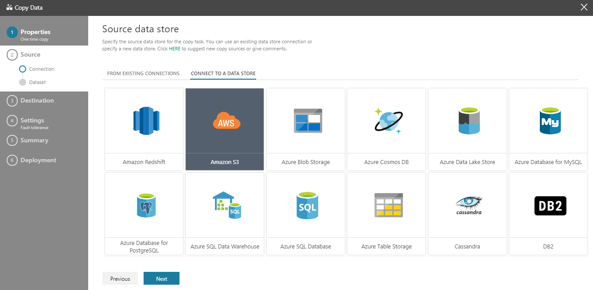
4. In the **Specify Amazon S3 connection** page, do the following steps: 
   1. Specify the **Access Key ID** value.
   2. Specify the **Secret Access Key** value.
   3. Select **Next**.
   
   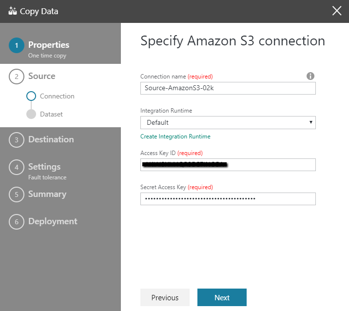
5. In the **Choose the input file or folder** page, browse to the folder and file that you want to copy over. Select the folder/file, select **Choose**, and then select **Next**:

    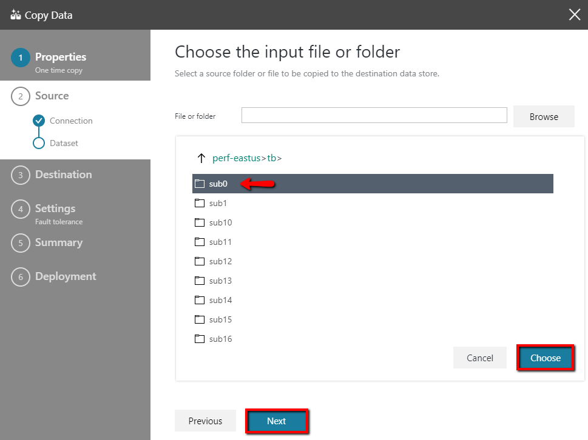

6. In the **Destination data store** page, select **Azure Data Lake Store**, and select **Next**:

    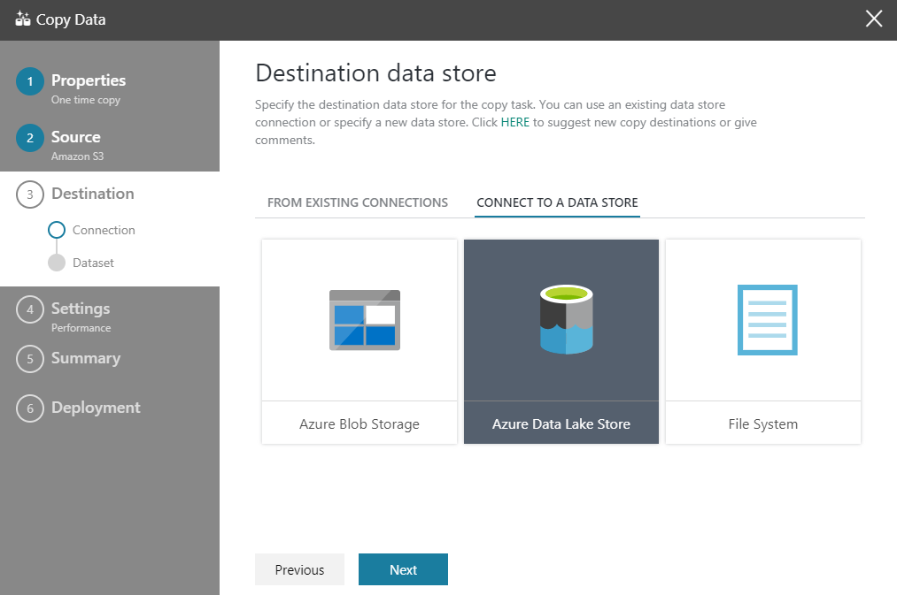

7. Choose the copy behavior by selecting the **Copy files recursively** and **Binary copy** (copy files as-is) options. Select **Next**:

    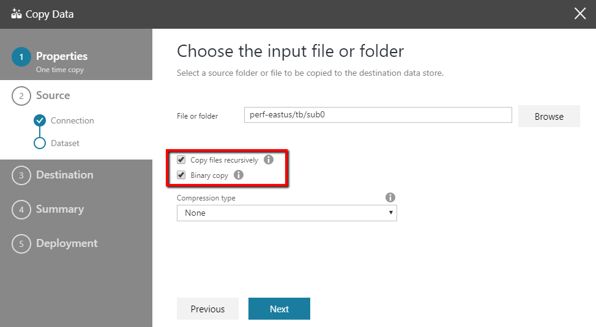

8. In the **Specify Data Lake Store connection** page, do the following steps: 

   1. Select your Data Lake Store for the **Data Lake Store account name**.
   2. Specify the service principal information: **Tenant**, **Service principal ID**, and **Service principal key**.
   3. Select **Next**.
   
   > [!IMPORTANT]
   > In this walkthrough, you use a _service principal_ to authenticate your Data Lake Store. Be sure to grant the service principal the proper permissions in Azure Data Lake Store by following [these instructions](connector-azure-data-lake-store.md#using-service-principal-authentication).
   
   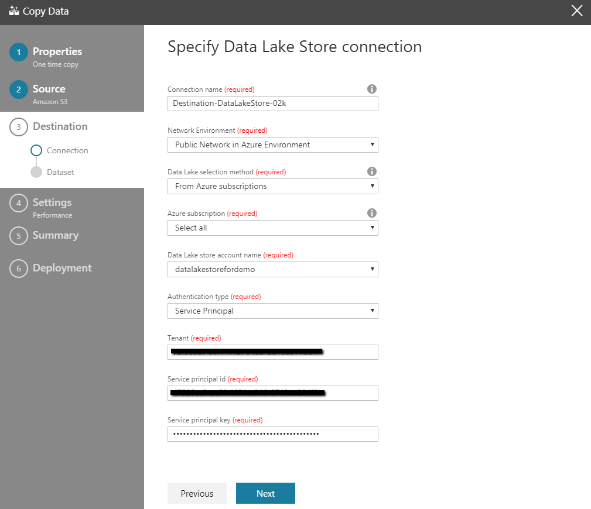
9. In the **Choose the output file or folder** page, enter **copyfroms3** as the output folder name, and select **Next**: 

    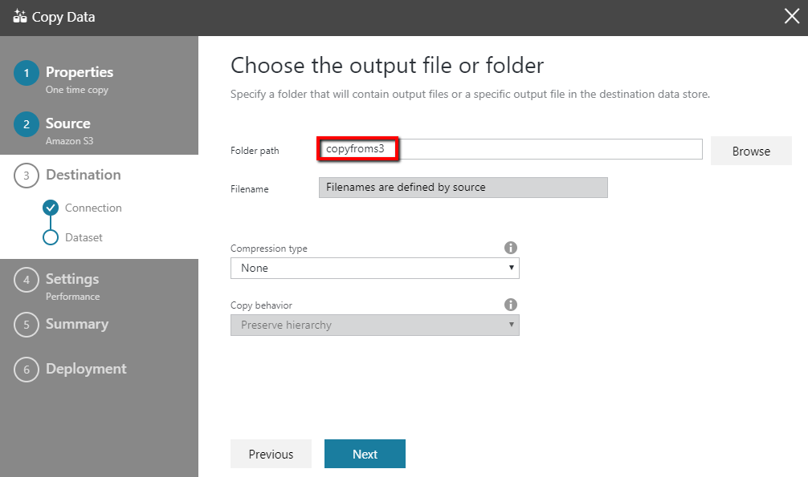

10. In the **Settings** page, select **Next**:

    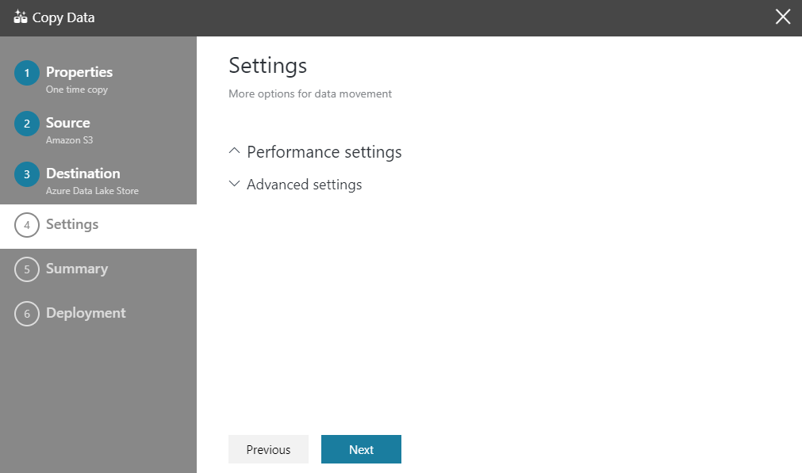
11. In the **Summary** page, review the settings, and select **Next**:

    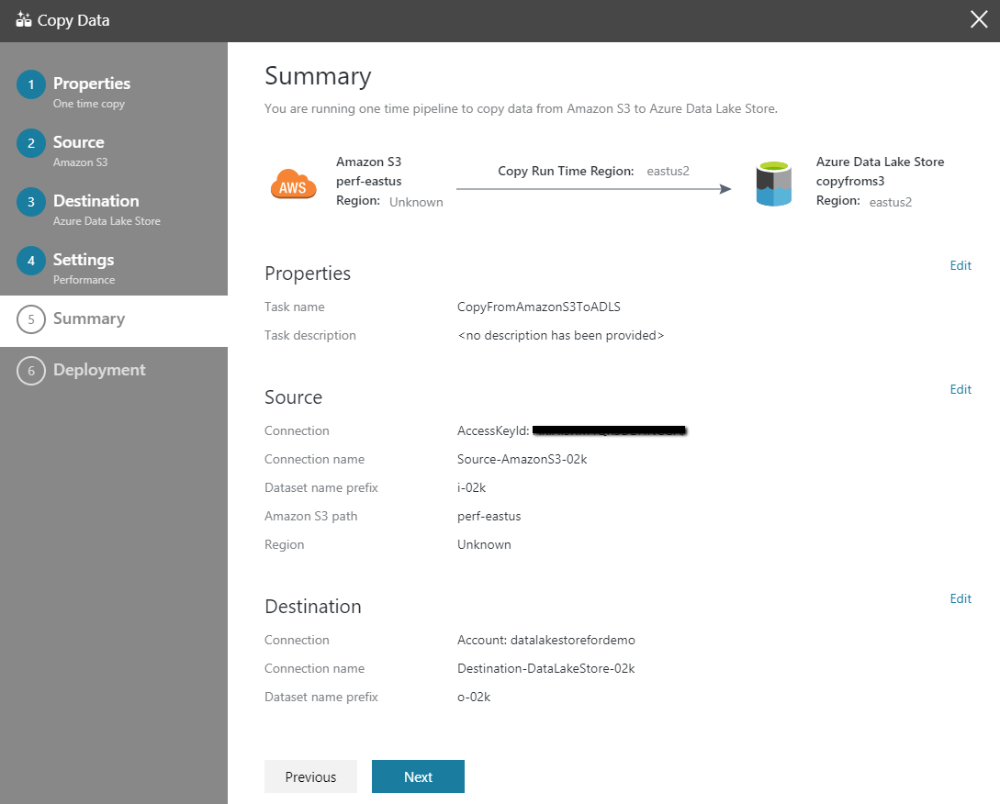
12. In the **Deployment page**, select **Monitor** to monitor the pipeline (task):

    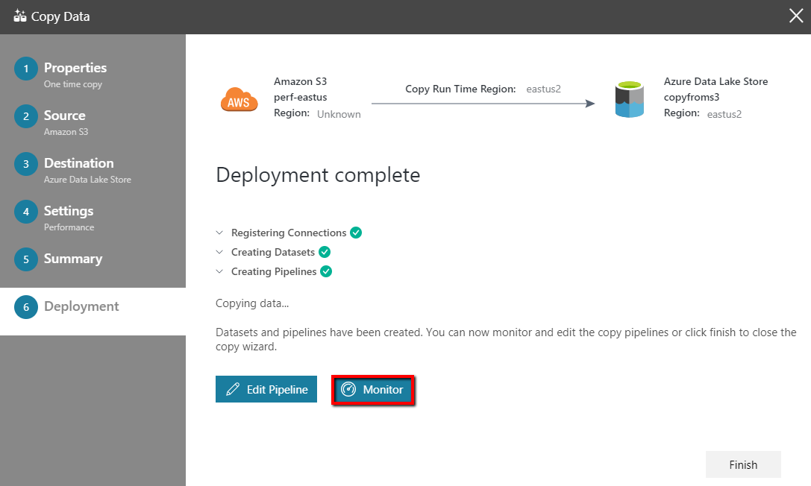
13. Notice that the **Monitor** tab on the left is automatically selected. The **Actions** column includes links to view activity run details and to rerun the pipeline:

    
14. To view activity runs that are associated with the pipeline run, select the **View Activity Runs** link in the **Actions** column. There's only one activity (copy activity) in the pipeline, so you see only one entry. To switch back to the pipeline runs view, select the **Pipelines** link at the top. Select **Refresh** to refresh the list. 

    

15. To monitor the execution details for each copy activity, select the **Details** link under **Actions** in the activity monitoring view. You can monitor details like the volume of data copied from the source to the sink, data throughput, execution steps with corresponding duration, and used configurations:

    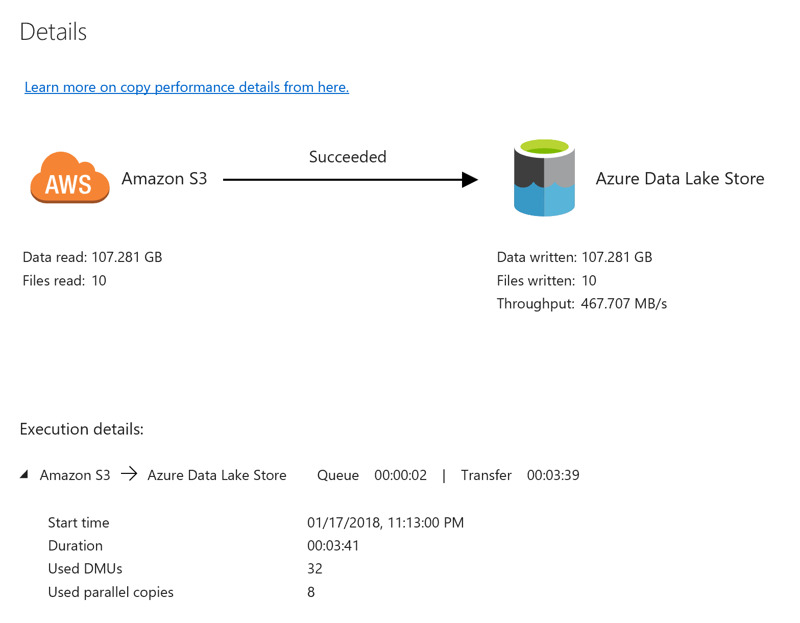

16. Verify that the data is copied into your Azure Data Lake Store: 

    

## Next steps

Advance to the following article to learn about Azure Data Lake Store support: 

> [!div class="nextstepaction"]
>[Azure Data Lake Store connector](connector-azure-data-lake-store.md)