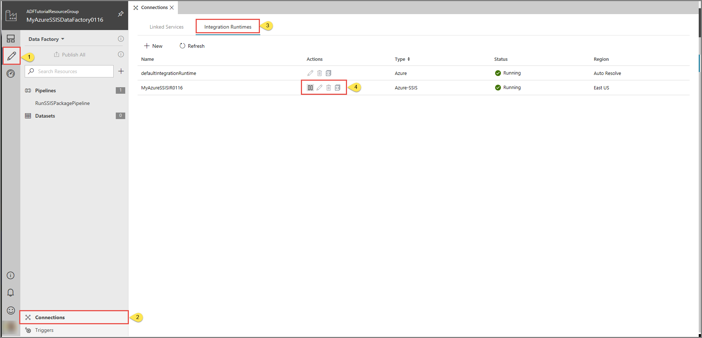

# Manage an Azure-SSIS integration runtime
The [Create an Azure-SSIS integration runtime](create-azure-ssis-integration-runtime.md) article shows you how to create an Azure-SSIS integration runtime (IR) by using Azure Data Factory. This article provides information about reconfiguring an existing Azure-SSIS integration runtime.  

> [!NOTE]
> This article applies to version 2 of Data Factory, which is currently in preview. If you are using version 1 of the Data Factory service, which is generally available (GA), see [Data Factory version 1 documentation](v1/data-factory-introduction.md).


## Data Factory UI 
You can use Data Factory UI to stop, edit/reconfigure, or delete an Azure-SSIS IR. 

1. In the **Data Factory UI**, switch to the **Edit** tab. To launch Data Factory UI, click **Author & Monitor** on the home page of your data factory.
2. In the left pane, click **Connections**.
3. In the right pane, switch to the **Integration Runtimes**. 
4. You can use buttons in the Actions column to **stop**, **edit**, or **delete** the integration runtime. The **Code** button in the **Actions** column lets you view the JSON definition associated with the integration runtime.  
    
    

### To reconfigure an Azure-SSIS IR
1. Stop the integration runtime by clicking **Stop** in the **Actions** column. To refresh the list view, click **Refresh** on the toolbar. After the IR is stopped, you see that the first action lets you start the IR. 

    
2. Edit/reconfigure IR by clicking **Edit** button in the **Actions** column. In the **Integration Runtime Setup** window, change settings (for example, size of the node, number of nodes, or maximum parallel executions per node). 
3. To restart the IR, click **Start** button in the **Actions** column.     

## Azure PowerShell
After you provision and start an instance of Azure-SSIS integration runtime, you can reconfigure it by running a sequence of `Stop` - `Set` - `Start` PowerShell cmdlets consecutively. For example, the following PowerShell script changes the number of nodes allocated for the Azure-SSIS integration runtime instance to five.

### Reconfigure an Azure-SSIS IR

1. First, stop the Azure-SSIS integration runtime by using the [Stop-AzureRmDataFactoryV2IntegrationRuntime](/powershell/module/azurerm.datafactoryv2/stop-azurermdatafactoryv2integrationruntime?view=azurermps-4.4.1) cmdlet. This command releases all of its nodes and stops billing.

    ```powershell
    Stop-AzureRmDataFactoryV2IntegrationRuntime -DataFactoryName $DataFactoryName -Name $AzureSSISName -ResourceGroupName $ResourceGroupName 
    ```
2. Next, reconfigure the Azure-SSIS IR by using the [Set-AzureRmDataFactoryV2IntegrationRuntime](/powershell/module/azurerm.datafactoryv2/set-azurermdatafactoryv2integrationruntime?view=azurermps-4.4.1) cmdlet. The following sample command scales out an Azure-SSIS integration runtime to five nodes.

    ```powershell
    Set-AzureRmDataFactoryV2IntegrationRuntime -DataFactoryName $DataFactoryName -Name $AzureSSISName -ResourceGroupName $ResourceGroupName -NodeCount 5
    ```  
3. Then, start the Azure-SSIS integration runtime by using the [Start-AzureRmDataFactoryV2IntegrationRuntime](/powershell/module/azurerm.datafactoryv2/start-azurermdatafactoryv2integrationruntime?view=azurermps-4.4.1) cmdlet. This command allocates all of its nodes for running SSIS packages.   

    ```powershell
    Start-AzureRmDataFactoryV2IntegrationRuntime -DataFactoryName $DataFactoryName -Name $AzureSSISName -ResourceGroupName $ResourceGroupName
    ```

### Delete an Azure-SSIS IR
1. First, list all existing Azure SSIS IRs under your data factory.

    ```powershell
    Get-AzureRmDataFactoryV2IntegrationRuntime -DataFactoryName $DataFactoryName -ResourceGroupName $ResourceGroupName -Status
    ```
2. Next, stop all existing Azure SSIS IRs in your data factory.

    ```powershell
    Stop-AzureRmDataFactoryV2IntegrationRuntime -DataFactoryName $DataFactoryName -Name $AzureSSISName -ResourceGroupName $ResourceGroupName -Force
    ```
3. Next, remove all existing Azure SSIS IRs in your data factory one by one.

    ```powershell
    Remove-AzureRmDataFactoryV2IntegrationRuntime -DataFactoryName $DataFactoryName -Name $AzureSSISName -ResourceGroupName $ResourceGroupName -Force
    ```
4. Finally, remove your data factory.

    ```powershell
    Remove-AzureRmDataFactoryV2 -Name $DataFactoryName -ResourceGroupName $ResourceGroupName -Force
    ```
5. If you had created a new resource group, remove the resource group.

    ```powershell
    Remove-AzureRmResourceGroup -Name $ResourceGroupName -Force 
    ```

## Next steps
For more information about Azure-SSIS runtime, see the following topics: 

- [Azure-SSIS Integration Runtime](concepts-integration-runtime.md#azure-ssis-integration-runtime). This article provides conceptual information about integration runtimes in general including the Azure-SSIS IR. 
- [Tutorial: deploy SSIS packages to Azure](tutorial-create-azure-ssis-runtime-portal.md). This article provides step-by-step instructions to create an Azure-SSIS IR and uses an Azure SQL database to host the SSIS catalog. 
- [How to: Create an Azure-SSIS integration runtime](create-azure-ssis-integration-runtime.md). This article expands on the tutorial and provides instructions on using Azure SQL Managed Instance (Preview) and joining the IR to a VNet. 
- [Join an Azure-SSIS IR to a VNet](join-azure-ssis-integration-runtime-virtual-network.md). This article provides conceptual information about joining an Azure-SSIS IR to an Azure virtual network (VNet). It also provides steps to use Azure portal to configure VNet so that Azure-SSIS IR can join the VNet. 
- [Monitor an Azure-SSIS IR](monitor-integration-runtime.md#azure-ssis-integration-runtime). This article shows you how to retrieve information about an Azure-SSIS IR and descriptions of statuses in the returned information. 
 
