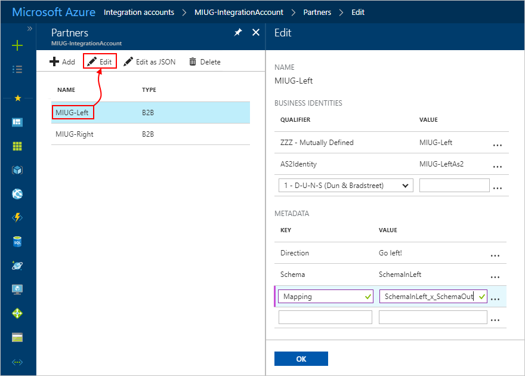
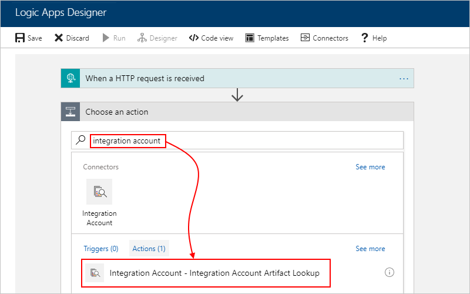
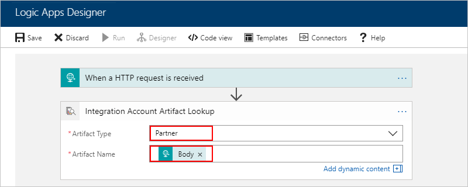
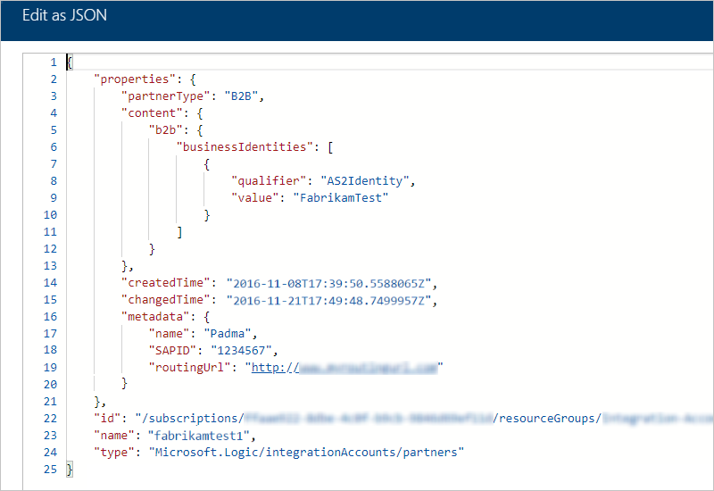
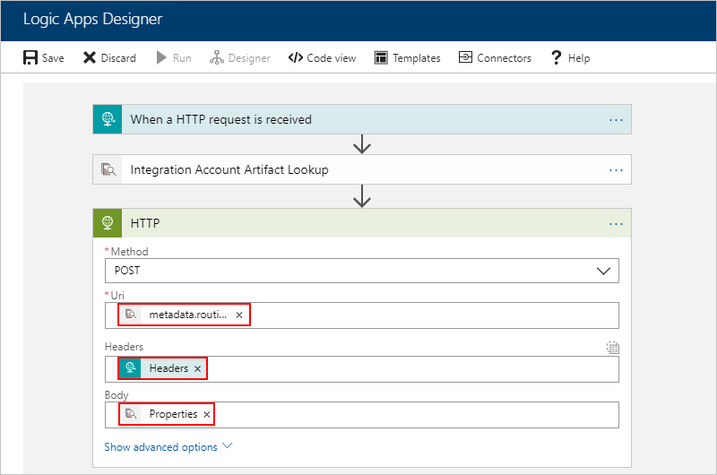
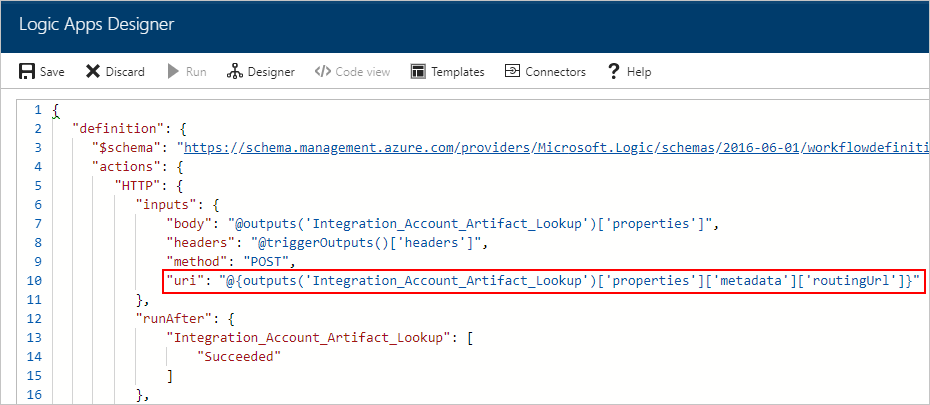

# Manage artifact metadata in integration accounts for logic apps

You can define custom metadata for artifacts in integration accounts 
and retrieve that metadata during runtime for your logic app. 
For example, you can specify metadata for artifacts, such as partners, 
agreements, schemas, and maps - all store metadata using key-value pairs. 

## Add metadata to artifacts in integration accounts

1. In the Azure portal, create an [integration account](logic-apps-enterprise-integration-create-integration-account.md).

2. Add an artifact to your integration account, for example, 
a [partner](logic-apps-enterprise-integration-partners.md), 
[agreement](logic-apps-enterprise-integration-agreements.md), 
or [schema](logic-apps-enterprise-integration-schemas.md).

3. Select the artifact, choose **Edit**, and enter metadata details.

   

## Retrieve metadata from artifacts for logic apps

1. In the Azure portal, create a [logic app](quickstart-create-first-logic-app-workflow.md).

2. Create a [link from your logic app to your integration account](logic-apps-enterprise-integration-create-integration-account.md#link-account). 

3. In Logic App Designer, add a trigger like **Request** or **HTTP** to your logic app.

4. Under the trigger, choose **New step** > **Add an action**. 
Search for "integration account" so you can find and then select 
this action: **Integration Account - Integration Account Artifact Lookup**

   

5. Select the **Artifact Type** and provide the **Artifact Name**. 
For example:

   

## Example: Retrieve partner metadata

Suppose this partner has this metadata with `routingUrl` details:

1. In your logic app, add your trigger, 
an **Integration Account - Integration Account Artifact Lookup** action for your partner, 
and an **HTTP** action, for example:

   

2. To retrieve the URI, on the Logic App Designer toolbar, choose **Code View** for your logic app. Your logic app definition should look like this example:

   

## Next steps

* [Learn more about agreements](logic-apps-enterprise-integration-agreements.md)
