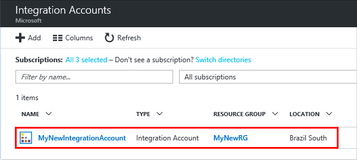
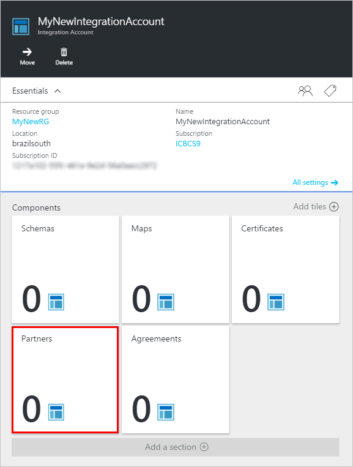
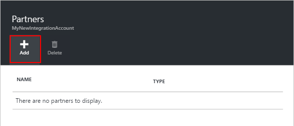
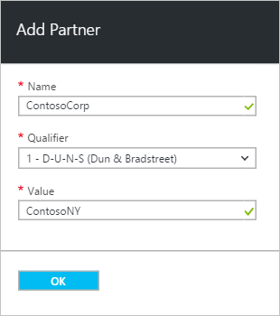
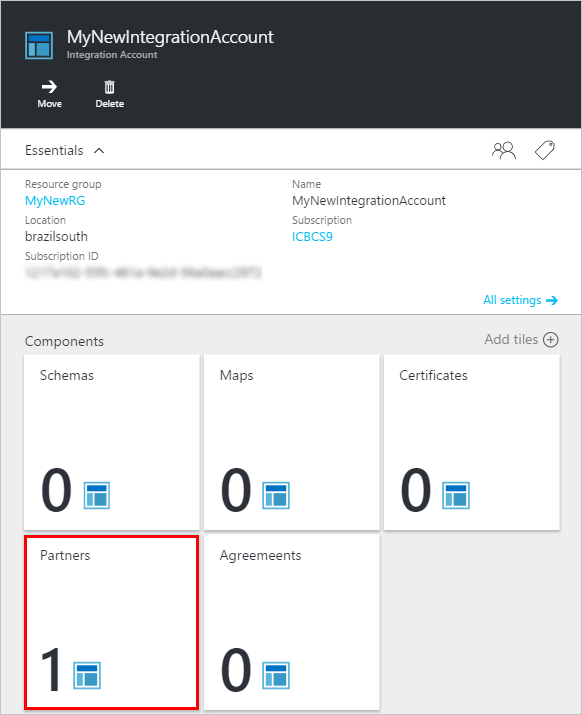
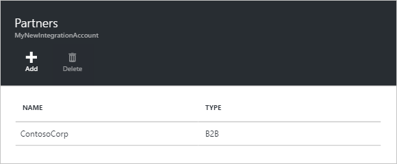
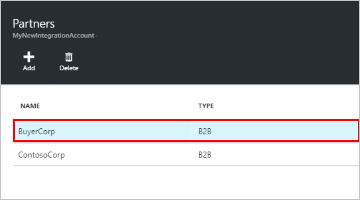
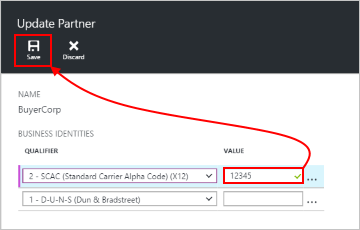
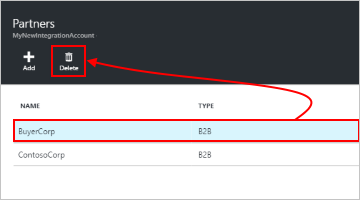

# Add or update partners in business-to-business agreements in your workflow

Partners are entities that participate in business-to-business (B2B) transactions and exchange messages between each other. Before you can create partners that represent you and another organization in these transactions, you must both share information that identifies and validates messages sent by each other. After you discuss these details and are ready to start your business relationship, you can create partners in your integration account to represent you both.

## What roles do partners play in your integration account?

To define details about the messages exchanged between partners, 
you create agreements between those partners. However, 
before you can create an agreement, you must have added 
at least two partners to your integration account. 
Your organization must be part of the agreement as the **host partner**. 
The other partner, or **guest partner** represents the organization that 
exchanges messages with your organization. The guest partner can be another company, 
or even a department in your own organization.

After you add these partners, you can create an agreement.

Receive and Send settings are oriented from the point of view of the Hosted Partner. 
For example, the Receive settings in an agreement determine how the hosted partner receives messages sent from a guest partner. Likewise, the Send settings on the agreement indicate how the hosted partner sends messages to the guest partner.

## Create partner

1. Sign in to the [Azure portal](https://portal.azure.com).

2. On the main Azure menu, select **All services**. 
In the search box, enter "integration", 
and then select **Integration accounts**.

   

3. Under **Integration Accounts**, select the integration 
account where you want to add your partners.

   

4. Choose the **Partners** tile.

   

5. Under **Partners**, choose **Add**.

   

6. Enter a name for your partner, then select a **Qualifier**. 
Enter a **Value** to identify documents that your apps receive. 
When you're done, choose **OK**.

   

7. Choose the **Partners** tile again.

   

   Your new partner now appears. 

   

## Edit partner

1. In the [Azure portal](https://portal.azure.com), 
find and select your integration account. 
Choose the **Partners** tile.

   

2. Under **Partners**, select the partner you want to edit.

   

3. Under **Update Partner**, make your changes.
After you're done, choose **Save**. 

   

   To cancel your changes, select **Discard**.

## Delete partner

1. In the [Azure portal](https://portal.azure.com), 
find and select your integration account. 
Choose the **Partners** tile.

   

2. Under **Partners**, 
select the partner that you want to delete.
Choose **Delete**.

   

## Next steps

* [Learn more about agreements](../logic-apps/logic-apps-enterprise-integration-agreements.md "Learn about enterprise integration agreements")  

