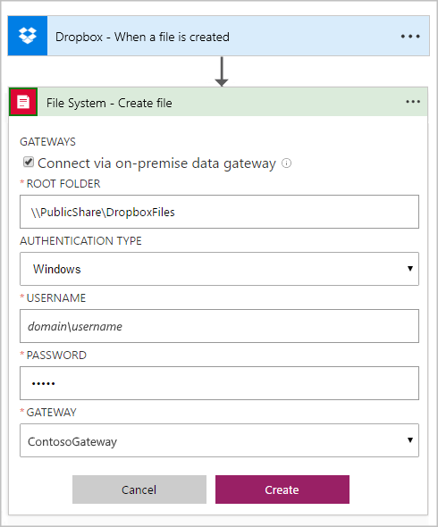

# Connect to on-premises file systems from logic apps with the File System connector

To manage data and securely access on-premises resources, 
your logic apps can use the on-premises data gateway. 
This article shows how you can connect to a file system on premises 
through this basic example scenario: copy a file that's uploaded to Dropbox to a file share, 
then send an email.

## Prerequisites

* Download the latest [on-premises data gateway](https://www.microsoft.com/download/details.aspx?id=53127).

* Install and set up the latest on-premises data gateway, version 1.15.6150.1 or above. 
For the steps, see [Connect to data sources on premises](http://aka.ms/logicapps-gateway). 
You must install the gateway on an on-premises machine 
before you can continue with these steps.

* Basic knowledge about [how to create logic apps](../logic-apps/quickstart-create-first-logic-app-workflow.md)

## Add trigger and actions for connecting to your file system

1. Create a blank logic app. Add this trigger as the first step: **Dropbox - When a file is created** 

2. Under the trigger, choose **+ Next step** > **Add an action**. 

3. In the search box, enter "file system" as your filter. 
When you see all the actions for the File System connector, 
choose the **File System - Create file** action. 

   

4. If you don't already have a connection to your file system, 
you're prompted to create a connection. 

5. Select **Connect via on-premises data gateway**. 
When the connection properties appear, 
set up your connection as specified in the table.

   

   | Setting | Description |
   | ------- | ----------- |
   | **Root folder** | Specify the root folder for your file system. You can specify a local folder on the machine where the on-premises data gateway is installed, or the folder can be a network share that the machine can access. 
**Tip:** The root folder is the main parent folder, which is used for relative paths for all file-related actions. | 
   | **Authentication type** | The type of authentication that's used by your file system | 
   | **Username** | Provide your username {*domain*\\*username*} for your previously installed gateway. | 
   | **Password** | Provide your password for your previously installed gateway. | 
   | **Gateway** | Select your previously installed gateway. | 
   ||| 

6. After you provide all the connection details, choose **Create**. 

   Logic Apps configures and tests your connection, 
   making sure that the connection works properly. 
   If the connection is set up correctly, 
   options appear for the action that you previously selected. 
   The file system connector is now ready for use.

7. Set up the **Create file** action for copying files from Dropbox 
to the root folder for your on-premises file share.

   

8. After this action for copying the file, 
add an Outlook action that sends an email 
so that relevant users know about the new file. 
Enter the recipients, title, and body of the email. 

   In the **Dynamic content** list, you can choose data outputs 
   from the file connector so you can add more details to the email.

   

9. Save your logic app. Test your app by uploading a file to Dropbox. 
The file should get copied to the on-premises file share, 
and you should receive an email about the operation.

Congratulations, you now have a working logic app that 
can connect to your on-premises file system. 

Try exploring other functionalities that the connector offers, for example:

- Create file
- List files in folder
- Append file
- Delete file
- Get file content
- Get file content using path
- Get file metadata
- Get file metadata using path
- List files in root folder
- Update file

## View the swagger

See the [swagger details](/connectors/fileconnector/). 

## Get support

* For questions, visit the 
[Azure Logic Apps forum](https://social.msdn.microsoft.com/Forums/en-US/home?forum=azurelogicapps).

* To help improve Azure Logic Apps and connectors, vote on or submit ideas at the 
[Azure Logic Apps User Voice site](http://aka.ms/logicapps-wish).

## Next steps

* [Connect to on-premises data](../logic-apps/logic-apps-gateway-connection.md) 
* [Monitor your logic apps](../logic-apps/logic-apps-monitor-your-logic-apps.md)
* [Enterprise integration for B2B scenarios](../logic-apps/logic-apps-enterprise-integration-overview.md)
