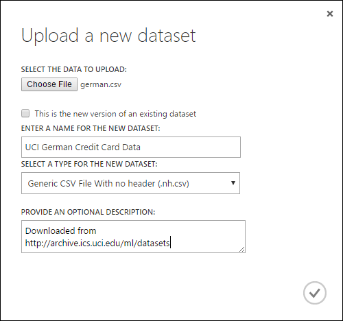

# Import training data from a file on your hard drive into Machine Learning Studio
[!INCLUDE [import-data-into-aml-studio-selector](../../../includes/machine-learning-import-data-into-aml-studio.md)]

Learn how to upload a data file from your hard drive to use as training data in Azure Machine Learning Studio. By importing the data file, you have a dataset module ready for use in your workspace.

## Steps to import data from a local file
To import data from a local hard drive, do the following:

1. Click **+NEW** at the bottom of the Machine Learning Studio window.
2. Select **DATASET** and **FROM LOCAL FILE**.
3. In the **Upload a new dataset** dialog, browse to the file you want to upload
4. Enter a name, identify the data type, and optionally enter a description. A description is recommended - it allows you to record any characteristics about the data that you want to remember when using the data in the future.
5. The checkbox **This is the new version of an existing dataset** allows you to update an existing dataset with new data. Click this checkbox and then enter the name of an existing dataset.

During upload, you'll see a message that your file is being uploaded. Upload time depends on the size of your data and the speed of your connection to the service. If you know the file will take a long time, you can do other things inside Machine Learning Studio while you wait. However, closing the browser causes the data upload to fail.

## Dataset module is ready for use
Once your data is uploaded, it's stored in a dataset module and is available to any experiment in your workspace.

When you're editing an experiment, you can find the datasets you've created in the **My Datasets** list under the **Saved Datasets** list in the module palette. You can drag and drop the dataset onto the experiment canvas when you want to use the dataset for further analytics and machine learning.
