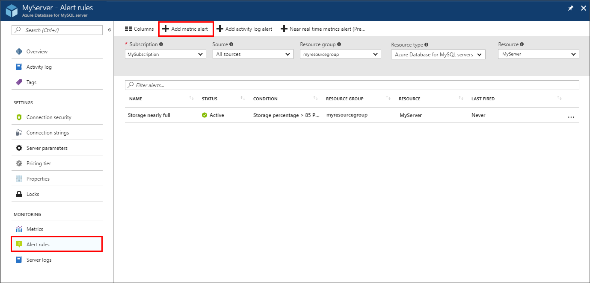
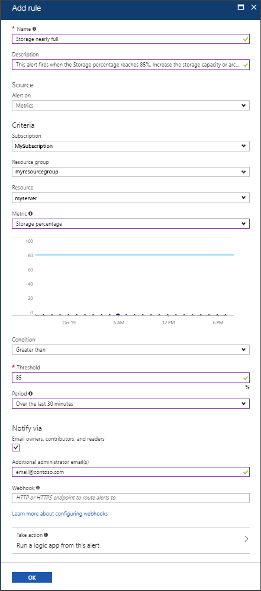

# Use the Azure portal to set up alerts on metrics for Azure Database for MySQL 

This article shows you how to set up Azure Database for MySQL alerts using the Azure portal. You can receive an alert based on monitoring metrics for your Azure services.

The alert triggers when the value of a specified metric crosses a threshold you assign. The alert triggers both when the condition is first met, and then afterwards when that condition is no longer being met. 

You can configure an alert to do the following actions when it triggers:
* Send email notifications to the service administrator and co-administrators
* Send email to additional emails that you specify.
* Call a webhook

You can configure and get information about alert rules using:
* [Azure portal](../monitoring-and-diagnostics/insights-alerts-portal.md)
* [PowerShell](../monitoring-and-diagnostics/insights-alerts-powershell.md)
* [Command-line interface (CLI)](../monitoring-and-diagnostics/insights-alerts-command-line-interface.md)
* [Azure Monitor REST API](https://msdn.microsoft.com/library/azure/dn931945.aspx)

## Create an alert rule on a metric from the Azure portal
1. In the [Azure portal](https://portal.azure.com/), select the Azure Database for MySQL server you want to monitor.

2. Under the **Monitoring** section of the sidebar, select **Alert rules** as shown:

   

3. Select **Add metric alert** (+ icon). 

4. The **Add rule** page opens as shown below.  Fill in the required information:

   

   | Setting | Description  |
   |---------|---------|
   | Name | Provide a name for the alert rule. This value is sent in the alert notification email. |
   | Description | Provide a short description of the alert rule. This value is sent in the alert notification email. |
   | Alert on | Choose **Metrics** for this kind of alert. |
   | Subscription | This field is prepopulated with the subscription that hosts your Azure Database for MySQL. |
   | Resource group | This field is prepopulated with the resource group of your Azure Database for MySQL. |
   | Resource | This field is prepopulated with the name of your Azure Database for MySQL. |
   | Metric | Select the metric that you want to issue an alert for. For example, **Storage percentage**. |
   | Condition | Choose the condition for the metric to be compared with. For example, **Greater than**. |
   | Threshold | Threshold value for the metric, for example 85 (percent). |
   | Period | The period of time that the metric rule must be satisfied before the alert triggers. For example, **Over the last 30 minutes**. |

   Based on the example, the alert looks for Storage percentage above 85% over a 30-minute period. That alert triggers when the average Storage percentage has been above 85% for 30 minutes. Once the first trigger occurs, it triggers again when the average Storage percentage is below 85% over 30 minutes.

5. Choose the notification method you want for the alert rule. 

   Check **Email owners, contributors, and readers** option if you want the subscription administrators and co-administrators to be emailed when the alert fires.

   If you want additional emails to receive a notification when the alert fires, add them in the **Additional administrator email(s)** field. Separate multiple emails with semi-colons - *email@contoso.com;email2@contoso.com*

   Optionally, provide a valid URI in the **Webhook** field if you want it called when the alert fires.

6. Select **OK** to create the alert.

   Within a few minutes, the alert is active and triggers as previously described.

## Manage your alerts
Once you have created an alert, you can select it and do the following actions:

* View a graph showing the metric threshold and the actual values from the previous day relevant to this alert.
* **Edit** or **Delete** the alert rule.
* **Disable** or **Enable** the alert, if you want to temporarily stop or resume receiving notifications.

## Next steps
* Learn more about [configuring webhooks in alerts](../monitoring-and-diagnostics/insights-webhooks-alerts.md).
* Get an [overview of metrics collection](../monitoring-and-diagnostics/insights-how-to-customize-monitoring.md) to make sure your service is available and responsive.
