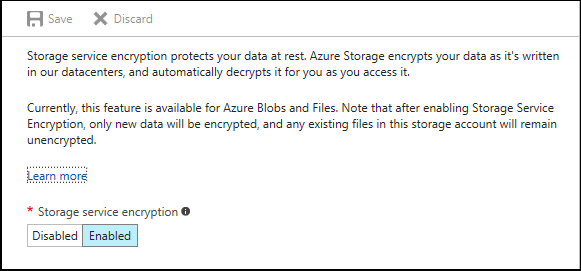
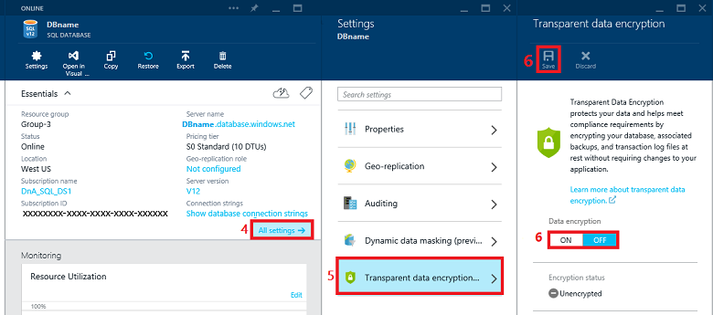

# Azure encryption technologies: Protect personal data at rest with encryption

This article helps you understand and use Azure encryption technologies to secure data at rest.

Encryption of data at rest is essential as a best practice to protect sensitive or personal data and to meet compliance and data privacy requirements. Encryption at rest is designed to prevent the attacker from accessing the unencrypted data by ensuring the data is encrypted when on disk. Information contained in this article may be used to comply with General Data Protection Regulation (GDPR).

## Scenario 

A large cruise company, headquartered in the United States, is expanding its operations to offer itineraries in the Mediterranean, and Baltic seas, as well as the British Isles. To support those efforts, it has acquired several smaller cruise lines based in Italy, Germany, Denmark, and the U.K.

The company uses Microsoft Azure to store corporate data in the cloud. This may include customer and/or employee information such as:

- addresses
- phone numbers
- tax identification numbers
- credit card information

The company must protect the privacy of customer and employee data while making data accessible to those departments that need it. (such as payroll and reservations departments)

The cruise line also maintains a large database of reward and loyalty program members that includes personal information to track relationships with current and past customers.

### Problem statement

The company must protect the privacy of customers' and employees’ personal data while making data accessible to those departments that need it (such as payroll and reservations departments). This personal data is stored outside of the corporate-controlled data center and is not under the company’s physical control.

### Company goal

As part of a multi-layered defense-in-depth security strategy, it is a company goal to ensure that all data sources that contain personal data are encrypted, including those residing in cloud storage. If unauthorized persons gain access to the personal data, it must be in a form that will render it unreadable. Applying encryption should be easy, or transparent – for users and administrators.

## Solutions

Azure services provide multiple tools and technologies to help you protect personal data at rest by encrypting it.

### Azure Key Vault

[Azure Key Vault](https://docs.microsoft.com/azure/key-vault/key-vault-whatis) provides secure storage for the keys used to encrypt data at rest in Azure services and is the recommended key storage and management solution. Encryption key management is essential to securing stored data.

#### How do I use Azure Key Vault to protect keys that encrypt personal data?

To use Azure Key Vault, you need a subscription to an Azure account. You also need Azure PowerShell installed. Steps include using PowerShell cmdlets to do the following:

1. Connect to your subscriptions

2. Create a key vault

3. Add a key or secret to the key vault

4. Register applications that will use the key vault with Azure Active Directory

5. Authorize the applications to use the key or secret

To create a key vault, use the New-AzureRmKeyVault PowerShell CmDlt. You will assign a vault name, resource group name, and geographic location. You’ll use the vault name when managing keys via other Cmdlets. Applications that use the vault through the REST API will use the vault URI.

Azure Key Vault can provide a software-protected key for you, or you can import an existing key in a .PFX file. You can also store secrets (passwords) in the vault.

You can also generate a key in your local HSM and transfer it to HSMs in the Key Vault service, without the key leaving the HSM boundary.

For detailed instructions on using Azure Key Vault, follow the steps in [Get Started with Azure Key Vault.](https://docs.microsoft.com/azure/key-vault/key-vault-get-started)

For a list of PowerShell Cmdlets used with Azure Key Vault, see [AzureRM.KeyVault](https://docs.microsoft.com/powershell/module/azurerm.keyvault/?view=azurermps-4.2.0).

### Azure Disk Encryption for Windows

[Azure Disk Encryption for Windows and Linux IaaS VMs](https://docs.microsoft.com/azure/security/azure-security-disk-encryption) protects personal data at rest on Azure virtual machines and integrates with Azure Key Vault. Azure Disk Encryption uses
[BitLocker](https://technet.microsoft.com/library/cc732774.aspx) in Windows and [DM-Crypt](https://en.wikipedia.org/wiki/Dm-crypt) in Linux to encrypt both the OS and the data disks. Azure Disk Encryption is supported on Windows Server 2008 R2, Windows Server 2012, Windows Server 2012 R2, Windows Server 2016, and on Windows 8 and Windows 10 clients.

#### How do I use Azure Disk Encryption to protect personal data?

To use Azure Disk Encryption, you need a subscription to an Azure account. To enable Azure Disk Encryption for Windows and Linux VMs, do the following:

1. Use the Azure Disk Encryption Resource Manager template, PowerShell, or the command line interface (CLI) to enable disk encryption and specify the
    encryption configuration. 

2. Grant access to the Azure platform to read the encryption material from your key vault.

3. Provide an Azure Active Directory (AAD) application identity to write the encryption key material to your key vault.

Azure will update the VM and the key vault configuration, and set up your encrypted VM.

When you set up your key vault to support Azure Disk Encryption, you can add a key encryption key (KEK) for added security and to support backup of encrypted virtual machines.

Detailed instructions for specific deployment scenarios and user experiences are included in [Azure Disk Encryption for Windows and Linux IaaS VMs.](https://docs.microsoft.com/azure/security/azure-security-disk-encryption)

### Azure Storage Service Encryption

[Azure Storage Service Encryption (SSE) for Data at Rest](https://docs.microsoft.com/azure/storage/storage-service-encryption) helps you protect and safeguard your data to meet your organizational security and compliance commitments. Azure Storage automatically encrypts your data using 256-bit AES encryption prior to persisting to storage, and decrypts it prior to retrieval. This service is available for Azure Blobs and Files.

#### How do I use Storage Service Encryption to protect personal data?

To enable Storage Service Encryption, do the following:

1. Log into the Azure portal.

2. Select a storage account.

3. In Settings, under the Blob Service section, select Encryption.

4. Under the File Service section, select Encryption.

After you click the Encryption setting, you can enable or disable Storage
Service Encryption.

New data will be encrypted. Data in existing files in this storage account will remain unencrypted.

After enabling encryption, copy data to the storage account using one of the following methods:

1. Copy blobs or files with the [AzCopy Command Line utility](https://docs.microsoft.com/azure/storage/storage-use-azcopy).

2. [Mount a file share using SMB](https://docs.microsoft.com/azure/storage/storage-file-how-to-use-files-windows) so you can use a utility such as Robocopy to copy files.

3. Copy blob or file data to and from blob storage or between storage accounts using [Storage Client Libraries such as .NET](https://docs.microsoft.com/azure/storage/storage-dotnet-how-to-use-blobs).

4.  Use a [Storage Explorer](https://docs.microsoft.com/azure/storage/storage-explorers) to upload blobs to your storage account with encryption enabled.

### Transparent Data Encryption

Transparent Data Encryption (TDE) is a feature in SQL Azure by which you can encrypt data at both the database and server levels. TDE is now enabled by default on all newly created databases. TDE performs real-time I/O encryption and decryption of the data and log files.

#### How do I use TDE to protect personal data?

You can configure TDE through the Azure portal, by using the REST API, or by using PowerShell. To enable TDE on an existing database using the Azure Portal, do the following:

1. Visit the Azure portal at <https://portal.azure.com> and sign-in with your Azure Administrator or Contributor account.

2. On the left banner, click to BROWSE, and then click SQL databases.

3. With SQL databases selected in the left pane, click your user database.

4. In the database blade, click All settings.

5. In the Settings blade, click Transparent data encryption part to open the Transparent data encryption blade.

6. In the Data encryption blade, move the Data encryption button to On, and then click Save (at the top of the page) to apply the setting. The Encryption status will approximate the progress of the transparent data encryption.

Instructions on how to enable TDE and information on decrypting TDE-protected databases and more can be found in the article [Transparent Data Encryption with Azure SQL Database.](https://docs.microsoft.com/sql/relational-databases/security/encryption/transparent-data-encryption-with-azure-sql-database)

## Summary

The company can accomplish its goal of encrypting personal data stored in the Azure cloud. They can do this by using Azure Disk Encryption to  protect entire volumes. This may include both the operating system files and data files that hold personal identifiable information and other sensitive data. Azure Storage Service encryption can be used to protect personal data that is stored in blobs and files. For data that is stored in Azure SQL databases, Transparent Data 
Encryption provides protection from unauthorized exposure of personal
information.

To protect the keys that are used to encrypt data in Azure, the company can use Azure Key Vault. This streamlines the key management process and enables the company to maintain control of keys that access and encrypt personal data.

## Next steps

- [Azure Disk Encryption Troubleshooting Guide](https://docs.microsoft.com/azure/security/azure-security-disk-encryption-tsg)

- [Encrypt an Azure Virtual Machine](https://docs.microsoft.com/azure/security-center/security-center-disk-encryption?toc=%2fazure%2fsecurity%2ftoc.json)

- [Encryption of data in Azure Data Lake Store](https://docs.microsoft.com/azure/data-lake-store/data-lake-store-encryption)

- [Azure Cosmos DB database encryption at rest](https://docs.microsoft.com/azure/cosmos-db/database-encryption-at-rest)
