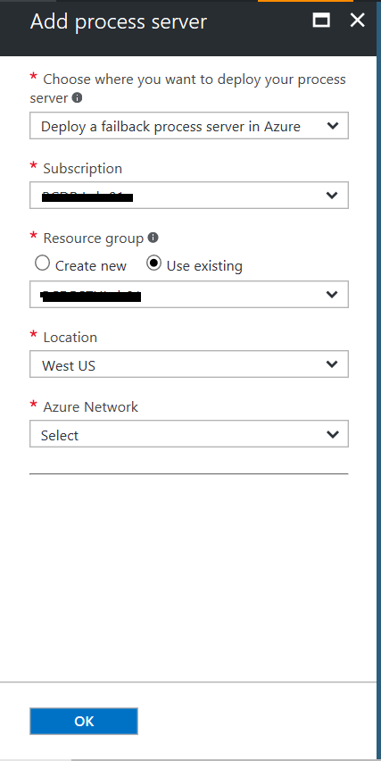

# Set up a process server in Azure for failback

After you fail over VMware VMs or physical servers to Azure using [Site Recovery](site-recovery-overview.md), you can fail them back to the on-premises site when it's up and running again. In order to fail back, you need to set up a temporary process server in Azure, to handle replication from Azure to on-premises. You can delete this VM after failback is complete.

## Before you start

Learn more about the [reprotection](vmware-azure-reprotect.md) and [failback](vmware-azure-failback.md) process.

[!INCLUDE [site-recovery-vmware-process-server-prerequ](../../includes/site-recovery-vmware-azure-process-server-prereq.md)]

## Deploy a process server in Azure

1. In the vault > **Site Recovery Infrastructure**> **Mnaage** > **Configuration Servers**, select the configuration server.
2. In the server page, click **+ Process server**
3. In **Add process server** page, and select to deploy the process server in Azure.
4. Specify the Azure settings, including the subscription used for failover, a resource group, the Azure region used for failover, and the virtual network in which the Azure VMs are located. If you used multiple Azure networks, you need a process server in each one.

  

4. In **Server name**, **User name**, and **Password**, specify a name for the process server, and credentials that will be assigned Admin permissions on the server.
5. Specify a storage account to be used for the server VM disks, the subnet in which the process server VM will be located, and the server IP address that will be assigned when the VM starts.
6. Click **OK** button to start deploying the process server VM.

>

## Registering the process server (running in Azure) to a Configuration Server (running on-premises)

After the process server VM is up and running, you need to register it with the on-premises configuration server, as follows:

[!INCLUDE [site-recovery-vmware-register-process-server](../../includes/site-recovery-vmware-register-process-server.md)]

