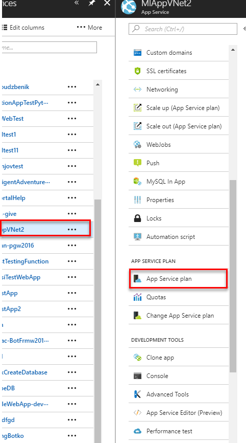

# Sync networking configuration for Azure App Service hosting plan

It might happen that although you [integrated your app with an Azure Virtual Network](../app-service/web-sites-integrate-with-vnet.md), you can't establish connection to Managed Instance. One thing you can try is to refresh networking configuration for your service plan. 

## Sync network configuration for App Service hosting plan

To do that, follow these steps:  

1. Go to your web apps App Service plan.
 
   

2. Click **Networking** and then click **Click here to Manage**.
 
   

3. Select your **VNet** and click **Sync Network**. 
 
   

4. Wait until the sync is done.
  
   

You are now ready to try to re-establish your connection to your Managed Instance.

## Next steps

- For information about configuring your VNet for Managed Instance, see [Managed Instance VNet configuration](sql-database-managed-instance-vnet-configuration.md).
