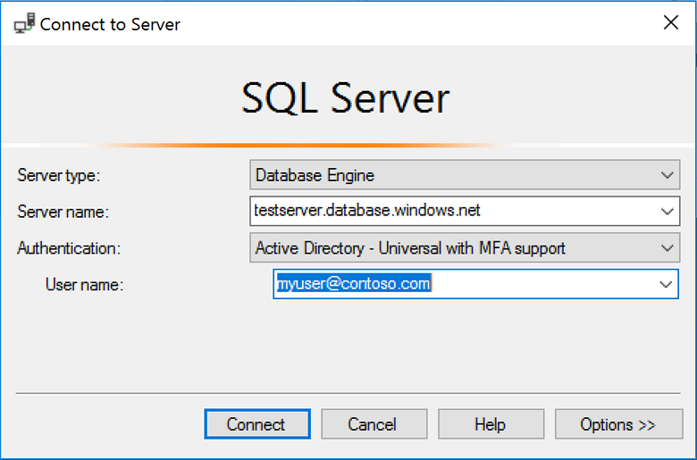

# Configure multi-factor authentication for SQL Server Management Studio and Azure AD

This topic shows you how to use Azure Active Directory multi-factor authentication (MFA) with SQL Server Management Studio. Azure AD MFA can be used when connecting SSMS or SqlPackage.exe to Azure SQL Database and Azure SQL Data Warehouse.

For an overview of Azure SQL Database multi-factor authentication, see [Universal Authentication with SQL Database and SQL Data Warehouse (SSMS support for MFA)](sql-database-ssms-mfa-authentication.md).

## Configuration steps

1. **Configure an Azure Active Directory** - For more information, see [Administering your Azure AD directory](https://msdn.microsoft.com/library/azure/hh967611.aspx), [Integrating your on-premises identities with Azure Active Directory](../active-directory/active-directory-aadconnect.md), [Add your own domain name to Azure AD](https://azure.microsoft.com/blog/2012/11/28/windows-azure-now-supports-federation-with-windows-server-active-directory/), [Microsoft Azure now supports federation with Windows Server Active Directory](https://azure.microsoft.com/blog/2012/11/28/windows-azure-now-supports-federation-with-windows-server-active-directory/), and [Manage Azure AD using Windows PowerShell](https://msdn.microsoft.com/library/azure/jj151815.aspx).
2. **Configure MFA** - For step-by-step instructions, see [What is Azure Multi-Factor Authentication?](../active-directory/authentication/multi-factor-authentication.md), [Conditional Access (MFA) with Azure SQL Database and Data Warehouse](sql-database-conditional-access.md). (Full conditional access requires a Premium Azure Active Directory (Azure AD). Limited MFA is available with a standard Azure AD.)
3. **Configure SQL Database or SQL Data Warehouse for Azure AD Authentication** - For step-by-step instructions, see [Connecting to SQL Database or SQL Data Warehouse By Using Azure Active Directory Authentication](sql-database-aad-authentication.md).
4. **Download SSMS** - On the client computer, download the latest SSMS, from [Download SQL Server Management Studio (SSMS)](https://msdn.microsoft.com/library/mt238290.aspx). For all the features in this topic, use at least July 2017, version 17.2.  

## Connecting by using universal authentication with SSMS

The following steps show how to connect to SQL Database or SQL Data Warehouse by using the latest SSMS.

1. To connect using Universal Authentication, on the **Connect to Server** dialog box, select **Active Directory - Universal with MFA support**. (If you see **Active Directory Universal Authentication** you are not on the latest version of SSMS.)  
   ![1mfa-universal-connect][1]  
2. Complete the **User name** box with the Azure Active Directory credentials, in the format `user_name@domain.com`.  
      
3. If you are connecting as a guest user, you must click **Options**, and on the **Connection Property** dialog box, complete the **AD domain name or tenant ID** box. For more information, see [Universal Authentication with SQL Database and SQL Data Warehouse (SSMS support for MFA)](sql-database-ssms-mfa-authentication.md).
      
4. As usual for SQL Database and SQL Data Warehouse, you must click **Options** and specify the database on the **Options** dialog box. (If the connected user is a guest user ( i.e. joe@outlook.com), you must check the box and add the current AD domain name or tenant ID as part of Options. See [Universal Authentication with SQL Database and SQL Data Warehouse (SSMS support for MFA)]()(sql-database-ssms-mfa-authentication.md. Then click **Connect**.  
5. When the **Sign in to your account** dialog box appears, provide the account and password of your Azure Active Directory identity. No password is required if a user is part of a domain federated with Azure AD.  
   ![2mfa-sign-in][2]  

   > [!NOTE]
   > For Universal Authentication with an account that does not require MFA, you connect at this point. For users requiring MFA, continue with the following steps:
   >  
   
6. Two MFA setup dialog boxes might appear. This one time operation depends on the MFA administrator setting, and therefore may be optional. For an MFA enabled domain this step is sometimes pre-defined (for example, the domain requires users to use a smartcard and pin).  
   ![3mfa-setup][3]  
7. The second possible one time dialog box allows you to select the details of your authentication method. The possible options are configured by your administrator.  
   ![4mfa-verify-1][4]  
8. The Azure Active Directory sends the confirming information to you. When you receive the verification code, enter it into the **Enter verification code** box, and click **Sign in**.  
   ![5mfa-verify-2][5]  

When verification is complete, SSMS connects normally presuming valid credentials and firewall access.

## Next steps

- For an overview of Azure SQL Database multi-factor authentication, see Universal Authentication with [SQL Database and SQL Data Warehouse (SSMS support for MFA)](sql-database-ssms-mfa-authentication.md).  
- Grant others access to your database: [SQL Database Authentication and Authorization: Granting Access](sql-database-manage-logins.md)  
- Make sure others can connect through the firewall: [Configure an Azure SQL Database server-level firewall rule using the Azure portal](sql-database-configure-firewall-settings.md)  
- When using **Active Directory- Universal with MFA** authentication, ADAL tracing is available beginning with [SSMS 17.3](https://docs.microsoft.com/sql/ssms/download-sql-server-management-studio-ssms). Off by default, you can turn on ADAL tracing by using the **Tools**, **Options** menu, under **Azure Services**, **Azure Cloud**, **ADAL Output Window Trace Level**, followed by enabling **Output**  in the **View** menu. The traces are available in the output window when selecting **Azure Active Directory option**.   

[1]: ./media/sql-database-ssms-mfa-auth/1mfa-universal-connect.png
[2]: ./media/sql-database-ssms-mfa-auth/2mfa-sign-in.png
[3]: ./media/sql-database-ssms-mfa-auth/3mfa-setup.png
[4]: ./media/sql-database-ssms-mfa-auth/4mfa-verify-1.png
[5]: ./media/sql-database-ssms-mfa-auth/5mfa-verify-2.png

