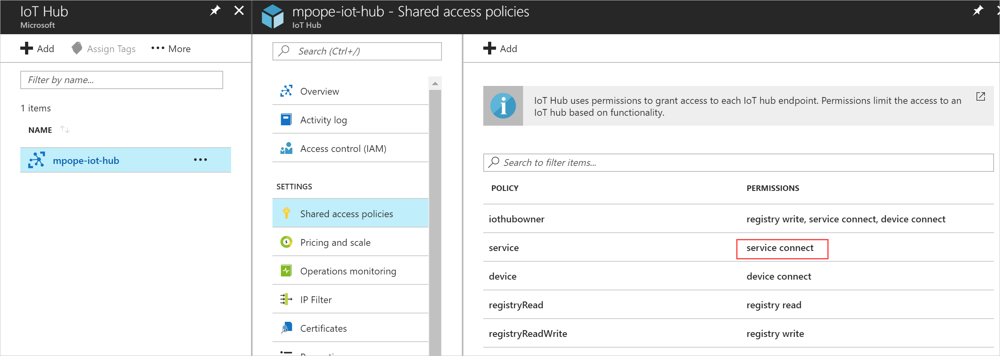
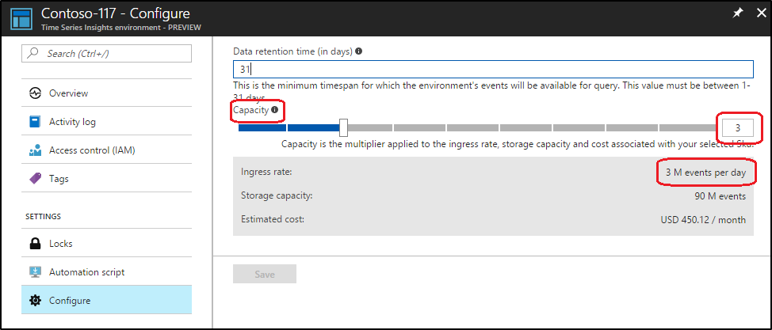
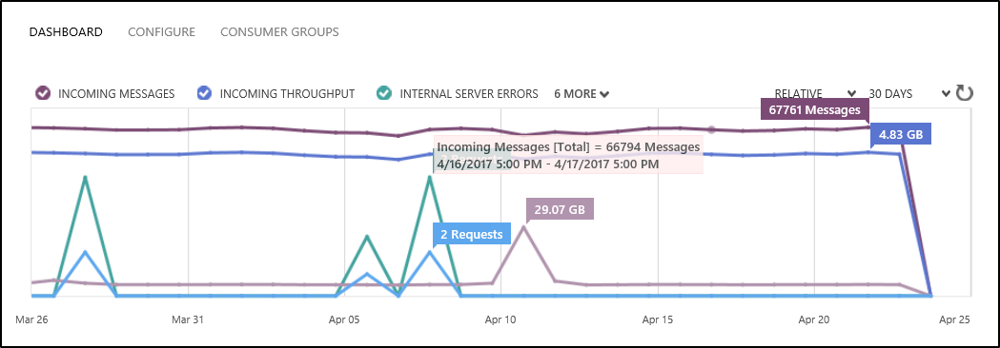

# Diagnose and solve problems in your Time Series Insights environment

## Problem 1: No data is shown
There are several common reasons why you might not see your data in the [Azure Time Series Insights Explorer](https://insights.timeseries.azure.com):

### Possible cause A: Event source data is not in JSON format
Azure Time Series Insights supports only JSON data. For JSON samples, see [Supported JSON shapes](time-series-insights-send-events.md#supported-json-shapes).

### Possible cause B: Event source key is missing a required permission
* For an IoT Hub, you need to provide the key that has **service connect** permission.

   

   As shown in the preceding image, either of the policies **iothubowner** and **service** would work, because both have **service connect** permission.
   
* For an event hub, you need to provide the key that has **Listen** permission.

   

   As shown in the preceding image, either of the policies **read** and **manage** would work, because both have **Listen** permission.

### Possible cause C: The consumer group provided is not exclusive to Time Series Insights
During registration of am IoT Hub or an event hub, you specify the consumer group that should be used for reading the data. This consumer group must **not** be shared. If the consumer group is shared, the underlying event hub automatically disconnects one of the readers randomly. Provide a unique consumer group for Time Series Insights to read from.

## Problem 2: Some data is shown, but some is missing
When you can see data partially, but the data is lagging behind, there are several possibilities to consider:

### Possible cause A: Your environment is getting throttled
This is a common problem when environments are provisioned after the creation of an event source with data.  Azure IoT Hubs and Events Hubs store data up to seven days.  TSI will always start from the oldest event (FIFO), within the event source.  So if you have five million events in an event source when you connect to an S1, single-unit TSI environment, TSI will read approximately one million events per day.  This might appear to look as though TSI is experiencing five days of latency at first glance.  What is actually happening is that the environment is being throttled.  If you have old events in your event source, you can approach one of two ways:

- Change your event source's retention limits to help get rid of old events that you don't want to show up in TSI
- Provision a larger environment size (in terms of number of units) to increase throughput of old events.  Using the example above, if you increased that same S1 environment to five units for one day, the environment should catch-up to now within the day.  If your steady state event production is 1M or less events/day, then you can reduce the capacity of the event back down to one unit after it has caught up.  

The throttling limit is enforced based on the environment's SKU type and capacity. All event sources in the environment share this capacity. If the event source for your IoT Hub or event hub is pushing data beyond the enforced limits, you see throttling and a lag.

The following diagram shows a Time Series Insights environment that has a SKU of S1 and a capacity of 3. It can ingress 3 million events per day.

For example, assume that this environment is ingesting messages from an event hub. Observe the ingress rate shown in the following diagram:

As shown in the diagram, the daily ingress rate is ~67,000 messages. This rate translates roughly to 46 messages every minute. If each event hub message is flattened to a single Time Series Insights event, this environment sees no throttling. If each event hub message is flattened to 100 Time Series Insights events, then 4,600 events should be ingested every minute. An S1 SKU environment that has a capacity of 3 can ingress only 2,100 events every minute (1 million events per day = 700 events per minute at 3 units = 2,100 events per minute). Therefore you see a lag due to throttling. 

For a high-level understanding of how flattening logic works, see [Supported JSON shapes](time-series-insights-send-events.md#supported-json-shapes).

### Recommended resolution steps for excessive throttling
To fix the lag, increase the SKU capacity of your environment. For more information, see [How to scale your Time Series Insights environment](time-series-insights-how-to-scale-your-environment.md).

### Possible cause B: Initial ingestion of historical data is causing slow ingress
If you are connecting an existing event source, it's likely that your IoT Hub or event hub already has data in it. The environment starts pulling data from the beginning of the event source's message retention period.

This behavior is the default behavior and cannot be overridden. You can engage throttling, and it may take a while to catch up on ingesting historical data.

#### Recommended resolution steps of large initial ingestion
To fix the lag, take the following steps:
1. Increase the SKU capacity to the maximum allowed value (10 in this case). After the capacity is increased, the ingress process starts catching up much faster. You can visualize how quickly you're catching up through the availability chart in the [Time Series Insights explorer](https://insights.timeseries.azure.com). You are charged for the increased capacity.
2. After the lag is caught up, decrease the SKU capacity back to your normal ingress rate.

## Problem 3: My event source's *timestamp property name* setting doesn't work
Ensure that the name and value conform to the following rules:
* The timestamp property name is _case-sensitive_.
* The timestamp property value that's coming from your event source, as a JSON string, should have the format _yyyy-MM-ddTHH:mm:ss.FFFFFFFK_. An example of such a string is “2008-04-12T12:53Z”.

The easiest way to ensure that your *timestamp property name* is captured and working properly is to use the TSI explorer.  Within the TSI explorer, using the chart, select a period of time after you provided the *timestamp property name*.  Right-click the selection and choose the *explore events* option.  The first column header should be your *timestamp property name* and it should have a *($ts)* next to the word *Timestamp*, rather than:
- *(abc)*, which would indicate TSI is reading the data values as strings
- *Calendar icon*, which would indicate TSI is reading the data value as *datetime*
- *#*, which would indicate TSI is reading the data values as an integer

## Next steps
- For additional assistance, start a conversation on the [MSDN forum](https://social.msdn.microsoft.com/Forums/home?forum=AzureTimeSeriesInsights) or [Stack Overflow](https://stackoverflow.com/questions/tagged/azure-timeseries-insights). 
- You can also use [Azure support](https://azure.microsoft.com/support/options/) for assisted support options.
