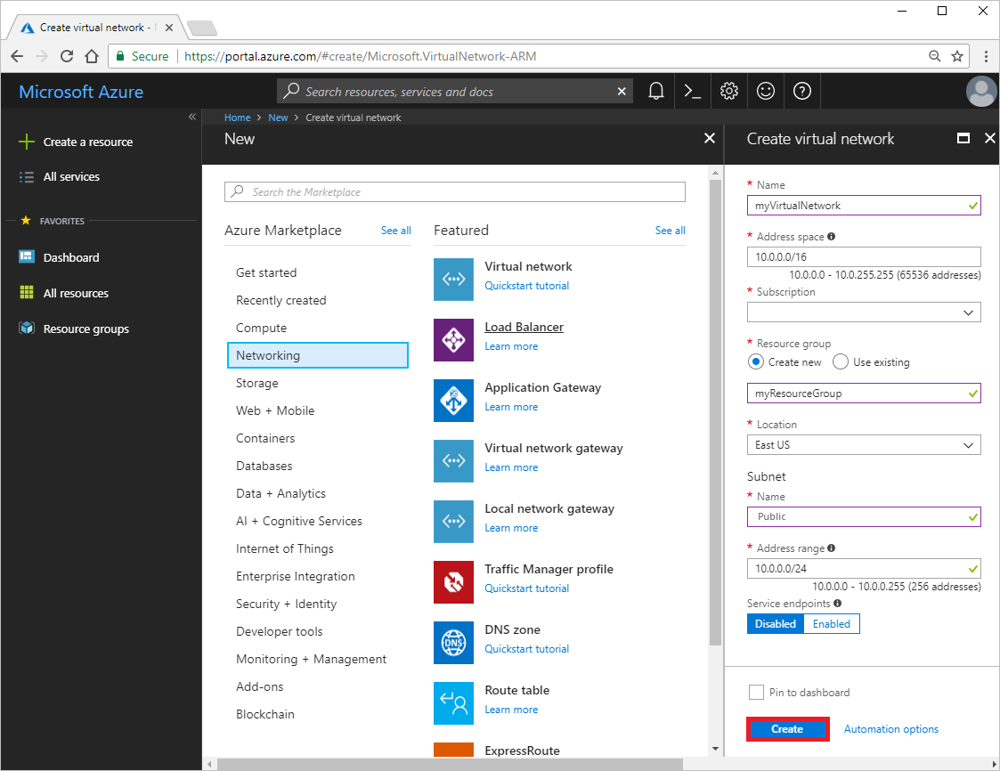
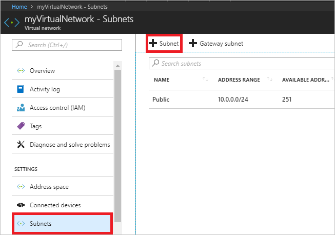
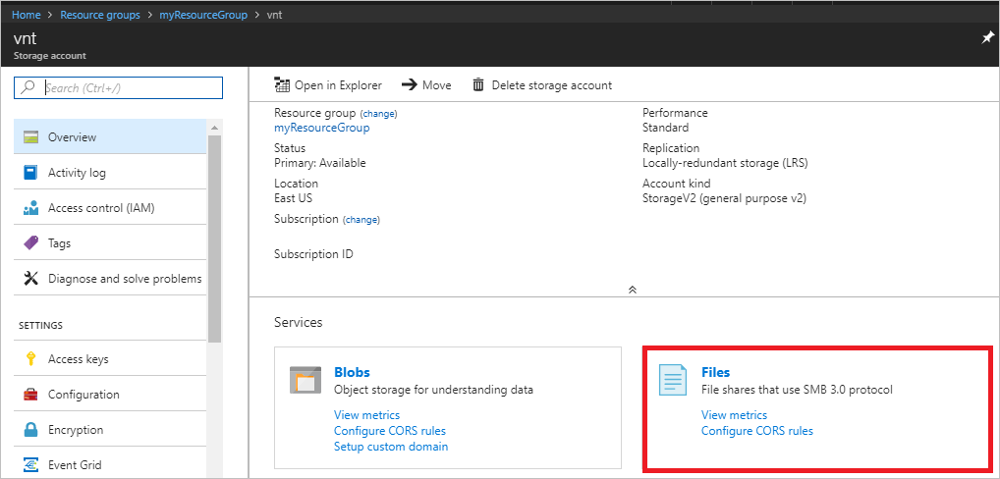
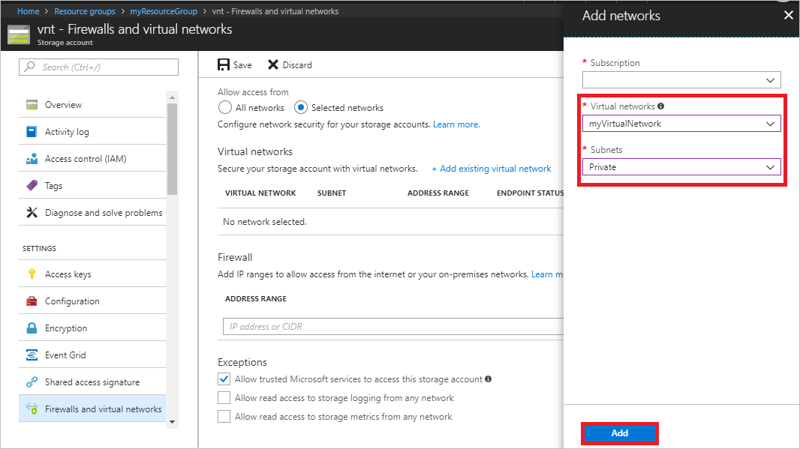
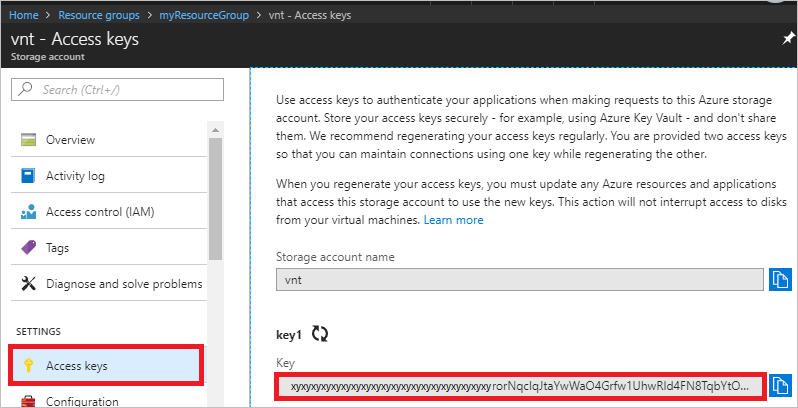
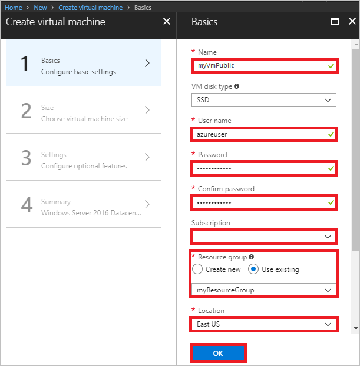
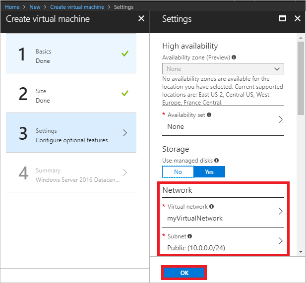

# Tutorial: Restrict network access to PaaS resources with virtual network service endpoints using the Azure portal

Virtual network service endpoints enable you to limit network access to some Azure service resources to a virtual network subnet. You can also remove internet access to the resources. Service endpoints provide direct connection from your virtual network to supported Azure services, allowing you to use your virtual network's private address space to access the Azure services. Traffic destined to Azure resources through service endpoints always stays on the Microsoft Azure backbone network. In this tutorial, you learn how to:

> [!div class="checklist"]
> * Create a virtual network with one subnet
> * Add a subnet and enable a service endpoint
> * Create an Azure resource and allow network access to it from only a subnet
> * Deploy a virtual machine (VM) to each subnet
> * Confirm access to a resource from a subnet
> * Confirm access is denied to a resource from a subnet and the internet

If you prefer, you can complete this tutorial using the [Azure CLI](tutorial-restrict-network-access-to-resources-cli.md) or [Azure PowerShell](tutorial-restrict-network-access-to-resources-powershell.md).

If you don't have an Azure subscription, create a [free account](https://azure.microsoft.com/free/?WT.mc_id=A261C142F) before you begin.

## Log in to Azure 

Log in to the Azure portal at http://portal.azure.com.

## Create a virtual network

1. Select **+ Create a resource** on the upper, left corner of the Azure portal.
2. Select **Networking**, and then select **Virtual network**.
3. Enter, or select, the following information, and then select **Create**:

    |Setting|Value|
    |----|----|
    |Name| myVirtualNetwork |
    |Address space| 10.0.0.0/16|
    |Subscription| Select your subscription|
    |Resource group | Select **Create new** and enter *myResourceGroup*.|
    |Location| Select **East US** |
    |Subnet Name| Public|
    |Subnet Address range| 10.0.0.0/24|
    |Service endpoints| Disabled|

    


## Enable a service endpoint

1. In the **Search resources, services, and docs** box at the top of the portal, enter *myVirtualNetwork.* When **myVirtualNetwork** appears in the search results, select it.
2. Add a subnet to the virtual network. Under **SETTINGS**, select **Subnets**, and then select **+ Subnet**, as shown in the following picture:

     

3. Under **Add subnet**, select or enter the following information, and then select **OK**:

    |Setting|Value|
    |----|----|
    |Name| Private |
    |Address range| 10.0.1.0/24|
    |Service endpoints| Select **Microsoft.Storage** under **Services**|

## Restrict network access for a subnet

1. Select **+ Create a resource** on the upper, left corner of the Azure portal.
2. Select **Networking**, and then select **Network security group**.
Under **Create a network security group**, enter, or select, the following information, and then select **Create**:

    |Setting|Value|
    |----|----|
    |Name| myNsgPrivate |
    |Subscription| Select your subscription|
    |Resource group | Select **Use existing** and select *myResourceGroup*.|
    |Location| Select **East US** |

4. After the network security group is created, enter *myNsgPrivate*, in the **Search resources, services, and docs** box at the top of the portal. When **myNsgPrivate** appears in the search results, select it.
5. Under **SETTINGS**, select **Outbound security rules**.
6. Select **+ Add**.
7. Create a rule that allows outbound access to the public IP addresses assigned to the Azure Storage service. Enter, or select, the following information, and then select **OK**:

    |Setting|Value|
    |----|----|
    |Source| Select **VirtualNetwork** |
    |Source port ranges| * |
    |Destination | Select **Service Tag**|
    |Destination service tag | Select **Storage**|
    |Destination port ranges| * |
    |Protocol|Any|
    |Action|Allow|
    |Priority|100|
    |Name|Allow-Storage-All|
8. Create a rule that overrides a default security rule that allows outbound access to all public IP addresses. Complete steps 6 and 7 again, using the following values:

    |Setting|Value|
    |----|----|
    |Source| Select **VirtualNetwork** |
    |Source port ranges| * |
    |Destination | Select **Service Tag**|
    |Destination service tag| Select **Internet**|
    |Destination port ranges| * |
    |Protocol|Any|
    |Action|Deny|
    |Priority|110|
    |Name|Deny-Internet-All|

9. Under **SETTINGS**, select **Inbound security rules**.
10. Select **+ Add**.
11. Create a rule that allows Remote Desktop Protocol (RDP) traffic inbound to the subnet from anywhere. The rule overrides a default security rule that denies all inbound traffic from the internet. Remote desktop connections are allowed to the subnet so that connectivity can be tested in a later step. Complete steps 6 and 7 again, using the following values:

    |Setting|Value|
    |----|----|
    |Source| Any |
    |Source port ranges| * |
    |Destination | Select **Service Tag**|
    |Destination service tag| Select **VirtualNetwork**|
    |Destination port ranges| 3389 |
    |Protocol|Any|
    |Action|Allow|
    |Priority|120|
    |Name|Allow-RDP-All|

12. Under **SETTINGS**, select **Subnets**.
13. Select **+ Associate**
14. Under **Associate subnet**, select **Virtual network** and then select **myVirtualNetwork** under **Choose a virtual network**.
15. Under **Choose subnet**, select **Private**, and then select **OK**.

## Restrict network access to a resource

The steps necessary to restrict network access to resources created through Azure services enabled for service endpoints varies across services. See the documentation for individual services for specific steps for each service. The remainder of this tutorial includes steps to restrict network access for an Azure Storage account, as an example.

### Create a storage account

1. Select **+ Create a resource** on the upper, left corner of the Azure portal.
2. Select **Storage**, and then select **Storage account - blob, file, table, queue**.
3. Enter, or select, the following information, accept the remaining defaults, and then select **Create**:

    |Setting|Value|
    |----|----|
    |Name| Enter a name that is unique across all Azure locations, between 3-24 characters in length, using only numbers and lower-case letters.|
    |Account kind|StorageV2 (general purpose v2)|
    |Replication| Locally-redundant storage (LRS)|
    |Subscription| Select your subscription|
    |Resource group | Select **Use existing** and select *myResourceGroup*.|
    |Location| Select **East US** |

### Create a file share in the storage account

1. After the storage account is created, enter the name of the storage account in the **Search resources, services, and docs** box, at the top of the portal. When the name of your storage account appears in the search results, select it.
2. Select **Files**, as shown in the following picture:

     
3. Select **+ File share**, under **File service**.
4. Enter *my-file-share* under **Name**, and then select **OK**.
5. Close the **File service** box.

### Enable network access from a subnet

By default, storage accounts accept network connections from clients in any network. To allow access from only a specific subnet, and deny network access from all other networks, complete the following steps:

1. Under **SETTINGS** for the storage account, select **Firewalls and virtual networks**.
2. Under **Virtual networks**, select **Selected networks**.
3. Select **Add existing virtual network**.
4. Under **Add networks**, select the following values, and then select **Add**:

    |Setting|Value|
    |----|----|
    |Subscription| Select your subscription.|
    |Virtual networks|Select **myVirtualNetwork**, under **Virtual networks**|
    |Subnets| Select **Private**, under **Subnets**|

     

5. Select **Save**.
6. Close the **Firewalls and virtual networks** box.
7. Under **SETTINGS** for the storage account, select **Access keys**, as shown in the following picture:

      

8. Note the **Key** value, as you'll have to manually enter it in a later step when mapping the file share to a drive letter in a VM.

## Create virtual machines

To test network access to a storage account, deploy a VM to each subnet.

### Create the first virtual machine

1. Select **+ Create a resource** found on the upper, left corner of the Azure portal.
2. Select **Compute**, and then select **Windows Server 2016 Datacenter**.
3. Enter, or select, the following information, and then select **OK**:

    |Setting|Value|
    |----|----|
    |Name| myVmPublic|
    |User name|Enter a user name of your choosing.|
    |Password| Enter a password of your choosing. The password must be at least 12 characters long and meet the [defined complexity requirements](../virtual-machines/windows/faq.md?toc=%2fazure%2fvirtual-network%2ftoc.json#what-are-the-password-requirements-when-creating-a-vm).|
    |Subscription| Select your subscription.|
    |Resource group| Select **Use existing** and select **myResourceGroup**.|
    |Location| Select **East US**.|

    
4. Select a size for the virtual machine and then select **Select**.
5. Under **Settings**, select **Network** and then select **myVirtualNetwork**. Then select **Subnet**, and select **Public**, as shown in the following picture:

    
6. On the **Summary** page, select **Create** to start the virtual machine deployment. The VM takes a few minutes to deploy, but you can continue to the next step while the VM is creating.

### Create the second virtual machine

Complete steps 1-6 again, but in step 3, name the virtual machine *myVmPrivate* and in step 5, select the **Private** subnet.

The VM takes a few minutes to deploy. Do not continue to the next step until it finishes creating and its settings open in the portal.

## Confirm access to storage account

1. Once the *myVmPrivate* VM finishes creating, Azure opens the settings for it. Connect to the VM by selecting the **Connect** button, as shown in the following picture:

    

2. After selecting the **Connect** button, a Remote Desktop Protocol (.rdp) file is created and downloaded to your computer.  
3. Open the downloaded rdp file. If prompted, select **Connect**. Enter the user name and password you specified when creating the VM. You may need to select **More choices**, then **Use a different account**, to specify the credentials you entered when you created the VM. 
4. Select **OK**.
5. You may receive a certificate warning during the sign-in process. If you receive the warning, select **Yes** or **Continue**, to proceed with the connection.
6. On the *myVmPrivate* VM, map the Azure file share to drive Z using PowerShell. Before running the commands that follow, replace `<storage-account-key>` and `<storage-account-name>` with values you supplied and retrieved in [Create a storage account](#create-a-storage-account).

    ```powershell
    $acctKey = ConvertTo-SecureString -String "<storage-account-key>" -AsPlainText -Force
    $credential = New-Object System.Management.Automation.PSCredential -ArgumentList "Azure\<storage-account-name>", $acctKey
    New-PSDrive -Name Z -PSProvider FileSystem -Root "\\<storage-account-name>.file.core.windows.net\my-file-share" -Credential $credential
    ```
    
    PowerShell returns output similar to the following example output:

    ```powershell
    Name           Used (GB)     Free (GB) Provider      Root
    ----           ---------     --------- --------      ----
    Z                                      FileSystem    \\vnt.file.core.windows.net\my-f...
    ```

    The Azure file share successfully mapped to the Z drive.

7. Confirm that the VM has no outbound connectivity to any other public IP addresses from a command prompt:

    ```
    ping bing.com
    ```
    
    You receive no replies, because the network security group associated to the *Private* subnet does not allow outbound access to public IP addresses other than the addresses assigned to the Azure Storage service.

8. Close the remote desktop session to the *myVmPrivate* VM.

## Confirm access is denied to storage account

1. Enter *myVmPublic* In the **Search resources, services, and docs** box at the top of the portal.
2. When **myVmPublic** appears in the search results, select it.
3. Complete steps 1-6 in [Confirm access to storage account](#confirm-access-to-storage-account) for the *myVmPublic* VM.

    Access is denied and you receive a `New-PSDrive : Access is denied` error. Access is denied because the *myVmPublic* VM is deployed in the *Public* subnet. The *Public* subnet does not have a service endpoint enabled for Azure Storage, and the storage account only allows network access from the *Private* subnet, not the *Public* subnet.

4. Close the remote desktop session to the *myVmPublic* VM.

5. From your computer, browse to the Azure [portal](https://portal.azure.com).
6. Enter the name of the storage account you created in the **Search resources, services, and docs** box. When the name of your storage account appears in the search results, select it.
7. Select **Files**.
8. You receive the error shown in the following picture:

    

    Access is denied, because your computer is not in the *Private* subnet of the *MyVirtualNetwork* virtual network.

## Clean up resources

When no longer needed, delete the resource group and all resources it contains:

1. Enter *myResourceGroup* in the **Search** box at the top of the portal. When you see **myResourceGroup** in the search results, select it.
2. Select **Delete resource group**.
3. Enter *myResourceGroup* for **TYPE THE RESOURCE GROUP NAME:** and select **Delete**.

## Next steps

In this tutorial, you enabled a service endpoint for a virtual network subnet. You learned that service endpoints can be enabled for resources deployed with multiple Azure services. You created an Azure Storage account and limited network access to the storage account to only resources within a virtual network subnet. To learn more about service endpoints, see [Service endpoints overview](virtual-network-service-endpoints-overview.md) and [Manage subnets](virtual-network-manage-subnet.md).

If you have multiple virtual networks in your account, you may want to connect two virtual networks together so the resources within each virtual network can communicate with each other. To learn how to connect virtual networks, advance to the next tutorial.

> [!div class="nextstepaction"]
> [Connect virtual networks](./tutorial-connect-virtual-networks-portal.md)