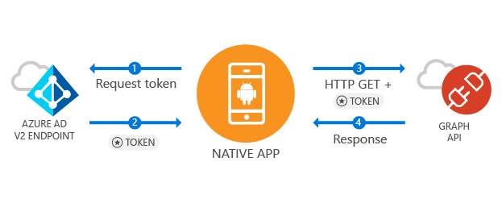

# Sign-in users and all the Microsoft Graph API from an Android app

This guide demonstrates how a native Android application can get an access token and call the Microsoft Graph API or other APIs that require access tokens from the Azure Active Directory v2 endpoint.

When you've completed the guide, your application will be able to accept sign-ins of personal accounts (including outlook.com, live.com, and others) and work and school accounts from any company or organization that uses Azure Active Directory. The application will then call an API that's protected by the Azure Active Directory v2 endpoint.  

## How the sample app generated by this guide works

The sample application that you create with this guide is based on a scenario where an Android application is used to query a Web API that accepts tokens from the Azure Active Directory v2 endpoint (Microsoft Graph API, in this case). For this scenario, your application adds the acquired token to HTTP requests via the Authorization header. The Microsoft Authentication Library (MSAL) handles the token acquisition and renewal for you.

## Prerequisites
* This Guided Setup is focused on Android Studio, but any other Android application development environment is also acceptable. 
* Android SDK 21 or later is required (SDK 25 is recommended).
* Google Chrome or a web browser that uses Custom Tabs is required for this release of MSAL for Android.

> [!NOTE]
> Google Chrome is not included with Visual Studio Emulator for Android. We recommend that you test this code on an Emulator with API 25 or an image with API 21 or newer that has Google Chrome installed.

## Handling token acquisition for accessing protected Web APIs

After the user is authenticated, the sample application receives an access token that can be used to query Microsoft Graph API or a Web API that's secured by Azure Active Directory v2.

APIs such as Microsoft Graph require an access token to allow access to specific resources. For example, an access token is required to read a user’s profile, access a user’s calendar, or send email. Your application can request an access token by using MSAL to access these resources by specifying API scopes. This access token is then added to the HTTP Authorization header for every call that's made against the protected resource. 

MSAL manages caching and refreshing access tokens for you, so that your application doesn't need to.

## Libraries

This guide uses the following libraries:

|Library|Description|
|---|---|
|[com.microsoft.identity.client](http://javadoc.io/doc/com.microsoft.identity.client/msal)|Microsoft Authentication Library (MSAL)|
