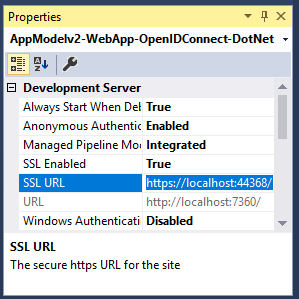

## Register your application

To register your application and add your application registration information to your solution, you have two options:

### Option 1: Express mode

You can quickly register your application by doing the following:

1. Register your application via the [Microsoft Application Registration Portal](https://apps.dev.microsoft.com/portal/register-app?appType=serverSideWebApp&appTech=aspNetWebAppOwin&step=configure)
2.	Enter a name for your application and your email
3.	Make sure the option for Guided Setup is checked
4.	Follow the instructions to add a Redirect URL to your application

### Option 2: Advanced mode

To register your application and add your application registration information to your solution, do the following:

1. Go to the [Microsoft Application Registration Portal](https://apps.dev.microsoft.com/portal/register-app) to register an application
2. Enter a name for your application and your email 
3. Make sure the option for Guided Setup is unchecked
4. Click `Add Platform`, then select `Web`
5. Go back to Visual Studio and, in Solution Explorer, select the project and look at the Properties window (if you don’t see a Properties window, press F4)
6. Change SSL Enabled to `True`
7. Right click on the project in Visual Studio, then choose **Properties**, and the **Web** tab. In the *Servers* section change the *Project Url* to be the SSL URL
8. Copy the SSL URL and add this URL to the list of Redirect URLs in the Registration Portal’s list of Redirect URLs:<br/><br/><br />
9. Add the following in `web.config` located in the root folder under the section `configuration\appSettings`:

    ```xml
    <add key="ClientId" value="Enter_the_Application_Id_here" />
    <add key="redirectUri" value="Enter_the_Redirect_URL_here" />
    <add key="Tenant" value="common" />
    <add key="Authority" value="https://login.microsoftonline.com/{0}/v2.0" />
    ```

10. Replace `ClientId` with the Application ID you just registered
11. Replace `redirectUri` with the SSL URL of your project

