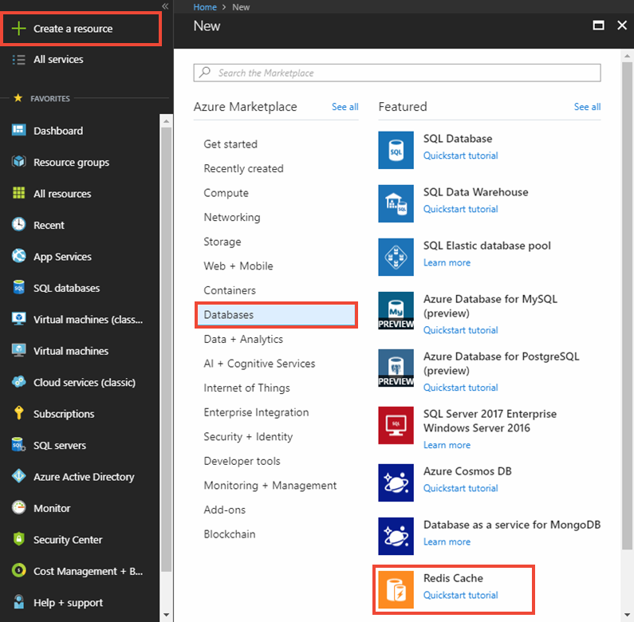
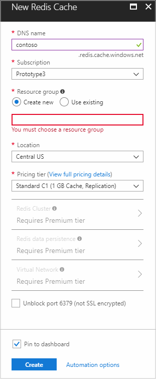

To create a cache, first sign in to the [Azure portal](https://portal.azure.com), and click **Create a resource** > **Databases** > **Redis Cache**.

In **New Redis Cache**, configure the settings for your new cache.

| Setting      | Suggested value  | Description |
| ------------ |  ------- | -------------------------------------------------- |
| **DNS name** | Globally unique name | The cache name must be a string between 1 and 63 characters and contain only numbers, letters, and the `-` character. The cache name cannot start or end with the `-` character, and consecutive `-` characters are not valid.  | 
| **Subscription** | Your subscription | The subscription under which this new Azure Redis Cache is created. | 
| **Resource Group** |  *TestResources* | Name for the new resource group in which to create your cache. By putting all the resources for an app in a group, you can manage them together. For example, deleting the resource group would delete all resources associated with the app. | 
| **Location** | East US | Choose a [region](https://azure.microsoft.com/regions/) near to other services that will use your cache. |
| **[Pricing tier](https://azure.microsoft.com/pricing/details/cache/)** |  Basic C0 (250 MB Cache) |  The pricing tier determines the size, performance, and features available for the cache. For more information, see [Azure Redis Cache Overview](../articles/redis-cache/cache-overview.md). |
| **Pin to dashboard** |  Selected | Click pin the new cache to your dashboard making it easy to find. |

 

Once the new cache settings are configured, click **Create**. 

It can take a few minutes for the cache to be created. To check the status, you can monitor the progress on the dashboard. After the cache has been created, your new cache has a **Running** status and is ready for use.

